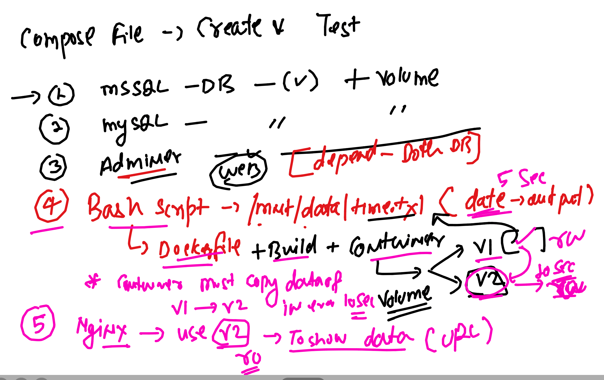

### Installation of docker in given linux based OS 

### Docker CE version 23 install  -- Task 1

<ol> 
  <li> amazon linux 2 & 3  </li>
  <li> Ubuntu OS -- minimum version 20   </li>
  <li> RHEL -- minimum version 7   </li>
  <li> Macbook  </li>
  <li> WIndows 10 or later   </li>
  
</ol>

### Docker code test with multiple images  --- task 2 


### Task 3 -- finalize the lower size from task 2 

<ol> 
  <li> check output of python code from finalize image container   </li>
  <li> Now change the code little bit like message inside container    </li>
  <li> Now let me know the process how the new code will start running    </li>
  <li> do not build new image   </li>
  <li> do not create new container    </li>
  
</ol>


### TAsK 4 -- use below given dockerfile to do task 

## Dockerfile 

```
FROM alpine 
# pulling python image from docker hub 
LABEL name="ashutoshh"
LABEL email="ashutoshh@linux.com"
# image creator info -- optional 
RUN apk add python3 
RUN mkdir  /opt/pycodes/ 
# to run any command whatever required we use RUN 
COPY *.py  /opt/pycodes/ 
# from docker server copy code to new image while building 
#CMD ["python3","/opt/pycodes/hello.py"]
# to set default process while creating container 
# it can be replaced by docker engineer  while creating container 
WORKDIR /opt/pycodes/ 
USER 1001 
# gaining non root user 
# this will work like cd command means final image will have pwd as /opt/pycodes
ENTRYPOINT [ "python3" ]
CMD ["/opt/pycodes/hello.py"]
# cmd and entrypoint are same but we can't replace entrypoint while creating container
```

### DO some adjustment 

<ol> 
  <li> modify above dockerfile to install python2 also    </li>
  <li> Build the final image with USER 1001 only    </li>
  <li> Now create 2 containers    </li>
  <li> container1 should run hello.py using python3 in above created image   </li>
  <li>  container2 should run ashu.py  using python2 in above created image   </li>
  
</ol>

### creating docker image for ssh server 


## Dockerfile tasks for nginx and httpd

### httpd image 
```
1. Creating httpd image for hosting hello.html page 
2. use bases images first ubuntu and second oraclelinux:8.4 
3. try to minimize size of images as much as you can do 

```

### nginx image -- Repeate the for nginx as per httpd things 

## Creat docker image as per given things

<ol>
  <li> Creating httpd image using oraclelinux:8.4 as base</li>
  <li> make sure this image is having 2 virtualhost configured </li>
  <li> servername of vhost will be same (localhost) but port number will be 80 and 81 </li>
  <li> documentroot will be /opt/mywebapp1 and /opt/mywebapp2 </li>
</ol>

### Docker Host networking task -- define and understand use of it

## compsoe task 1 



## Docker More tasks 

### -- Post completion -- task1 

###  Container data copy 

<details><summary>show</summary>
<p>

```bash
  1. Create two containers named with  <yourname>c1 and <yourname>c2
  2. choose whatever docker image you want to 
  3. choose whatever parent process 
  4. In container 1st create a file called  helloc1.txt , file must contain some data 
  5. now copy helloc1.txt to  2nd container 
```

</p>
</details>

### Task 2 --

###  Container with Cgroups

<details><summary>show</summary>
<p>

```bash
  1. Create one container named with  <yourname>cg1 
  2. choose busybox as docker image
  3. choose any parent process that must run for atleast 20 minutes 
  4. container must not exceed more than 30% of single core CPU 
  5. after container creation update max use RAM usage to 300MB for this container 
  6. After RAM update  in this container also update restart policy to always for this container 
```

</p>
</details>

## Task 3 

 ###  From Container to Docker image 

<details><summary>show</summary>
<p>

```bash
  1. Create a container named  <yourname>cimg 
  2. choose oraclelinux:8.4 as docker image
  3. Install vim and httpd software inside a running container 
  4. Now create a docker image from this running container 
  5. make docker image and be sure this docker  image name must be  <yourname>cimg:v007  
  6. check it by docker images
  7. create a container from this imaeg  by whatever name 
  8. choose any process so that container can keep running 
  9. after container creation change its restart policy to "always"
  10. check restart policy that it got updated 
  11. if all setup then push this image to dockerhub on your personal account 
```

</p>
</details>

## Task 4 


 ###  Container with output check 

<details><summary>show</summary>
<p>

```bash
  1. Create one container named with  <yourname>cg1 also use "-d" option to put container in background 
  2. choose busybox as docker image
  3. choose  parent process of container as  "uname -r" 
  4. now check the output of process which you given in  your container 
  5. store that output in a file <yourname>task1.txt in /tmp/<yourname>task1.txt in docker host machine 
 
```

</p>
</details>