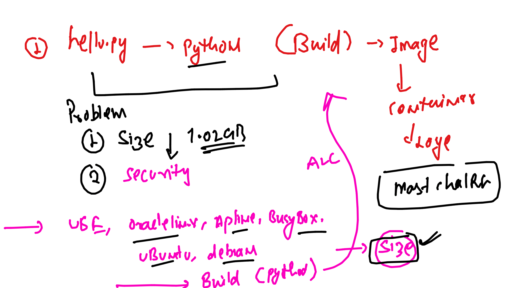
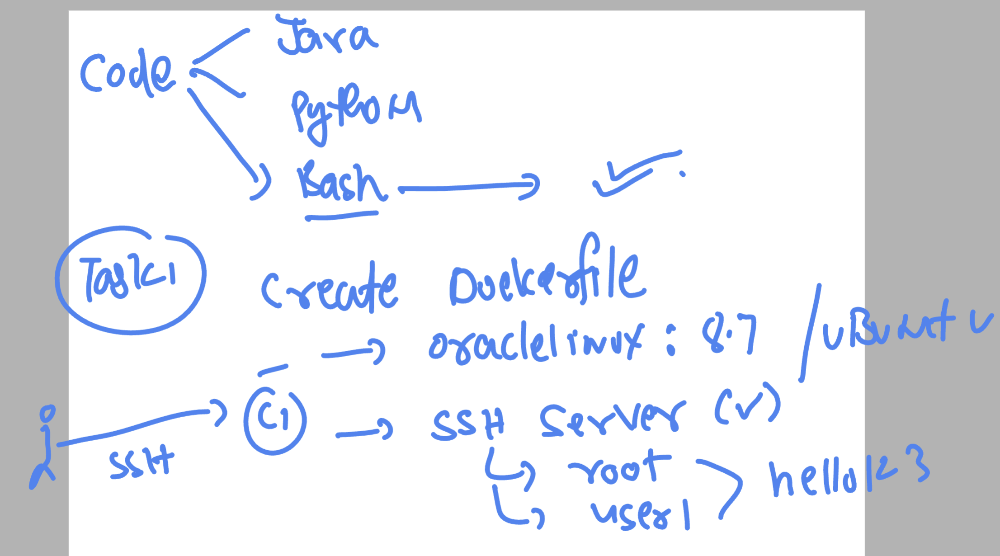

### Installation of docker in given linux based OS 

### Docker CE version 23 install  -- Task 1

<ol> 
  <li> amazon linux 2 & 3  </li>
  <li> Ubuntu OS -- minimum version 20   </li>
  <li> RHEL -- minimum version 7   </li>
  <li> Macbook  </li>
  <li> WIndows 10 or later   </li>
  
</ol>

### Docker code test with multiple images  --- task 2 



### Task 3 -- finalize the lower size from task 2 

<ol> 
  <li> check output of python code from finalize image container   </li>
  <li> Now change the code little bit like message inside container    </li>
  <li> Now let me know the process how the new code will start running    </li>
  <li> do not build new image   </li>
  <li> do not create new container    </li>
  
</ol>


### TAsK 4 -- use below given dockerfile to do task 

## Dockerfile 

```
FROM alpine 
# pulling python image from docker hub 
LABEL name="ashutoshh"
LABEL email="ashutoshh@linux.com"
# image creator info -- optional 
RUN apk add python3 
RUN mkdir  /opt/pycodes/ 
# to run any command whatever required we use RUN 
COPY *.py  /opt/pycodes/ 
# from docker server copy code to new image while building 
#CMD ["python3","/opt/pycodes/hello.py"]
# to set default process while creating container 
# it can be replaced by docker engineer  while creating container 
WORKDIR /opt/pycodes/ 
USER 1001 
# gaining non root user 
# this will work like cd command means final image will have pwd as /opt/pycodes
ENTRYPOINT [ "python3" ]
CMD ["/opt/pycodes/hello.py"]
# cmd and entrypoint are same but we can't replace entrypoint while creating container
```

### DO some adjustment 

<ol> 
  <li> modify above dockerfile to install python2 also    </li>
  <li> Build the final image with USER 1001 only    </li>
  <li> Now create 2 containers    </li>
  <li> container1 should run hello.py using python3 in above created image   </li>
  <li>  container2 should run ashu.py  using python2 in above created image   </li>
  
</ol>

### creating docker image for ssh server 




