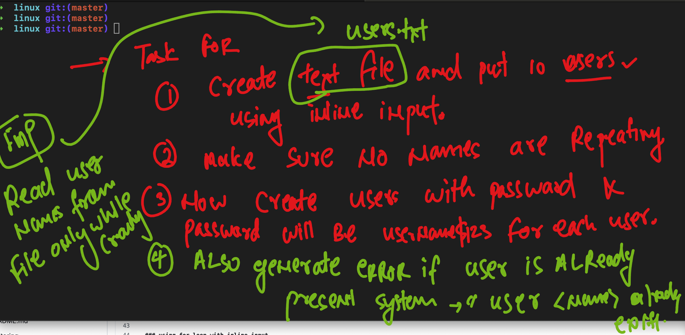
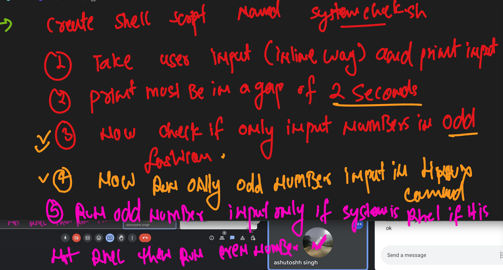

## Linux shell scripting 

### for loop task 1 

 
  
access

  

### for loop task 2 

 
  
access

  

### task 3  loop and condition 

 
  
access

  ## Directory Management Task

### 1. Variable Definition
Declare a variable `directory_name` and set it to "MyFiles."

### 2. Directory Creation
Use an `if` statement to check if a directory with the name stored in `directory_name` already exists. If not, create the directory; otherwise, print a message indicating that the directory already exists.

### 3. File Creation
Inside the directory created (or existing), use a `for` loop to create five empty text files named `file1.txt`, `file2.txt`, ..., `file5.txt`.

### 4. File Counting
Use a `while` loop to count and display the number of text files in the directory.

### 5. Cleanup
Remove all the text files created in step 3.

