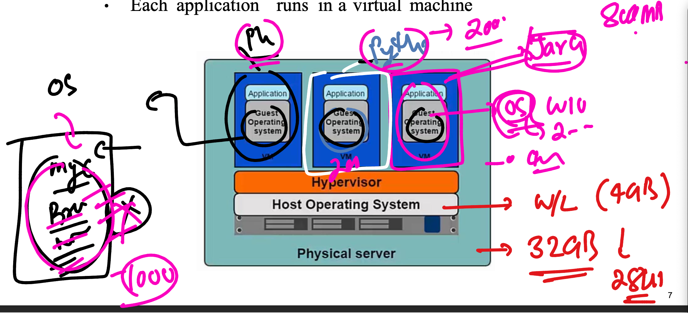
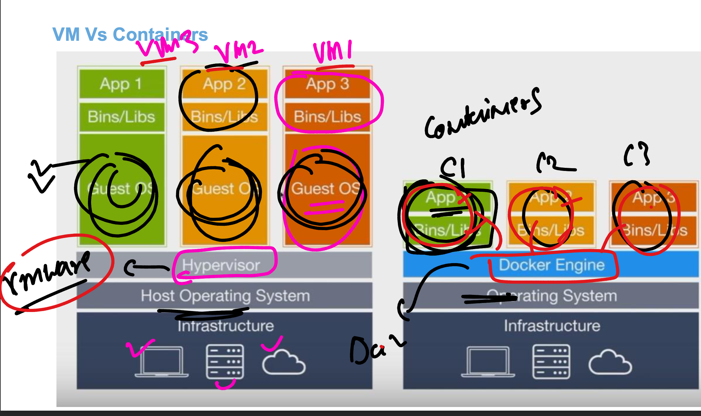

### TO run app in past time 

### problems with physical server

### prob 2

## TO run multiple apps in past we -- introduced virtulization 

### few hypervisor software names for managing VM 

### VM related problems 

### containers are having dedicated tasks 

