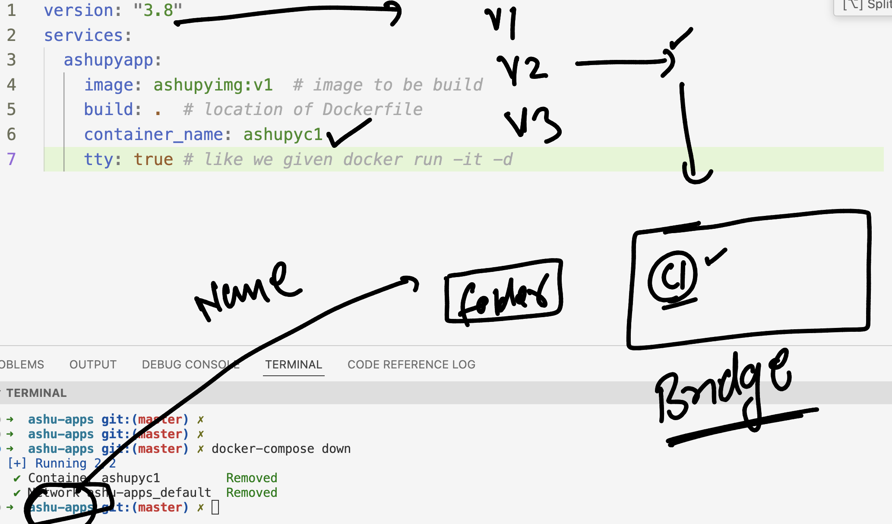

# devops_airtel

### Understanding compose 


### Installing docker-compose 2.26 in linux 

```
curl -SL https://github.com/docker/compose/releases/download/v2.26.1/docker-compose-linux-x86_64 -o   /usr/bin/docker-compose

===>
chmod +x /usr/bin/docker-compose

====>
docker-compose version 
Docker Compose version v2.23.3
```

## compose file case 1 

### with Dockerfile and python code 

```
ashu-apps git:(master) ✗ 

➜  ashu-apps git:(master) ✗ ls
Dockerfile          docker-compose.yaml hello.py
```

### Running first compose file 

```
docker-compose  up  -d
[+] Running 2/2
 ✔ Network ashu-apps_default  Created                                                                                       0.0s 
 ✔ Container ashupyc1         Started           
```
### more compsoe commands 

```
  ashu-apps git:(master) ✗ docker-compose  ps     
NAME       IMAGE          COMMAND              SERVICE     CREATED          STATUS          PORTS
ashupyc1   ashupyimg:v1   "python3 hello.py"   ashupyapp   17 seconds ago   Up 16 seconds   
➜  ashu-apps git:(master) ✗ 

```

###

```
docker-compose  ps
10033  docker-compose  stop 
10034  docker-compose  ps -a
10035  docker-compose  ps 
10036  docker-compose start
10037  docker-compose logs 
```

### loging into service container of compose 

```
docker-compose ps
NAME       IMAGE          COMMAND              SERVICE     CREATED              STATUS          PORTS
ashupyc1   ashupyimg:v1   "python3 hello.py"   ashupyapp   About a minute ago   Up 33 seconds   
➜  ashu-apps git:(master) ✗ 
➜  ashu-apps git:(master) ✗ 
➜  ashu-apps git:(master) ✗ docker-compose  exec  -it  ashupyapp  sh 
/codes # ls
hello.py
/codes # exit
```

### logs 

```
 ashu-apps git:(master) ✗ docker-compose logs 
ashupyc1  | Hello i am checking os details 
ashupyc1  | 6.1.75-0-virt
ashupyc1  | @@@@@@@@@@@@@@
```

### images

```
docker-compose images
CONTAINER           REPOSITORY          TAG                 IMAGE ID            SIZE
ashupyc1            ashupyimg           v1                  4018c0a75b70        56.3MB
➜  ashu-apps git:(master) ✗ 

```

### destroy all resoruces by compose 

```
docker-compose down  
[+] Running 0/1
 ⠋ Container ashupyc1  Stopping                                                                                             7.1s 
```

### from compose file version 2 onwards 



### more close look to compsoe network 

```
 ashu-apps git:(master) ✗ ls
Dockerfile          docker-compose.yaml hello.py
➜  ashu-apps git:(master) ✗ docker-compose up -d
[+] Running 2/2
 ✔ Network ashu-apps_default  Created                                                                                       0.0s 
 ✔ Container ashupyc1         Started                                                                                       0.0s 
➜  ashu-apps git:(master) ✗ docker network ls
NETWORK ID     NAME                DRIVER    SCOPE
cba589604dd5   ashu-apps_default   bridge    local
0f69335a44b9   ashubr1             bridge    local
c72cfa620543   ashubr2             bridge    local
a8e879ec122f   bridge              bridge    local
185a0f66b49a   host                host      local
30987d39b1c7   none                null      local
➜  ashu-apps git:(master) ✗ docker  network inspect ashu-apps_default 
[
    {
        "Name": "ashu-apps_default",
        "Id": "cba589604dd5ea6fd0830c7d46fef284c15e8504cc8f0d5b0cac456b033eb0b4",
        "Created": "2024-04-20T03:12:49.927362567Z",
        "Scope": "local",
        "Driver": "bridge",
        "EnableIPv6": false,
        "IPAM": {
            "Driver": "default",
            "Options": null,
            "Config": [
                {
                    "Subnet": "172.20.0.0/16",
                    "Gateway": "172.20.0.1"
                }
            ]
        },
        "Internal": false,
        "Attachable": false,
        "Ingress": false,
        "ConfigFrom": {
            "Network": ""
        },
        "ConfigOnly": false,
        "Containers": {
            "f265caad775fa5e3c9d6f1ce46a3b446e304759c9c41e32c5a72e3d488ddadfd": {
                "Name": "ashupyc1",
```

### compose with new options 

```
 ashu-apps git:(master) ✗ docker-compose ps -a
NAME          IMAGE          COMMAND                SERVICE       CREATED              STATUS                       PORTS
ashuhttpdc1   ashuhttpd:v1   "httpd -DFOREGROUND"   ashuwebapp1   About a minute ago   Exited (0) 15 seconds ago    
ashupyc1      ashupyimg:v1   "python3 hello.py"     ashupyapp     About a minute ago   Exited (137) 5 seconds ago   
➜  ashu-apps git:(master) ✗ 
➜  ashu-apps git:(master) ✗ docker-compose start  ashuwebapp1
[+] Running 1/1
 ✔ Container ashuhttpdc1  Started                                                                                           0.4s 
➜  ashu-apps git:(master) ✗ docker-compose start             
[+] Running 1/1
 ✔ Container ashupyc1  Started                                                                                              0.3s 
➜  ashu-apps git:(master) ✗ docker-compose ps   
NAME          IMAGE          COMMAND                SERVICE       CREATED              STATUS         PORTS
ashuhttpdc1   ashuhttpd:v1   "httpd -DFOREGROUND"   ashuwebapp1   About a minute ago   Up 7 seconds   0.0.0.0:4466->80/tcp, :::4466->80/tcp
ashupyc1      ashupyimg:v1   "python3 hello.py"     ashupyapp     About a minute ago   Up 2 seconds   
➜  ashu-apps git:(master) ✗ docker-compose  stop  ashupyapp
[+] Stopping 1/1
 ✔ Container ashupyc1  Stopped                                                                                             10.3s 
➜  ashu-apps git:(master) ✗ 
```