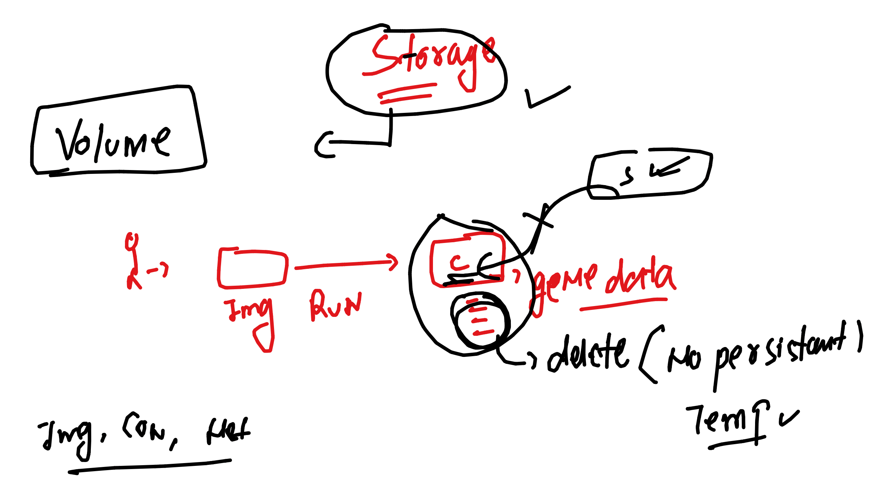

# devops_airtel

## a single project can have multiple compose fiel

```
ashu-apps git:(master) ✗ ls
Dockerfile          docker-compose.yaml httpd.dockerfile
ashu-compose.yaml   hello.py            webapps
➜  ashu-apps git:(master) ✗ docker-compose up -f  ashu-compose.yaml -d 
unknown shorthand flag: 'f' in -f
➜  ashu-apps git:(master) ✗ docker-compose -f  ashu-compose.yaml up  -d 
[+] Running 2/2
 ✔ Container ashupyc1     Started                                                                               0.0s 
 ✔ Container ashuhttpdc1  Started                                                                               0.0s 
➜  ashu-apps git:(master) ✗ docker-composem -f ashu-compose.yaml ps
zsh: command not found: docker-composem
➜  ashu-apps git:(master) ✗ docker-compose  -f ashu-compose.yaml ps
NAME          IMAGE          COMMAND                SERVICE       CREATED          STATUS          PORTS
ashuhttpdc1   ashuhttpd:v1   "httpd -DFOREGROUND"   ashuwebapp1   17 seconds ago   Up 15 seconds   0.0.0.0:4466->80/tcp, :::4466->80/tcp
ashupyc1      ashupyimg:v1   "python3 hello.py"     ashupyapp     17 seconds ago   Up 15 seconds   
➜  ashu-apps git:(master) ✗ docker-compose  -f ashu-compose.yaml down 
[+] Running 1/2
 ✔ Container ashuhttpdc1  Removed                                                                               0.3s 
 ⠏ Container ashupyc1     Stopping       
```

### Docker storage 



### Creating database container without storage 

```
ashu-apps git:(master) ✗ docker run -d --name ashudb -e MYSQL_ROOT_PASSWOR="Root@12345" mysql
Unable to find image 'mysql:latest' locally
latest: Pulling from library/mysql
c6a0976a2dbe: Pull complete 
8dd4f8e415ca: Pull complete 
```

### accessing db and creating data

```
 ashu-apps git:(master) ✗ docker run -d --name ashudb1 -e MYSQL_ROOT_PASSWORD="Root@12345" mysql
➜  ashu-apps git:(master) ✗ 
➜  ashu-apps git:(master) ✗ 
➜  ashu-apps git:(master) ✗ docker  exec -it ashudb1 bash 
bash-4.4# mysql -u root -p
Enter password: 
Welcome to the MySQL monitor.  Commands end with ; or \g.
Your MySQL connection id is 8
Server version: 8.3.0 MySQL Community Server - GPL

Copyright (c) 2000, 2024, Oracle and/or its affiliates.

Oracle is a registered trademark of Oracle Corporation and/or its
affiliates. Other names may be trademarks of their respective
owners.

Type 'help;' or '\h' for help. Type '\c' to clear the current input statement.

mysql> show databases;
+--------------------+
| Database           |
+--------------------+
| information_schema |
| mysql              |
| performance_schema |
| sys                |
+--------------------+
4 rows in set (0.01 sec)

mysql> create database ashudb;
Query OK, 1 row affected (0.01 sec)

mysql> show databases;
+--------------------+
| Database           |
+--------------------+
| ashudb             |
| information_schema |
| mysql              |
| performance_schema |
| sys                |
+--------------------+
5 rows in set (0.01 sec)

mysql> ^DBye
bash-4.4# exit

```

## Removing container and recreating it to test data loss

```
ashu-apps git:(master) ✗ docker kill ashudb1
ashudb1
➜  ashu-apps git:(master) ✗ docker rm  ashudb1 
ashudb1
➜  ashu-apps git:(master) ✗ 
➜  ashu-apps git:(master) ✗ docker run -d --name ashudb1 -e MYSQL_ROOT_PASSWORD="Root@12345" mysql
6266f5929b6f9fd0ecb92e5a84d1e45d3d7c2a2c472539cb52be9e85ac4a7889
➜  ashu-apps git:(master) ✗ 
➜  ashu-apps git:(master) ✗ docker  exec -it ashudb1 bash                                         
bash-4.4# mysql -u root -p
Enter password: 
Welcome to the MySQL monitor.  Commands end with ; or \g.
Your MySQL connection id is 8
Server version: 8.3.0 MySQL Community Server - GPL

Copyright (c) 2000, 2024, Oracle and/or its affiliates.

Oracle is a registered trademark of Oracle Corporation and/or its
affiliates. Other names may be trademarks of their respective
owners.

Type 'help;' or '\h' for help. Type '\c' to clear the current input statement.

mysql> show databases;
+--------------------+
| Database           |
+--------------------+
| information_schema |
| mysql              |
| performance_schema |
| sys                |
+--------------------+
4 rows in set (0.00 sec)

mysql> ^DBye
bash-4.4# exit
```

## Solution with storage 

```
  ashu-apps git:(master) ✗ docker  volume  create  ashu-voldb 
ashu-voldb
➜  ashu-apps git:(master) ✗ docker volume ls
DRIVER    VOLUME NAME
local     9d79c10a2ce8a791bd2ee20386f7e262986a477d39be6113e354550d68c78a9b
local     74c5a5e316482a4c59bb8c71e3bd1f4c4791449ee008d784f2b5654ebf4fadf1
local     237327a3eff7e092092634ffab23da7cf5c8fa76230705c51d41052737829f0c
local     ashu-voldb
local     ashuvol1
local     day12_ashuvolnew1
local     day13_ashudbvol1
➜  ashu-apps git:(master) ✗ docker run -d --name ashudb1 -e MYSQL_ROOT_PASSWORD="Root@12345"  -v  ashu-voldb:/var/lib/mysql/     mysql
docker: Error response from daemon: Conflict. The container name "/ashudb1" is already in use by container "6266f5929b6f9fd0ecb92e5a84d1e45d3d7c2a2c472539cb52be9e85ac4a7889". You have to remove (or rename) that container to be able to reuse that name.
See 'docker run --help'.
➜  ashu-apps git:(master) ✗ docker rm ashudb1 -f                                                                                      
ashudb1
➜  ashu-apps git:(master) ✗ docker run -d --name ashudb1 -e MYSQL_ROOT_PASSWORD="Root@12345"  -v  ashu-voldb:/var/lib/mysql/     mysql
bd30364aad48869166d154739d9a17be00ea72d7159d5c291a981cd3e43b4093
➜  ashu-apps git:(master) ✗ 


```

### lets try to test data loss

```
ashu-apps git:(master) ✗ docker  exec -it ashudb1 bash                                                                             
bash-4.4# 
bash-4.4# mysql -u root -p
Enter password: 
Welcome to the MySQL monitor.  Commands end with ; or \g.
Your MySQL connection id is 8
Server version: 8.3.0 MySQL Community Server - GPL

Copyright (c) 2000, 2024, Oracle and/or its affiliates.

Oracle is a registered trademark of Oracle Corporation and/or its
affiliates. Other names may be trademarks of their respective
owners.

Type 'help;' or '\h' for help. Type '\c' to clear the current input statement.

mysql> create database okey;
Query OK, 1 row affected (0.00 sec)

mysql> show databases;
+--------------------+
| Database           |
+--------------------+
| information_schema |
| mysql              |
| okey               |
| performance_schema |
| sys                |
+--------------------+
5 rows in set (0.00 sec)

mysql> ^DBye
bash-4.4# exit
➜  ashu-apps git:(master) ✗ docker rm ashudb1 -f                                                                                      
ashudb1
➜  ashu-apps git:(master) ✗ docker run -d --name ashudb1 -e MYSQL_ROOT_PASSWORD="Root@12345"  -v  ashu-voldb:/var/lib/mysql/     mysql
d880aab727cb5f4e4870ceda7aae4b5d116cbf87a513c2dbecbc24a928b235ee
➜  ashu-apps git:(master) ✗ docker  exec -it ashudb1 bash                                                                             
bash-4.4# mysql -u root -p
Enter password: 
Welcome to the MySQL monitor.  Commands end with ; or \g.
Your MySQL connection id is 8
Server version: 8.3.0 MySQL Community Server - GPL

Copyright (c) 2000, 2024, Oracle and/or its affiliates.

Oracle is a registered trademark of Oracle Corporation and/or its
affiliates. Other names may be trademarks of their respective
owners.

Type 'help;' or '\h' for help. Type '\c' to clear the current input statement.

mysql> show databases;
+--------------------+
| Database           |
+--------------------+
| information_schema |
| mysql              |
| okey               |
| performance_schema |
| sys                |
+--------------------+
5 rows in set (0.01 sec)

mysql> ^DBye
bash-4.4# exit
```

### Testing with compose 

```
version: "3.8"
volumes: # create volume 
  ashudbvol8:  # name of volume 
services:
  ashudb: 
    image: mysql 
    container_name: ashudbc1 
    environment:
      MYSQL_ROOT_PASSWORD: Root@0987
    volumes: # mounting volume 
    - ashudbvol8:/var/lib/mysql/
  ashupyapp:
    image: ashupyimg:v1  # image to be build 
    build: .  # location of Dockerfile 
    container_name: ashupyc1 
    network_mode: none
    tty: true # like we given docker run -it 
  ashuwebapp1: 
    image: ashuhttpd:v1 
    build:
      context: .  #location 
      dockerfile: httpd.dockerfile # name 
    container_name: ashuhttpdc1 
    ports:
      - 4466:80 
    depends_on:
    - ashupyapp
```

### commands 

```
 docker-compose -f ashu-compose.yaml up -d
[+] Running 5/5
 ✔ Network ashu-apps_default      Created                                                                                                          0.0s 
 ✔ Volume "ashu-apps_ashudbvol8"  Created                                                                                                          0.0s 
 ✔ Container ashudbc1             Started                                                                                                          0.0s 
 ✔ Container ashupyc1             Started                                                                                                          0.0s 
 ✔ Container ashuhttpdc1          Started                                                                                                          0.0s 
➜  ashu-apps git:(master) ✗ docker-compose -f ashu-compose.yaml exec -it  ashudbc1   bash 
service "ashudbc1" is not running
➜  ashu-apps git:(master) ✗ docker-compose -f ashu-compose.yaml ps                        
NAME          IMAGE          COMMAND                  SERVICE       CREATED          STATUS          PORTS
ashudbc1      mysql          "docker-entrypoint.s…"   ashudb        40 seconds ago   Up 38 seconds   3306/tcp, 33060/tcp
ashuhttpdc1   ashuhttpd:v1   "httpd -DFOREGROUND"     ashuwebapp1   40 seconds ago   Up 38 seconds   0.0.0.0:4466->80/tcp, :::4466->80/tcp
ashupyc1      ashupyimg:v1   "python3 hello.py"       ashupyapp     40 seconds ago   Up 38 seconds   
➜  ashu-apps git:(master) ✗ 
➜  ashu-apps git:(master) ✗ 
➜  ashu-apps git:(master) ✗ docker-compose -f ashu-compose.yaml exec -it  ashudb   bash   
bash-4.4# mysql -u root -p
Enter password: 
Welcome to the MySQL monitor.  Commands end with ; or \g.
Your MySQL connection id is 8
Server version: 8.3.0 MySQL Community Server - GPL

Copyright (c) 2000, 2024, Oracle and/or its affiliates.

Oracle is a registered trademark of Oracle Corporation and/or its
affiliates. Other names may be trademarks of their respective
owners.

Type 'help;' or '\h' for help. Type '\c' to clear the current input statement.

mysql> ^DBye
bash-4.4# exit
```

### we can mount volume in readonly permission 

```
 git clone https://github.com/schoolofdevops/html-sample-app.git
Cloning into 'html-sample-app'...
remote: Enumerating objects: 74, done.
remote: Counting objects: 100% (74/74), done.
remote: Compressing objects: 100% (69/69), done.
remote: Total 74 (delta 5), reused 71 (delta 5), pack-reused 0
Receiving objects: 100% (74/74), 1.38 MiB | 3.92 MiB/s, done.
Resolving deltas: 100% (5/5), done.
➜  Desktop ls
$RECYCLE.BIN      Thumbs.db         ashu-k8smanifest  desktop.ini       k8s-study-guide   upgrades
Air_backup        Tranings          college_workshops docs              prom-data         website
EKS               Video_content     datadog_certs     html-sample-app   st1.png
➜  Desktop docker run -itd --name webc1  -p 4455:80     -v  ./html-sample-app:/usr/share/nginx/html/    nginx 
9677e84a66f63a04d5844f64331e1b93aff42f60af289542ac3aaccc5858e3c8
➜  Desktop 
➜  Desktop docker rm -f webc1 
webc1
➜  Desktop docker run -itd --name webc1  -p 4455:80     -v  ./html-sample-app:/usr/share/nginx/html/:ro     nginx 
fddfb3fd97e97f8849d45902250a3e96d38718bc5bab74329b0f02350d186aed
➜  Desktop docker exec -it webc1 -- bash 
OCI runtime exec failed: exec failed: unable to start container process: exec: "--": executable file not found in $PATH: unknown
➜  Desktop docker exec -it webc1 bash    
root@fddfb3fd97e9:/# cd /usr/share/nginx/html/
root@fddfb3fd97e9:/usr/share/nginx/html# ls
LICENSE.txt  README.txt  assets  elements.html	generic.html  html5up-phantom.zip  images  index.html
root@fddfb3fd97e9:/usr/share/nginx/html# rm -rf index.html 
rm: cannot remove 'index.html': Read-only file system
root@fddfb3fd97e9:/usr/share/nginx/html# exit
exit

```

### using compose to mount a folder as volume in readonly format 

```
version: "3.8"
volumes: # create volume 
  ashudbvol8:  # name of volume 
services:
  ashudb: 
    image: mysql 
    container_name: ashudbc1 
    environment:
      MYSQL_ROOT_PASSWORD: Root@0987
    volumes: # mounting volume 
    - ashudbvol8:/var/lib/mysql/
  webaapp:
    image: adminer 
    container_name: ashuwebc1 
    ports:
    - 1133:8080 
    depends_on:
    - ashudb 
  ashuwebcode:
    image: nginx 
    container_name: ashuwebc12 
    ports:
    - 4455:80 
    volumes:
    - ./html-sample-app:/usr/share/nginx/html/:ro 
  
```

