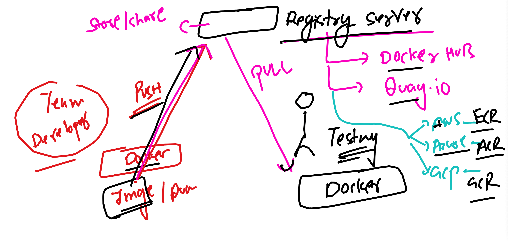
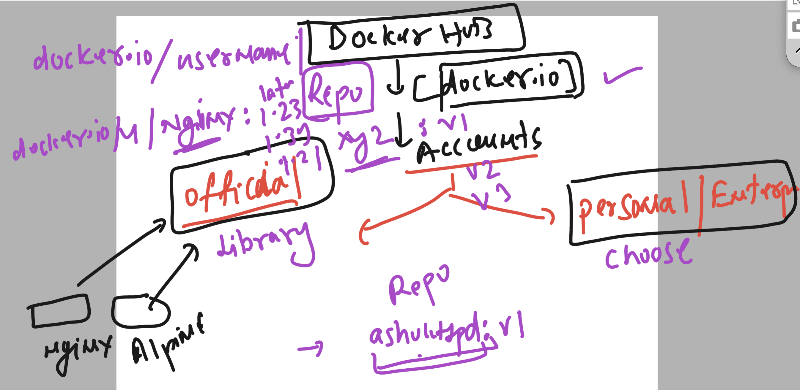
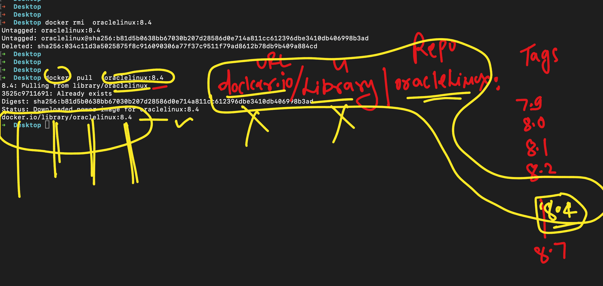

# devops_airtel

### Understanding image storage and sharing platform 



### Understanding image name format in docker hub 




### verify image name 



### pushing image to docker hub 

### image tag -- 

```
 docker   tag  ashupyimg:v1    docker.io/dockerashu/ashupythonapp:version1 
```

### login to docker hub from cli

```
 Desktop docker  login  
Log in with your Docker ID or email address to push and pull images from Docker Hub. If you don't have a Docker ID, head over to https://hub.docker.com/ to create one.
You can log in with your password or a Personal Access Token (PAT). Using a limited-scope PAT grants better security and is required for organizations using SSO. Learn more at https://docs.docker.com/go/access-tokens/

Username: dockerashu
Password: 
Login Succeeded

```

### pushimg image 

```
docker push  docker.io/dockerashu/ashupythonapp:version1
The push refers to repository [docker.io/dockerashu/ashupythonapp]
5f70bf18a086: Preparing 
71cd52a5a724: Pushing [==================================================>]   2.56kB
109a362298da: Preparing 
b09314aec293: Preparing 
```

### optional -- for safety 

```
docker logout 
Removing login credentials for https://index.docker.io/v1/
➜  Desktop 

```

## anyone can pull image 

```

➜  ~ docker pull   dockerashu/ashupythonapp:version1        

```

### 
