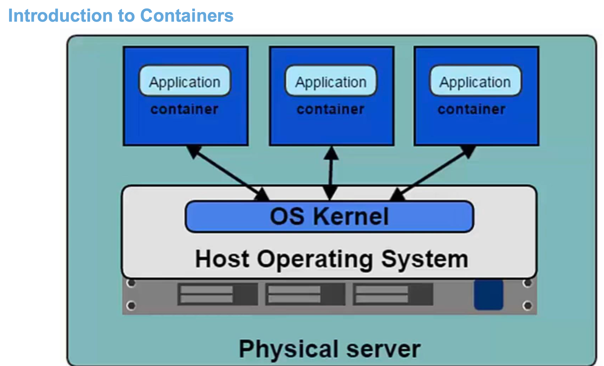
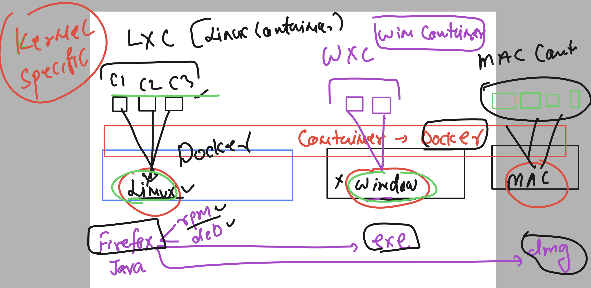
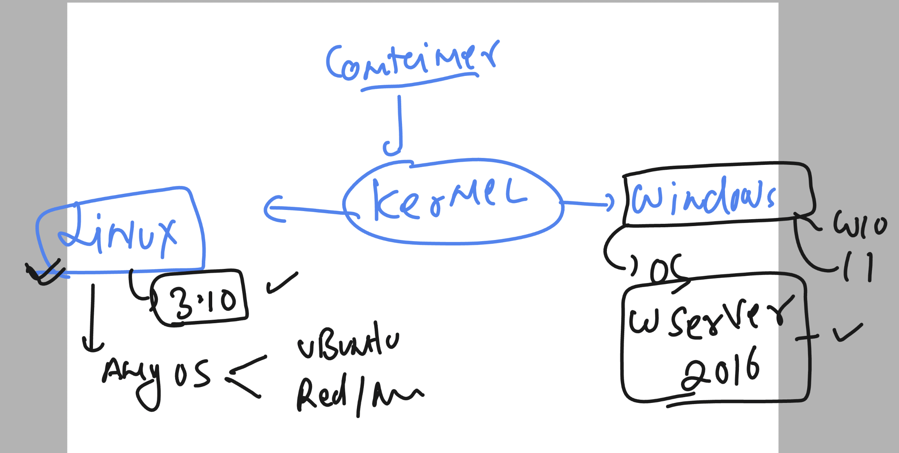
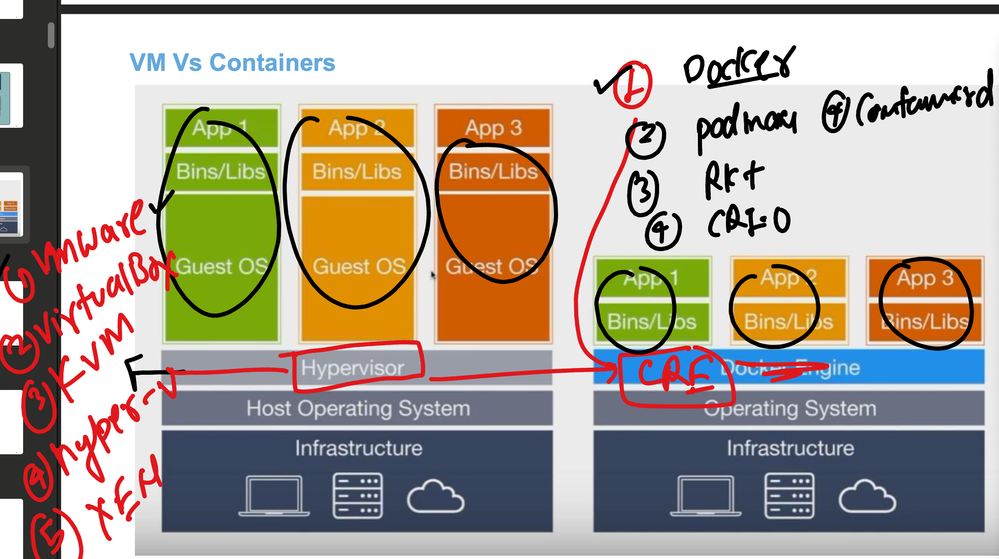
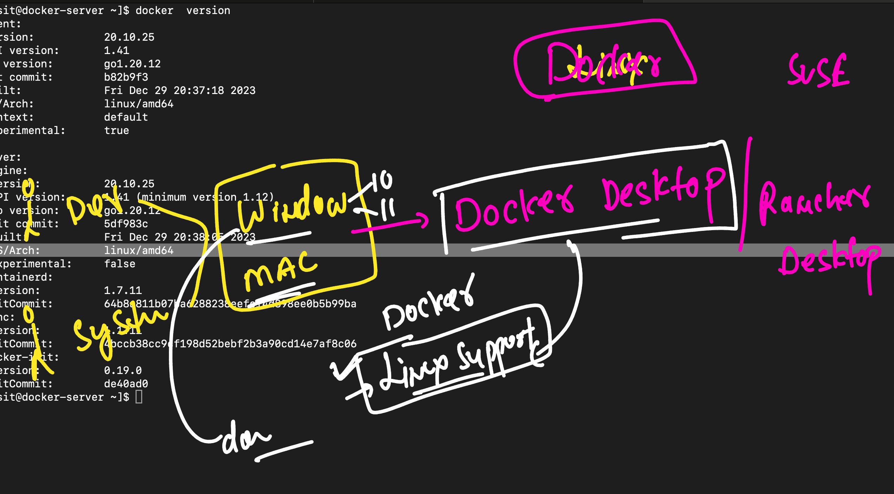

## COntainers 

### Containers are going to use Host OS kernel 



### Containers are kernel specific 



### supported kernel for containers 



### Container runtime options 



### Installing docker in amazon linux 2 

```
sudo yum install docker -y
```
### starting docker service 

```
sudo systemctl start docker
sudo systemctl enable docker 
```

### verify 

```
[root@docker-server ~]# docker  version 
Client:
 Version:           20.10.25
 API version:       1.41
 Go version:        go1.20.12
 Git commit:        b82b9f3
 Built:             Fri Dec 29 20:37:18 2023
 OS/Arch:           linux/amd64
 Context:           default
 Experimental:      true

Server:
 Engine:
  Version:          20.10.25
  API version:      1.41 (minimum version 1.12)
  Go version:       go1.20.12
  Git commit:       5df983c
  Built:            Fri Dec 29 20:38:05 2023
  OS/Arch:          linux/amd64
  Experimental:     false
 containerd:
  Version:          1.7.11
  GitCommit:        64b8a811b07ba6288238eefc14d898ee0b5b99ba
 runc:
  Version:          1.1.11
  GitCommit:        4bccb38cc9cf198d52bebf2b3a90cd14e7af8c06
 docker-init:
  Version:          0.19.0
  GitCommit:        de40ad0
[root@docker-server ~]# 

```

### -- by default only root user can access docker 

### try with non root user 

```
root@docker-server ~]# su - basit 
[basit@docker-server ~]$ 
[basit@docker-server ~]$ docker version 
Client:
 Version:           20.10.25
 API version:       1.41
 Go version:        go1.20.12
 Git commit:        b82b9f3
 Built:             Fri Dec 29 20:37:18 2023
 OS/Arch:           linux/amd64
 Context:           default
 Experimental:      true
Got permission denied while trying to connect to the Docker daemon socket at unix:///var/run/docker.sock: Get "http://%2Fvar%2Frun%2Fdocker.sock/v1.24/version": dial unix /var/run/docker.sock: connect: permission denied
[basit@docker-server ~]$ 


```

### fix -- allow non root user 

```
usermod -aG docker  basit 
```

### lets check again 

```
basit@docker-server ~]$ 
[basit@docker-server ~]$ docker  version 
Client:
 Version:           20.10.25
 API version:       1.41
 Go version:        go1.20.12
 Git commit:        b82b9f3
 Built:             Fri Dec 29 20:37:18 2023
 OS/Arch:           linux/amd64
 Context:           default
 Experimental:      true

Server:
 Engine:
  Version:          20.10.25
  API version:      1.41 (minimum version 1.12)
  Go version:       go1.20.12
  Git commit:       5df983c
  Built:            Fri Dec 29 20:38:05 2023
  OS/Arch:          linux/amd64
  Experimental:     false
 containerd:
  Version:          1.7.11
  GitCommit:        64b8a811b07ba6288238eefc14d898ee0b5b99ba
 runc:
  Version:          1.1.11
  GitCommit:        4bccb38cc9cf198d52bebf2b3a90cd14e7af8c06
 docker-init:
  Version:          0.19.0
  GitCommit:        de40ad0

```

### using docker or rancher desktop we can enable linux container in windows 10/11 or macbook 




