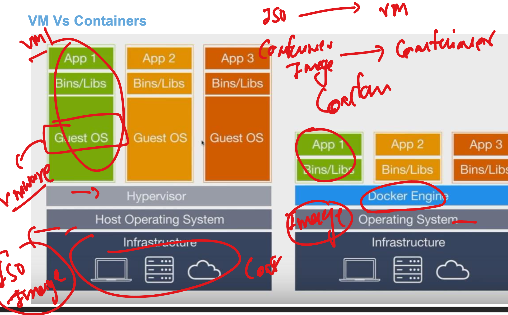
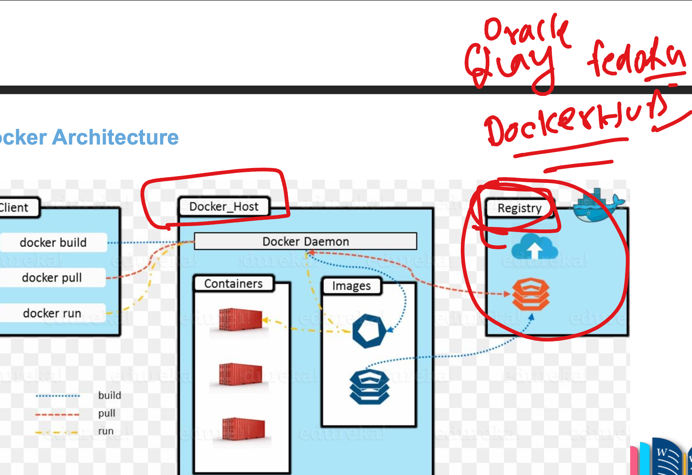
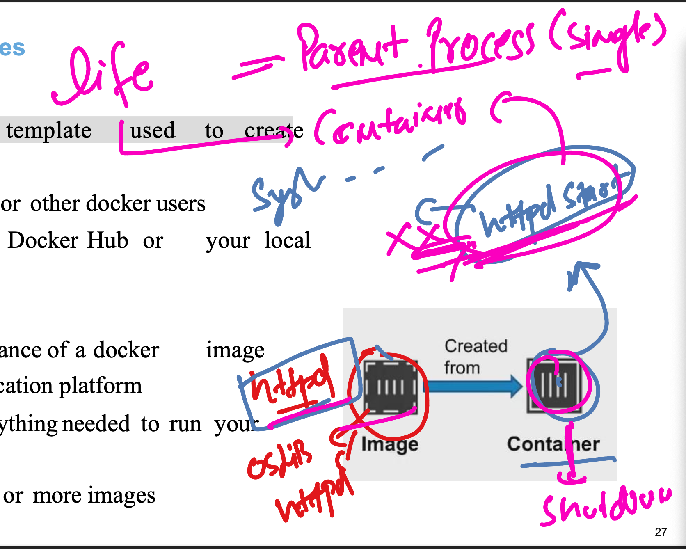
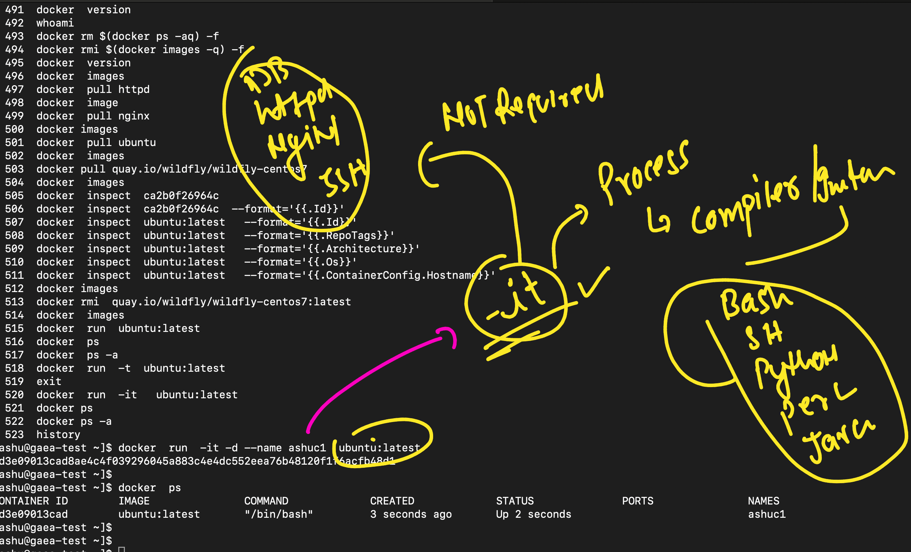

## VM vs container creation options 



### images of containers 



## docker basic commands 

### checking version 

```
[ashu@gaea-test ~]$ docker  version 
Client: Docker Engine - Community
 Version:           19.03.11-ol
 API version:       1.40
 Go version:        go1.16.2
 Git commit:        9bb540d
 Built:             Fri Jul 23 01:33:55 2021
 OS/Arch:           linux/amd64
 Experimental:      false

Server: Docker Engine - Community
 Engine:
  Version:          19.03.11-ol
  API version:      1.40 (minimum version 1.12)
  Go version:       go1.16.2
  Git commit:       9bb540d
  Built:            Fri Jul 23 01:32:08 2021
  OS/Arch:          linux/amd64
  Experimental:     false
  Default Registry: docker.io
 containerd:
  Version:          v1.4.8
  GitCommit:        7eba5930496d9bbe375fdf71603e610ad737d2b2
 runc:
  Version:          1.1.7
  GitCommit:        860f061
 docker-init:
  Version:          0.18.0
  GitCommit:        fec3683

```

### pulling images 

```
===>> checking

ashu@gaea-test ~]$ docker  images
REPOSITORY          TAG                 IMAGE ID            CREATED             SIZE
[ashu@gaea-test ~]$ 

===>> pulling

[ashu@gaea-test ~]$ docker  pull httpd 
Using default tag: latest
Trying to pull repository docker.io/library/httpd ... 
latest: Pulling from docker.io/library/httpd
8a1e25ce7c4f: Pull complete 
8b0a7c8478f8: Pull complete 
4f4fb700ef54: Pull complete 
7f8fb0a042e0: Pull complete 
91e4b2f2b52a: Pull complete 
c78cdbf9617d: Pull complete 
Digest: sha256:374766f5bc5977c9b72fdb8ae3ed05b7fc89060e7edc88fcbf142d6988e58eeb
Status: Downloaded newer image for httpd:latest
httpd:latest
[ashu@gaea-test ~]$ docker  images
REPOSITORY          TAG                 IMAGE ID            CREATED             SIZE
httpd               latest              ac45b24b92cc        2 months ago        167MB
[ashu@gaea-test ~]$ 


====>> pulling from quay.io
ashu@gaea-test ~]$ docker pull quay.io/wildfly/wildfly-centos7
Using default tag: latest
Trying to pull repository quay.io/wildfly/wildfly-centos7 ... 
latest: Pulling from quay.io/wildfly/wildfly-centos7
b2cc5146c9c7: Downloading [=>                                                 ]  2.161MB/75.87MB
782ee99b4ec9: Download complete

====>>

docker  images
REPOSITORY                        TAG                 IMAGE ID            CREATED             SIZE
ubuntu                            latest              ca2b0f26964c        3 weeks ago         77.9MB
nginx                             latest              92b11f67642b        4 weeks ago         187MB
httpd                             latest              ac45b24b92cc        2 months ago        167MB
quay.io/wildfly/wildfly-centos7   latest              a7030f13dfd1        14 months ago       1.35GB

```

### image checking internal structure info 

```
ashu@gaea-test ~]$ docker  inspect  ubuntu:latest   --format='{{.Id}}'
sha256:ca2b0f26964cf2e80ba3e084d5983dab293fdb87485dc6445f3f7bbfc89d7459
[ashu@gaea-test ~]$ 

===>
[ashu@gaea-test ~]$ docker  inspect  ubuntu:latest   --format='{{.RepoTags}}'
[ubuntu:latest]
[ashu@gaea-test ~]$ docker  inspect  ubuntu:latest   --format='{{.Architecture}}'
amd64
[ashu@gaea-test ~]$ docker  inspect  ubuntu:latest   --format='{{.Os}}'
linux

```

### removing images 

```
ashu@gaea-test ~]$ docker rmi  quay.io/wildfly/wildfly-centos7:latest
Untagged: quay.io/wildfly/wildfly-centos7:latest
Untagged: quay.io/wildfly/wildfly-centos7@sha256:841b2ddc68a925a9197cd5b4c061b2b579119a81ba8f74eecdde012733a460e5
Deleted: sha256:a7030f13dfd1fde2888957093d1be7877588901c404c9dde2e4ae6b531118455
Deleted: sha256:8e26d566fdf086ae81c00c3192321dee773cad07225023bf2090a94e559422e7
Deleted: sha256:763fe6ec38a1b5fd4505e71db69bcfa1211c
```

## Container ops 

### creating 




```
[ashu@gaea-test ~]$ docker  images
REPOSITORY          TAG                 IMAGE ID            CREATED             SIZE
ubuntu              latest              ca2b0f26964c        3 weeks ago         77.9MB
nginx               latest              92b11f67642b        4 weeks ago         187MB
httpd               latest              ac45b24b92cc        2 months ago        167MB
[ashu@gaea-test ~]$ 
[ashu@gaea-test ~]$ 
[ashu@gaea-test ~]$ docker  run  ubuntu:latest 
[ashu@gaea-test ~]$ docker  ps
CONTAINER ID        IMAGE               COMMAND             CREATED             STATUS              PORTS               NAMES
[ashu@gaea-test ~]$ 
[ashu@gaea-test ~]$ docker  ps -a
CONTAINER ID        IMAGE               COMMAND             CREATED             STATUS                      PORTS               NAMES
7bc9505b1ad4        ubuntu:latest       "/bin/bash"         15 seconds ago      Exited (0) 14 seconds ago                       peaceful_johnson
[ashu@gaea-test ~]$ 
[ashu@gaea-test ~]$ docker  run  -t  ubuntu:latest 
root@4909a1acddcb:/#         


ls
^C^C
root@4909a1acddcb:/# exit
^C^C
root@4909a1acddcb:/# ^C^C
root@4909a1acddcb:/# ^C^C
root@4909a1acddcb:/# 


^C^C
root@4909a1acddcb:/# 
exit
[ashu@gaea-test ~]$ 

[ashu@gaea-test ~]$ docker  run  -it   ubuntu:latest 
root@b9e72fd1f5c6:/# 
root@b9e72fd1f5c6:/# 
root@b9e72fd1f5c6:/# ls
bin  boot  dev  etc  home  lib  lib32  lib64  libx32  media  mnt  opt  proc  root  run  sbin  srv  sys  tmp  usr  var
root@b9e72fd1f5c6:/# whoami
root
root@b9e72fd1f5c6:/# cat  /etc/os-release 
PRETTY_NAME="Ubuntu 22.04.4 LTS"
NAME="Ubuntu"
VERSION_ID="22.04"
VERSION="22.04.4 LTS (Jammy Jellyfish)"
VERSION_CODENAME=jammy
ID=ubuntu
ID_LIKE=debian
HOME_URL="https://www.ubuntu.com/"
SUPPORT_URL="https://help.ubuntu.com/"
BUG_REPORT_URL="https://bugs.launchpad.net/ubuntu/"
PRIVACY_POLICY_URL="https://www.ubuntu.com/legal/terms-and-policies/privacy-policy"
UBUNTU_CODENAME=jammy
root@b9e72fd1f5c6:/# exit
exit
[ashu@gaea-test ~]$ docker ps
CONTAINER ID        IMAGE               COMMAND             CREATED             STATUS              PORTS               NAMES
[ashu@gaea-test ~]$ docker ps -a
CONTAINER ID        IMAGE               COMMAND             CREATED             STATUS                        PORTS               NAMES
b9e72fd1f5c6        ubuntu:latest       "/bin/bash"         23 seconds ago      Exited (0) 6 seconds ago                          elegant_greider
4909a1acddcb        ubuntu:latest       "/bin/bash"         2 minutes ago       Exited (137) 46 seconds ago                       relaxed_blackburn
7bc9505b1ad4        ubuntu:latest       "/bin/bash"         3 minutes ago       Exited (0) 3 minutes ago                          peaceful_johnson
[ashu@gaea-test ~]$ 


```

### best way to create container from image

```
[ashu@gaea-test ~]$ docker  run  -it -d --name ashuc1  ubuntu:latest 
3d3e09013cad8ae4c4f039296045a883c4e4dc552eea76b48120f1f6acfb48d1
[ashu@gaea-test ~]$ 
[ashu@gaea-test ~]$ docker  ps
CONTAINER ID        IMAGE               COMMAND             CREATED             STATUS              PORTS               NAMES
3d3e09013cad        ubuntu:latest       "/bin/bash"         3 seconds ago       Up 2 seconds                            ashuc1
[ashu@gaea-test ~]$ 

```

### need of -it in container creation option 



### replacing default process of container while creating 

```
ashu@gaea-test ~]$ docker run -dit --name ashuc3  ubuntu  sleep 50 
3f92ea5c5b31e4951253556337e38c365add88304744ca46e2ed3e6ba4d7561c
[ashu@gaea-test ~]$ docker  ps
CONTAINER ID        IMAGE               COMMAND             CREATED             STATUS              PORTS               NAMES
3f92ea5c5b31        ubuntu              "sleep 50"          2 seconds ago       Up 1 second                             ashuc3
766b60ff495c        ubuntu              "/bin/bash"         40 seconds ago      Up 39 seconds                           ashuc2
3d3e09013cad        ubuntu:latest       "/bin/bash"         4 minutes ago       Up 4 minutes                            ashuc1
[ashu@gaea-test ~]$ 
[ashu@gaea-test ~]$ 

```

### common error 

```
[ashu@gaea-test ~]$ docker run -itd --name ashuc4  ubuntu  cal 
8af33c496eae6e50d4c2347c9254670ef7c801282206a3319c49b5b8166be44f
docker: Error response from daemon: OCI runtime create failed: runc create failed: unable to start container process: exec: "cal": executable file not found in $PATH: unknown.
[ashu@gaea-test ~]$ docker  ps -a
CONTAINER ID        IMAGE               COMMAND             CREATED              STATUS                       PORTS               NAMES
8af33c496eae        ubuntu             
```

### removing non running containers 

```
[ashu@gaea-test ~]$ docker  rm peaceful_johnson
peaceful_johnson
[ashu@gaea-test ~]$ docker  rm relaxed_blackburn  elegant_greider  ashuc4 
relaxed_blackburn
elegant_greider
ashuc4
[ashu@gaea-test ~]$ docker ps -a
CONTAINER ID        IMAGE               COMMAND             CREATED             STATUS                     PORTS               NAMES
3f92ea5c5b31        ubuntu              "sleep 50"          3 minutes ago       Exited (0) 2 minutes ago                       ashuc3
766b60ff495c        ubuntu              "/bin/bash"         3 minutes ago       Up 3 minutes                                   ashuc2
3d3e09013cad        ubuntu:latest       "/bin/bash"         7 minutes ago       Up 7 minutes                                   ashuc1
[ashu@gaea-test ~]$ 


```
