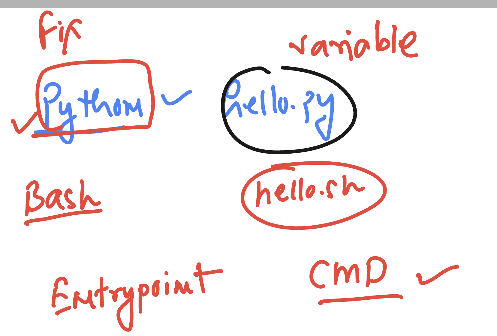

### Alpine linux -- package manager 

### apk is the package manager

### dockerfile 

```
FROM alpine 
# pulling python image from docker hub 
LABEL name="ashutoshh"
LABEL email="ashutoshh@linux.com"
# image creator info -- optional 
RUN apk add python3 
RUN mkdir  /opt/pycodes/ 
# to run any command whatever required we use RUN 
COPY hello.py  /opt/pycodes/ 
# from docker server copy code to new image while building 
CMD ["python3","/opt/pycodes/hello.py"]
# to set default process while creating container 
# it can be replaced by container created while creating container 
```

### how to build it 

```
[test@docker-server normal_code]$ docker build  -t ashualpine:python3  -f alpine.dockerfile  . 
Sending build context to Docker daemon  4.096kB
Step 1/7 : FROM alpine
 ---> 05455a08881e
Step 2/7 : LABEL name="ashutoshh"
 ---> Running in d9ee219c7554
Removing intermediate container d9ee219c7554
 ---> a3ff8cd5ae5a
Step 3/7 : LABEL email="ashutoshh@linux.com"
 ---> Running in 4d44f1604f03
[test@docker-server normal_code]$ 
[test@docker-server normal_code]$

===>>
[test@docker-server normal_code]$ docker  run -itd --name t1 ashualpine:python3 
d45daa004f1b582e8a5429b982a8e3d69f9983b5d49817c2f097a765ae53e3bd
[test@docker-server normal_code]$ docker  ps
CONTAINER ID   IMAGE                COMMAND                  CREATED         STATUS         PORTS     NAMES
d45daa004f1b   ashualpine:python3   "python3 /opt/pycode…"   2 seconds ago   Up 1 second              t1
0a8a28991c6e   alpine               "/bin/sh"                9 days ago      Up 6 minutes             ashuc4

-====>>

[test@docker-server normal_code]$ docker  logs t1 
Hello airtel
Hello docker , we are in progress 
_________________
_________________
_________________
Hello airtel
Hello docker , we are in progress 
```

## More about Dockerfile 

### COPY with *

```
FROM alpine 
# pulling python image from docker hub 
LABEL name="ashutoshh"
LABEL email="ashutoshh@linux.com"
# image creator info -- optional 
RUN apk add python3 
RUN mkdir  /opt/pycodes/ 
# to run any command whatever required we use RUN 
COPY *.py  /opt/pycodes/ 
# from docker server copy code to new image while building 
CMD ["python3","/opt/pycodes/hello.py"]
# to set default process while creating container 
# it can be replaced by docker engineer  while creating container 
```

### we can replace argument during container creation time 

```
9  docker  run -itd --name t2 ashualpine:python3new 
  100  docker ps
  101  docker  run -itd --name t3 ashualpine:python3new  python3 /opt/pycodes/ashu.py 
  102  docker  ps
```

### CMD vs entrypoint 

```
FROM alpine 
# pulling python image from docker hub 
LABEL name="ashutoshh"
LABEL email="ashutoshh@linux.com"
# image creator info -- optional 
RUN apk add python3 
RUN mkdir  /opt/pycodes/ 
# to run any command whatever required we use RUN 
COPY *.py  /opt/pycodes/ 
# from docker server copy code to new image while building 
#CMD ["python3","/opt/pycodes/hello.py"]
# to set default process while creating container 
# it can be replaced by docker engineer  while creating container 
ENTRYPOINT [ "python3" , "/opt/pycodes/hello.py" ]
# cmd and entrypoint are same but we can't replace entrypoint while creating container
```

### using cmd and entrypoint all together 



### Dockerfile

```
FROM alpine 
# pulling python image from docker hub 
LABEL name="ashutoshh"
LABEL email="ashutoshh@linux.com"
# image creator info -- optional 
RUN apk add python3 
RUN mkdir  /opt/pycodes/ 
# to run any command whatever required we use RUN 
COPY *.py  /opt/pycodes/ 
# from docker server copy code to new image while building 
#CMD ["python3","/opt/pycodes/hello.py"]
# to set default process while creating container 
# it can be replaced by docker engineer  while creating container 
ENTRYPOINT [ "python3" ]
CMD ["/opt/pycodes/hello.py"]
# cmd and entrypoint are same but we can't replace entrypoint while creating container
```

## we can only replace code not python3 interprator 

```
test@docker-server normal_code]$ docker  run -itd --name t7  ashualpine:python3entrypointcmd  /opt/pycodes/ashu.py 
0bfd4302c0d40e04c10712ad05cce5fd6777582a46ae996d486065495d6cb57f
[test@docker-server normal_code]$ docker logs  t7
Hello ashu
Hello docker , we are in progress 
_________________
_________________
_________________
Hello ashu
Hello docker , we are in progress 
_________________
_________________
_________________
Hello ashu
```

### using workdir also to change pwd

```
FROM alpine 
# pulling python image from docker hub 
LABEL name="ashutoshh"
LABEL email="ashutoshh@linux.com"
# image creator info -- optional 
RUN apk add python3 
RUN mkdir  /opt/pycodes/ 
# to run any command whatever required we use RUN 
COPY *.py  /opt/pycodes/ 
# from docker server copy code to new image while building 
#CMD ["python3","/opt/pycodes/hello.py"]
# to set default process while creating container 
# it can be replaced by docker engineer  while creating container 
WORKDIR /opt/pycodes/ 
# this will work like cd command means final image will have pwd as /opt/pycodes
ENTRYPOINT [ "python3" ]
CMD ["/opt/pycodes/hello.py"]
# cmd and entrypoint are same but we can't replace entrypoint while creating container
```

### build and test 

```
[test@docker-server normal_code]$ docker build  -t ashualpine:python3b1     -f alpine.dockerfile  . 
Sending build context to Docker daemon  5.632kB
Step 1/9 : FROM alpine
 ---> 05455a08881e
Step 2/9 : LABEL name="ashutoshh"
 ---> Using cache
 ---> a3ff8cd5ae5a
Step 3/9 : LABEL email="ashutoshh@linux.com"
 ---> Using cache
 ---> 5f5fdc75324e
Step 4/9 : RUN apk add python3
 ---> Using cache
 ---> d10b581853a5
Step 5/9 : RUN mkdir  /opt/pycodes/
 ---> Using cache
 ---> ec473cfe325c
Step 6/9 : COPY *.py  /opt/pycodes/
 ---> Using cache
[test@docker-server normal_code]$ 
[test@docker-server normal_code]$

[test@docker-server normal_code]$ docker  run -itd --name t7  ashualpine:python3b1  
aa1f196e4be3bd2f3de4dff7d690338b3ed1c7fc5e12d7c0617bc08512070bfa
[test@docker-server normal_code]$ docker  run -itd --name t8  ashualpine:python3b1  ashu.py 
fd6a9f5fe8e542b9ef8427bac39a1317a137b33e47fb5a3f0286be1fefb42324

[test@docker-server normal_code]$ docker logs t8
Hello ashu
Hello docker , we are in progress 
_________________
_________________
_________________
Hello ashu


[test@docker-server normal_code]$ docker logs t7
Hello airtel
Hello docker , we are in progress 
_________________
_________________
_________________
Hello airtel
Hello docker , we are in progress 
_________________
_________________
_________________
Hello airtel
Hello docker , we are in progress 
_________________
_________________
_________________
Hello airtel
Hello docker , we are in progress 
_________________
_________________
_________________
Hello airtel
Hello docker , we are in progress 
_________________
_________________
_________________
Hello airtel
Hello docker , we are in progress 
_________________
_________________
_________________
Hello airtel
Hello docker , we are in progress 
_________________
_________________
_________________
Hello airtel
Hello docker , we are in progress 
_________________
_________________
_________________
Hello airtel
Hello docker , we are in progress 
_________________
_________________
_________________
Hello airtel
Hello docker , we are in progress 
_________________
_________________
_________________
Hello airtel
Hello docker , we are in progress 
_________________
_________________
_________________
Hello airtel
Hello docker , we are in progress 
_________________
```
