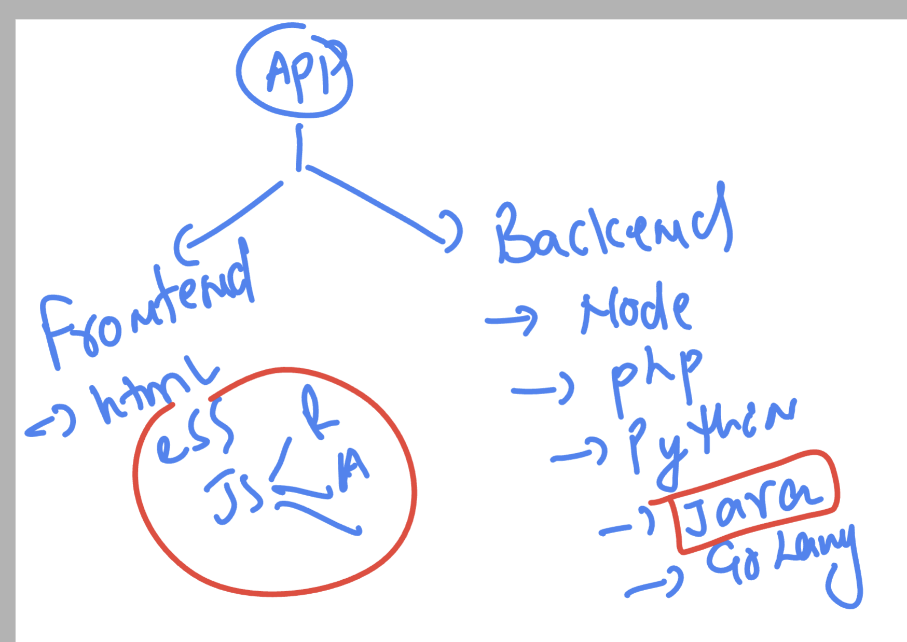
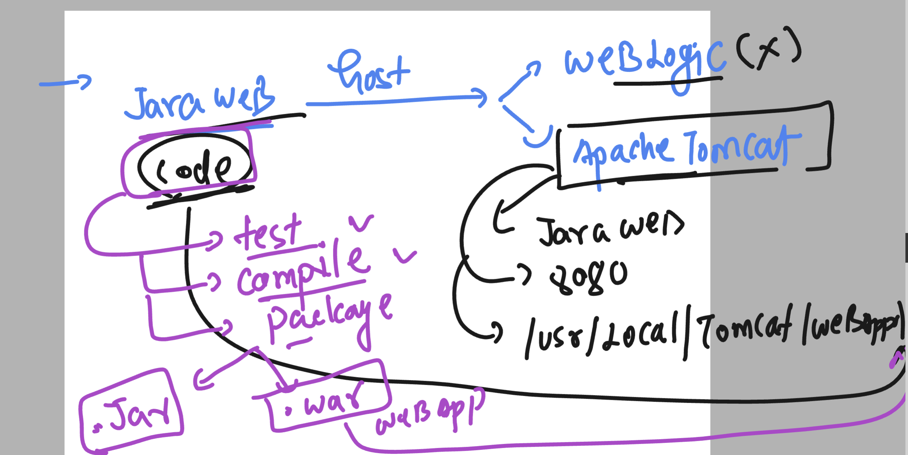
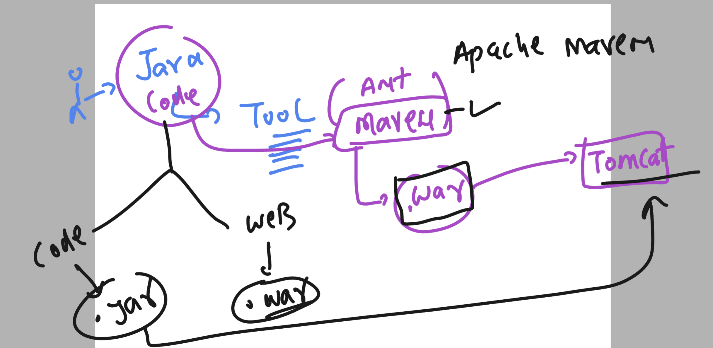
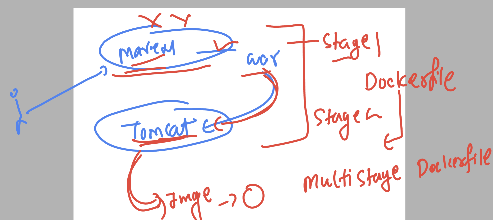

# devops_airtel

### building docker image for webapps

```
 day8 git:(master) ✗ ls
Dockerfile       README.md        hello.html       nginx.dockerfile
➜  day8 git:(master) ✗ docker build -t nginx:ashuv1 -f  nginx.dockerfile . 
[+] Building 0.1s (7/7) FINISHED                                                                                                              docker:rancher-desktop
 => [internal] load .dockerignore                                                                                                                               0.0s
 => => transferring context: 2B                                                                                                                                 0.0s
 => [internal] load build definition from nginx.dockerfile                                                                                                      0.0s
 => => transferring dockerfile: 146B                                                                                                                            0.0s
 => [internal] load metadata for docker.io/library/nginx:latest                                                                                                 0.0s
 => [internal] load build context                                                                                                                               0.0s
 => => transferring context: 32B                                                                                                                                0.0s
 => CACHED [1/2] FROM docker.io/library/nginx                                                                                                                   0.0s
 => [2/2] COPY hello.html /usr/share/nginx/html/index.html                                                                                                      0.0s
 => exporting to image                                                                                                                                          0.0s
 => => exporting layers                                                                                                                                         0.0s
 => => writing image sha256:48d667fd5d85c966e82cc357465d6a609d333de8df4d74c3334cd142e732f243                                                                    0.0s
 => => naming to docker.io/library/nginx:ashuv1                                                                                                                 0.0s
➜  day8 git:(master) ✗ docker images | grep http
ashuhttpd                                           v1          d621c5d49ed4   3 minutes ago   602MB
➜  day8 git:(master) ✗ docker images | grep ngi 
nginx                                               ashuv1      48d667fd5d85   10 seconds ago   192MB
nginx                                               latest      070027a3cbe0   7 weeks ago      192MB
ap-mumbai-1.ocir.io/bmfqoyqvmham/trainingapp        nginxamd    6508bd2e8ab4   2 months ago     190MB
➜  day8 git:(master) ✗ 


```
### understanding webapps 



## Java based webapps 


### process to deploy java webapp 



### taking source code from git of java spring webapp

```
 git clone https://github.com/redashu/java-springboot.git
```

## multi stage dockerfile 



