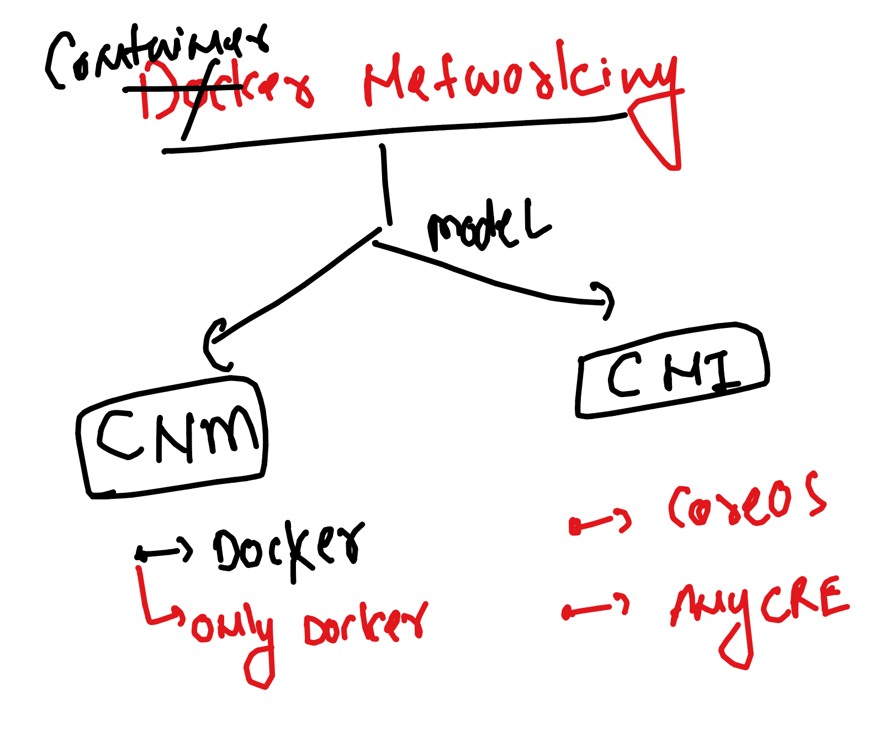
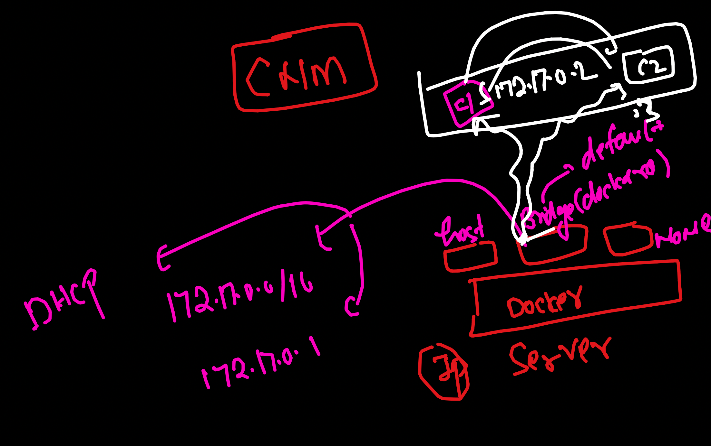
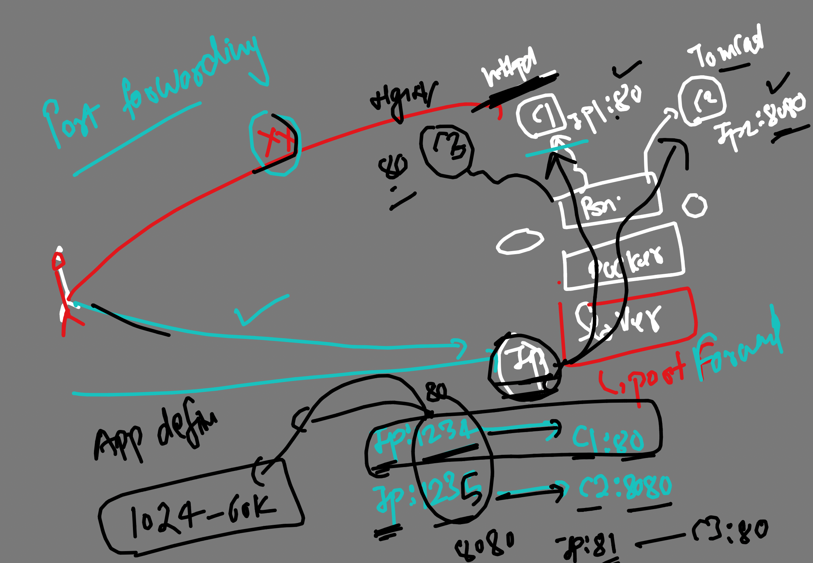
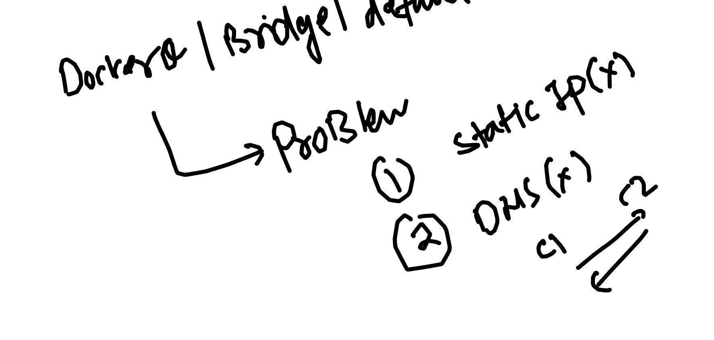
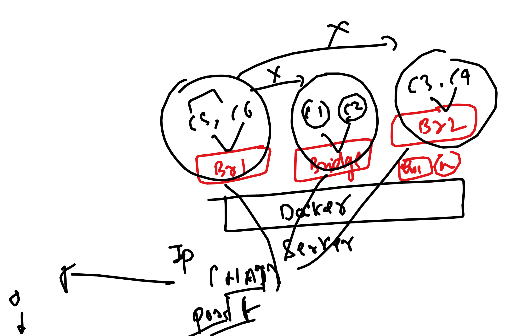

# devops_airtel
### Example of java spring boot app using multistage dockerfile

## Dockerfile 

```
FROM maven AS javaBuilder
LABEL name="ashutoshh"
WORKDIR /mycode 
COPY java-springboot .
RUN mvn install 
# above step will compile  , test code and release war file in target folder

FROM tomcat 
LABEL email="ashutoshh@linux.com"
COPY --from=javaBuilder /mycode/target/*.war /usr/local/tomcat/webapps/
```

### building image and creating contaienr 

```
day9 git:(master) ✗ ls
Dockerfile      README.md       java-springboot
➜  day9 git:(master) ✗ docker build -t javawebapp:tomcatv1 . 

====>>
 docker run -d --name cc11 -p 1234:8080  javawebapp:tomcatv1 
23180add4f1d4d37a83a0da8a289cf055810c3119abaa30a6b4732a858137674
➜  day9 git:(master) ✗ docker ps
CONTAINER ID   IMAGE                 COMMAND             CREATED         STATUS         PORTS                                       NAMES
23180add4f1d   javawebapp:tomcatv1   "catalina.sh run"   3 seconds ago   Up 2 seconds   0.0.0.0:1234->8080/tcp, :::1234->8080/tcp   cc11

```

### now you access using hostip:1234/WebApp

## Container netowrking models 



### Default container networking things 



### checking default bridges 

```
 upgrades docker  network  ls
NETWORK ID     NAME      DRIVER    SCOPE
b9b5a7abae3a   bridge    bridge    local
185a0f66b49a   host      host      local
30987d39b1c7   none      null      local
```
### inspecting bridge 

```
docker  network inspect  b9b5a7abae3a
[
    {
        "Name": "bridge",
        "Id": "b9b5a7abae3a5555fdd53c4dd216d11386bdf53fd6aa3958b1aadf24ab5e1a52",
        "Created": "2024-03-20T10:13:23.53124405Z",
        "Scope": "local",
        "Driver": "bridge",
        "EnableIPv6": false,
        "IPAM": {
            "Driver": "default",
            "Options": null,
            "Config": [
                {
                    "Subnet": "172.17.0.0/16",
                    "Gateway": "172.17.0.1"
                }
            ]
        },
        "Internal": false,
        "Attachable": false,
        "Ingress": false,
        "ConfigFrom": {
            "Network": ""
        },
        "ConfigOnly": false,
        "Containers": {},

```

### creating contaienr and checking 

```
 docker run -itd --name c2 alpine     
c718948660a72707ecb07a4df1f3d1fbc8db79874880d757fcb48f7ecf245012
➜  upgrades docker  network inspect  b9b5a7abae3a
[
    {
        "Name": "bridge",
        "Id": "b9b5a7abae3a5555fdd53c4dd216d11386bdf53fd6aa3958b1aadf24ab5e1a52",
        "Created": "2024-03-20T10:13:23.53124405Z",
        "Scope": "local",
        "Driver": "bridge",
        "EnableIPv6": false,
        "IPAM": {
            "Driver": "default",
            "Options": null,
            "Config": [
                {
                    "Subnet": "172.17.0.0/16",
                    "Gateway": "172.17.0.1"
                }
            ]
        },
        "Internal": false,
        "Attachable": false,
        "Ingress": false,
        "ConfigFrom": {
            "Network": ""
        },
        "ConfigOnly": false,
        "Containers": {
            "c718948660a72707ecb07a4df1f3d1fbc8db79874880d757fcb48f7ecf245012": {
                "Name": "c2",
                "EndpointID": "1f3f5be691a4e7eea31737294288b606b5efc9114b68706329526177f440c9fa",
                "MacAddress": "02:42:ac:11:00:03",
                "IPv4Address": "172.17.0.3/16",
                "IPv6Address": ""
            },
            "d1459ba2bd76ea8ccfff99518cb1daee3fe115d4470622085dea5632fd7124e5": {
                "Name": "c1",
                "EndpointID": "869fc90a14aa5d2a29436f02172dbc04863afbc8bbcbbe1c7fe40fe74cfa46b6",
                "MacAddress": "02:42:ac:11:00:02",
                "IPv4Address": "172.17.0.2/16",
                "IPv6Address": ""

```

### contaienrs in same bridge can connect to each other

```
 upgrades docker  exec -it c1 sh 
/ # ifconfig 
eth0      Link encap:Ethernet  HWaddr 02:42:AC:11:00:02  
          inet addr:172.17.0.2  Bcast:172.17.255.255  Mask:255.255.0.0
          UP BROADCAST RUNNING MULTICAST  MTU:1500  Metric:1
          RX packets:11 errors:0 dropped:0 overruns:0 frame:0
          TX packets:0 errors:0 dropped:0 overruns:0 carrier:0
          collisions:0 txqueuelen:0 
          RX bytes:946 (946.0 B)  TX bytes:0 (0.0 B)

lo        Link encap:Local Loopback  
          inet addr:127.0.0.1  Mask:255.0.0.0
          UP LOOPBACK RUNNING  MTU:65536  Metric:1
          RX packets:0 errors:0 dropped:0 overruns:0 frame:0
          TX packets:0 errors:0 dropped:0 overruns:0 carrier:0
          collisions:0 txqueuelen:1000 
          RX bytes:0 (0.0 B)  TX bytes:0 (0.0 B)

/ # ping  172.17.0.3
PING 172.17.0.3 (172.17.0.3): 56 data bytes
64 bytes from 172.17.0.3: seq=0 ttl=64 time=3.736 ms
64 bytes from 172.17.0.3: seq=1 ttl=64 time=0.199 ms
^C
--- 172.17.0.3 ping statistics ---
2 packets transmitted, 2 packets received, 0% packet loss
round-trip min/avg/max = 0.199/1.967/3.736 ms
/ # exit

```

## Understanding NAT 


## portforwarding 



### example 

```
 docker run -d --name c222  -p  1236:80 -p 1235:81   nginx 
44b95bbe418e2cd8d95585dcb28761c892f61e4a57b052820eee42e6fb5b87f6
```

### container with no networking 

```
 upgrades docker run -itd --name c9  --network none  alpine 
7cfa91073998012d13c28c6cc519fc48bfe7472c2e5d45068fef0c1e2e1fce28
➜  upgrades 
➜  upgrades docker  exec -it c9 sh 
/ # ifconfig 
lo        Link encap:Local Loopback  
          inet addr:127.0.0.1  Mask:255.0.0.0
          UP LOOPBACK RUNNING  MTU:65536  Metric:1
          RX packets:0 errors:0 dropped:0 overruns:0 frame:0
          TX packets:0 errors:0 dropped:0 overruns:0 carrier:0
          collisions:0 txqueuelen:1000 
          RX bytes:0 (0.0 B)  TX bytes:0 (0.0 B)

/ # ping 172.17.0.1
PING 172.17.0.1 (172.17.0.1): 56 data bytes
ping: sendto: Network unreachable
/ # ping 8.8.8.8
PING 8.8.8.8 (8.8.8.8): 56 data bytes
ping: sendto: Network unreachable
/ # 

```

### alternative

```
 docker run -itd --name c91  --net none  alpine 
57d1e96f78219c1b263cf9180f6b0820cbb9c65e4cfd48bca9e58b09a91589d3
```

## problem with default docker network bridge



### we can create custom bridge 

```
upgrades docker network  create  ashubr1 
0f69335a44b999028b7087ec84e09c9a595830f61ef140a52b2bc546e5bb7638
➜  upgrades docker  network ls
NETWORK ID     NAME      DRIVER    SCOPE
0f69335a44b9   ashubr1   bridge    local
b9b5a7abae3a   bridge    bridge    local
185a0f66b49a   host      host      local
30987d39b1c7   none      null      local

```
### with custom subnet 

```
docker network  create  ashubr2 --subnet  10.0.0.0/8 
c72cfa62054342606e3c6eb9cb3d001bad5ac00bd8dcf8a091245739595c1120
➜  upgrades docker network ls
NETWORK ID     NAME      DRIVER    SCOPE
0f69335a44b9   ashubr1   bridge    local
c72cfa620543   ashubr2   bridge    local
b9b5a7abae3a   bridge    bridge    local
185a0f66b49a   host      host      local
30987d39b1c7   none      null      local
➜  upgrades docker  network inspect  ashubr2                     
[
    {
        "Name": "ashubr2",
        "Id": "c72cfa62054342606e3c6eb9cb3d001bad5ac00bd8dcf8a091245739595c1120",
        "Created": "2024-04-09T04:34:47.66820585Z",
        "Scope": "local",
        "Driver": "bridge",
        "EnableIPv6": false,
        "IPAM": {
            "Driver": "default",
            "Options": {},
            "Config": [
                {
                    "Subnet": "10.0.0.0/8"
                }
            ]

```

## testing communication 

```
 upgrades docker run -itd --name c3 --net  ashubr1 alpine 
6cf28df491ec08b8c80431c5b1bd8e46d91570eedfe24eddb676b82f49912dae
➜  upgrades docker run -itd --name c4 --net  ashubr1 alpine 
1c8577cc778e6034c03f6bdc9f329fb735540ebb48c58583af9e36d545f31b45
➜  upgrades 
➜  upgrades docker  exec -it c3 sh 
/ # ping c4
PING c4 (192.168.48.3): 56 data bytes
64 bytes from 192.168.48.3: seq=0 ttl=64 time=1.494 ms
64 bytes from 192.168.48.3: seq=1 ttl=64 time=0.414 ms
^C
--- c4 ping statistics ---
2 packets transmitted, 2 packets received, 0% packet loss
round-trip min/avg/max = 0.414/0.954/1.494 ms
/ # 

```

## final docker networking understanding 




