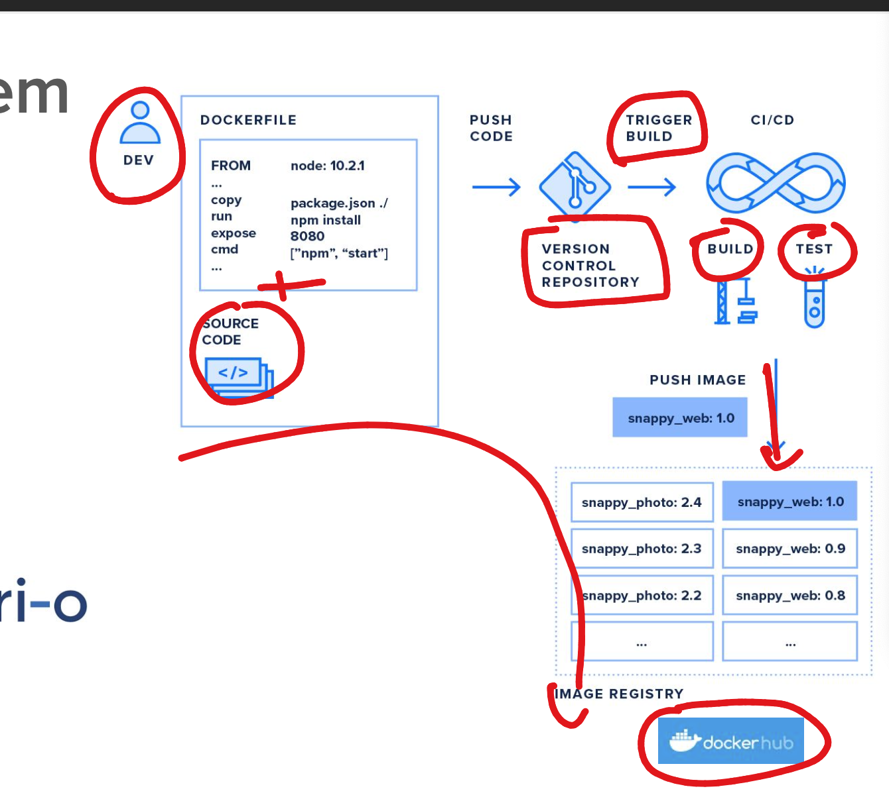
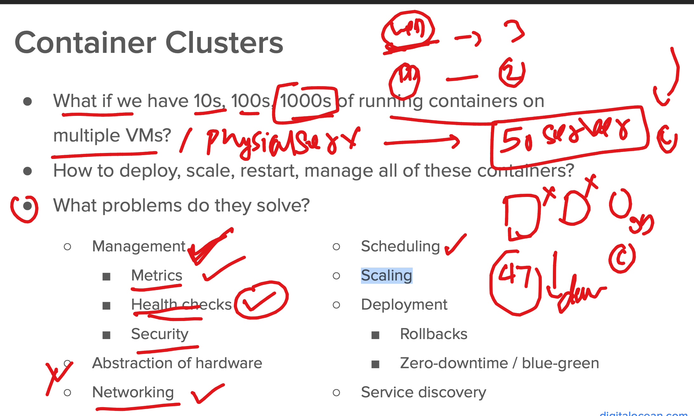
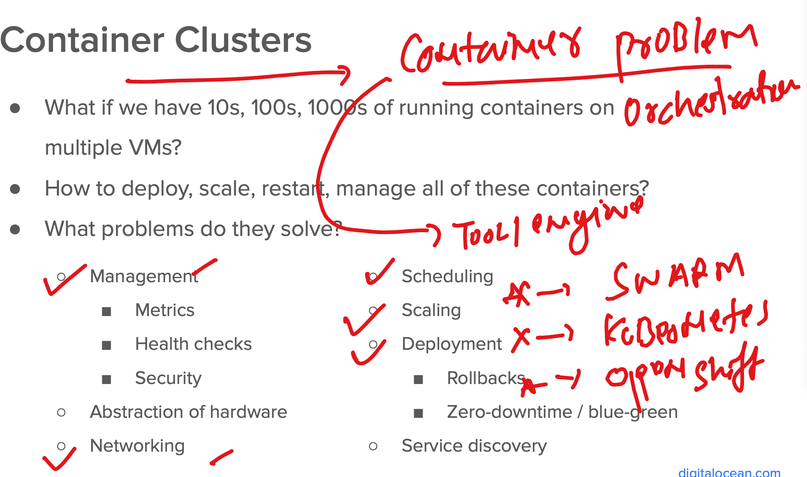
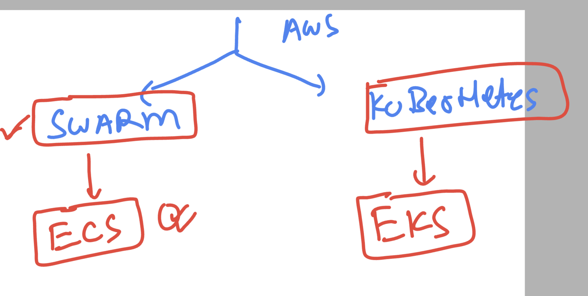
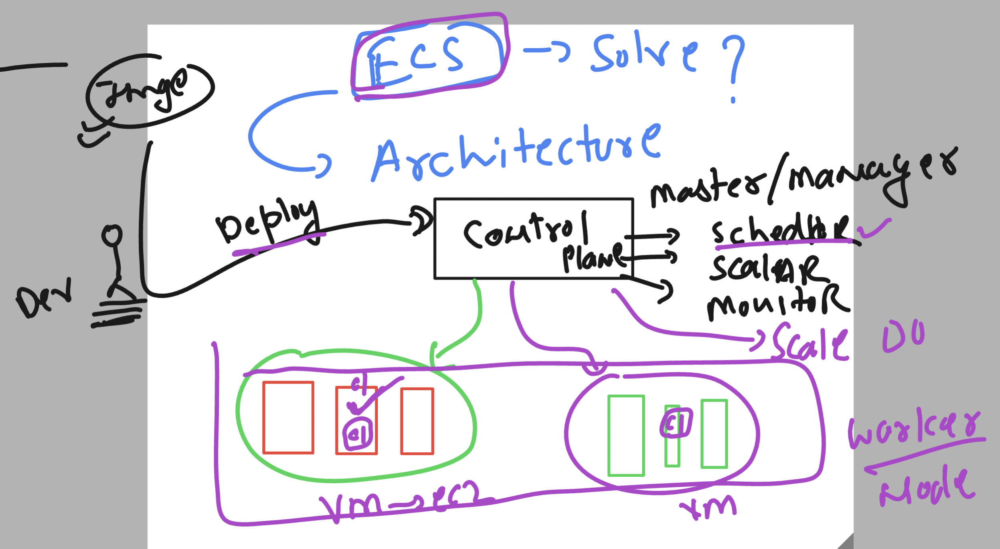
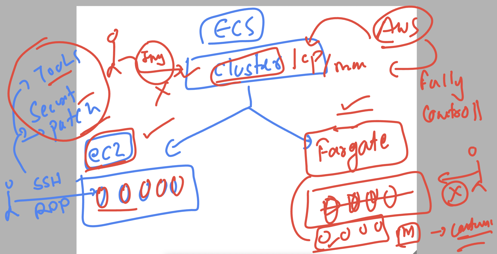

# devops_airtel -- Day1

### How app containerization is happening at CI level

### Problem with multi server and containers 

### Introduction to Container orchestration engine to solve problem 

## AWS services for container orchestration 

## ECS architecture

### ECS has 2 launch type vm -- EC2 & fargate 

