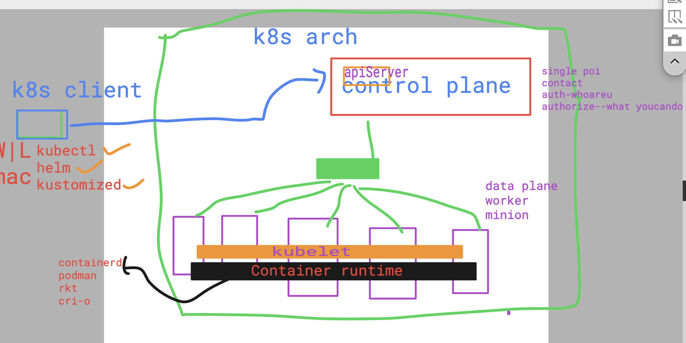

# devops_airtel

### Introduction to Kubernetes (k8s)

## Architecture 

### components of control plane  / master

### apiServer in master 

## TO setup K8s in local machine 

[click_to_watch](https://www.youtube.com/watch?v=MwwF-dWtEAk&t=13s)

## we can setup K8s on vm using kubeadm 

