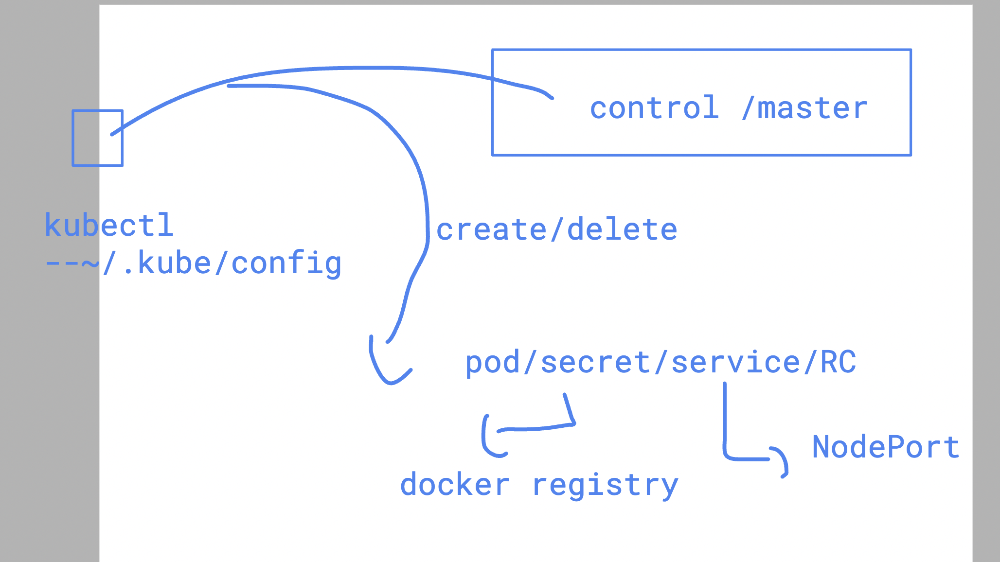
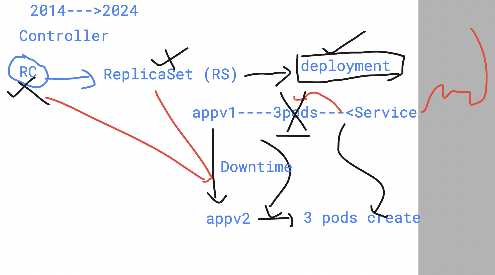

# devops_airtel

### Revision 



## Introduction to deployment controller 



### checking apiVersion and their resources 

```
kubectl  api-resources 
NAME                              SHORTNAMES   APIVERSION                        NAMESPACED   KIND
bindings                                       v1                                true         Binding
componentstatuses                 cs           v1                                false        ComponentStatus
configmaps                        cm           v1                                true         ConfigMap
endpoints                         ep           v1                                true         Endpoints
events                            ev           v1                                true         Event
limitranges                       limits       v1                                true         LimitRange
namespaces                        ns           v1                                false        Namespace

```

### Creating pod using deployment 

```
3814  kubectl create deployment  ashu-deploy --image=nginx --port 80  --dry-run=client -o yaml  >d.yml
 3815  kubectl create -f d.yml
 3816  kubectl  get deployment 
 3817  kubectl  get po
 3818  kubectl delete  pod  ashu-deploy-676d64ddbf-lggdn 
 3819  kubectl  get po
 3820  kubectl  expose  deployment ashu-deploy --type NodePort --port 80 --name lb1 
 3821  kubectl get svc
 3822  kubectl get  ep
```

### access pod and change page data

```
kubectl exec -it ashu-deploy-676d64ddbf-gcx2j --  bash 
root@ashu-deploy-676d64ddbf-gcx2j:/# 
root@ashu-deploy-676d64ddbf-gcx2j:/# cd /usr/share/nginx/html/
root@ashu-deploy-676d64ddbf-gcx2j:/usr/share/nginx/html# ls
50x.html  index.html
root@ashu-deploy-676d64ddbf-gcx2j:/usr/share/nginx/html# echo hello guys  >index.html 
root@ashu-deploy-676d64ddbf-gcx2j:/usr/share/nginx/html# 
exit
 humanfirmware@darwin  ~/devops_airtel/k8s   master  

```