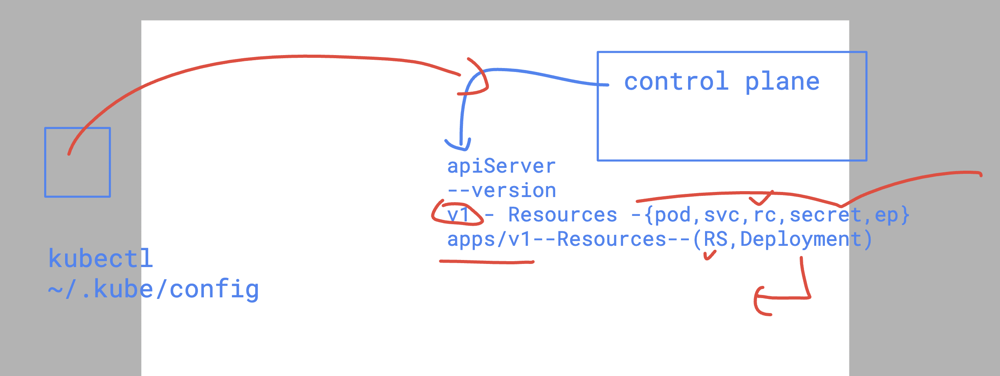

# devops_airtel

### API resources in Kubernetes 



### Revision of deployment controller 


## deployment webapp using deployment controller 

```
kubectl  create  deployment ashuapp --image=nginx --port 80 --replicas=2 --dry-run=client -o yaml >dep.yml
kubectl apply -f dep.yml 
deployment.apps/ashuapp created

===>> verify 
kubectl  get  deploy
NAME      READY   UP-TO-DATE   AVAILABLE   AGE
ashuapp   2/2     2            2           23s
```

### creating service using Deployment 

```
kubectl expose deployment ashuapp --type NodePort --port 80 --name lb1 --dry-run=client -o yaml >svc
.yml
 humanfirmware@darwin  ~/devops_airtel/k8s/day11   master  kubectl  get po --show-labels 
NAME                       READY   STATUS        RESTARTS       AGE     LABELS
pod2                       0/1     Terminating   33 (40h ago)   46h     run=pod2
ashuapp-847bfcb4d4-lkdc8   1/1     Running       0              2m27s   app=ashuapp,pod-template-hash=847bfcb4d4
ashuapp-847bfcb4d4-hfl9m   1/1     Running       0              2m27s   app=ashuapp,pod-template-hash=847bfcb4d4
 humanfirmware@darwin  ~/devops_airtel/k8s/day11   master  kubectl create -f svc.yml 
service/lb1 created
 humanfirmware@darwin  ~/devops_airtel/k8s/day11   master  kubectl get svc
NAME         TYPE        CLUSTER-IP      EXTERNAL-IP   PORT(S)        AGE
kubernetes   ClusterIP   10.43.0.1       <none>        443/TCP        8m56s
lb1          NodePort    10.43.147.233   <none>        80:32502/TCP   3s
```

### Understanding and Using EKS 


### EKS means fully controlled  master node / control plane 


### EKS cluster 


