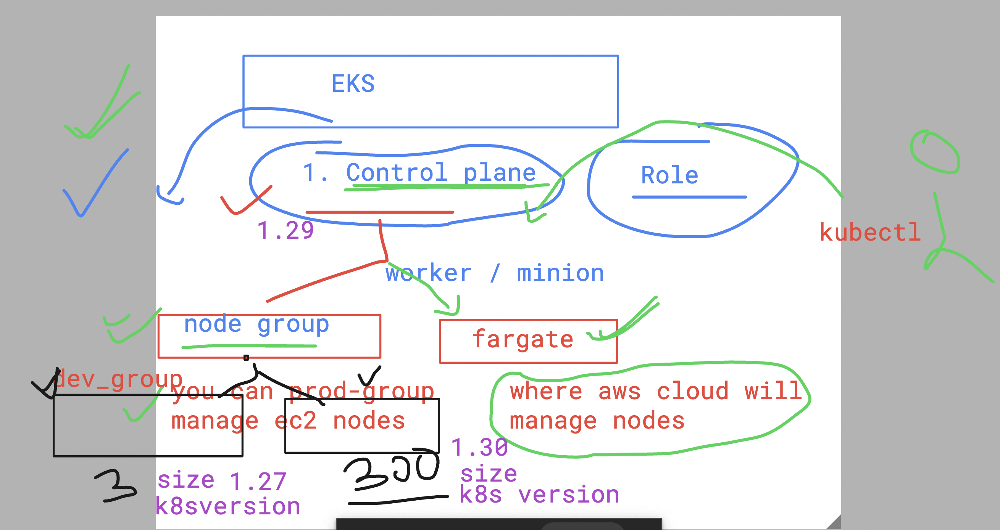
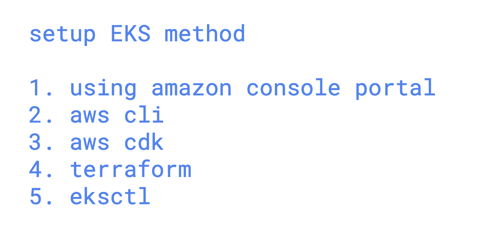

# devops_airtel

### EKS understanding 



### setup method of EKS 



## to setup EKS using webconsole 

### step 1 -- setup vpc using cloudformation 

```
https://s3.us-west-2.amazonaws.com/amazon-eks/cloudformation/2020-10-29/amazon-eks-vpc-private-subnets.yaml
```

### get more info there 

[click_here](https://docs.aws.amazon.com/eks/latest/userguide/creating-a-vpc.html)


