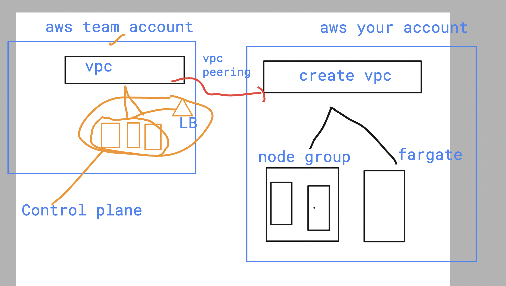
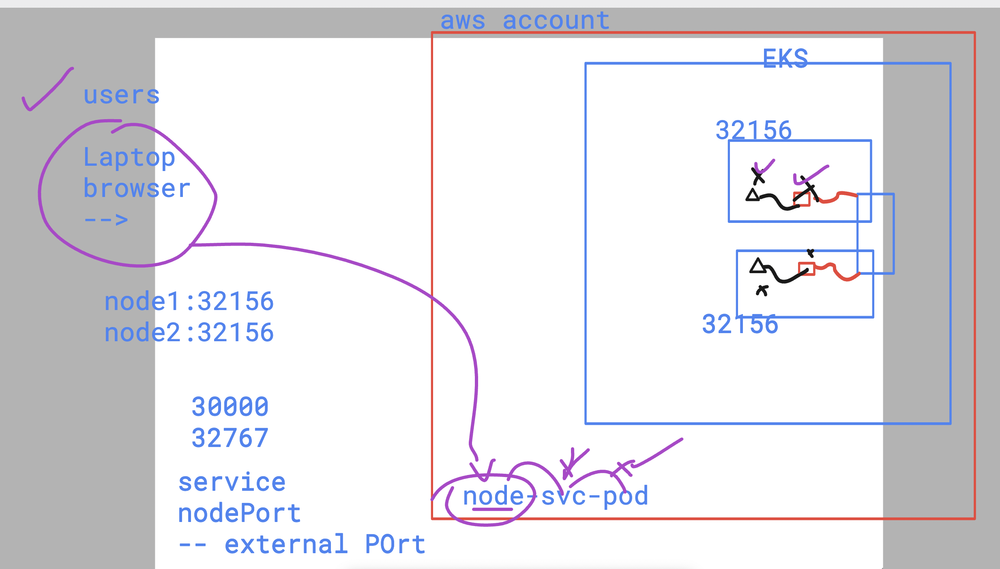
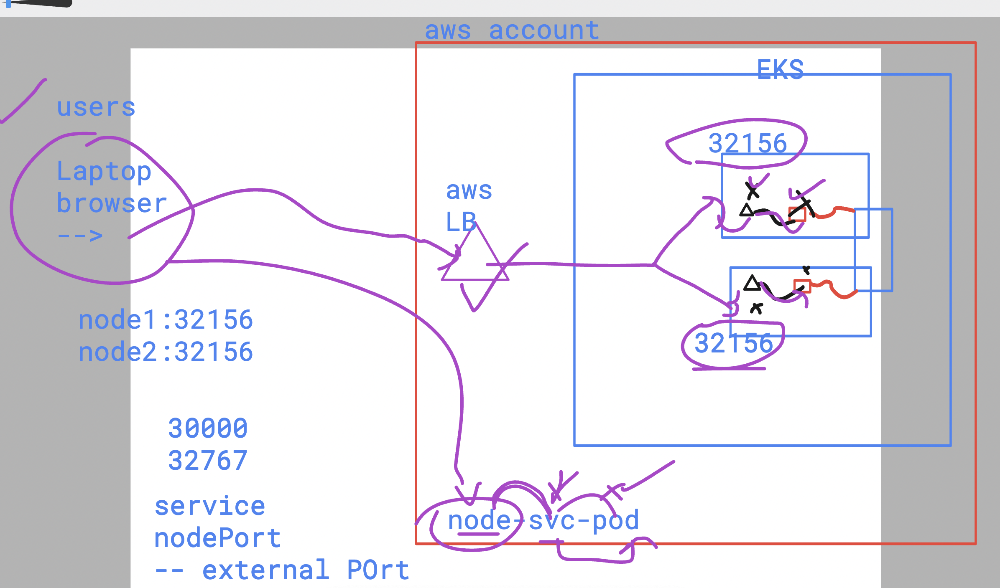
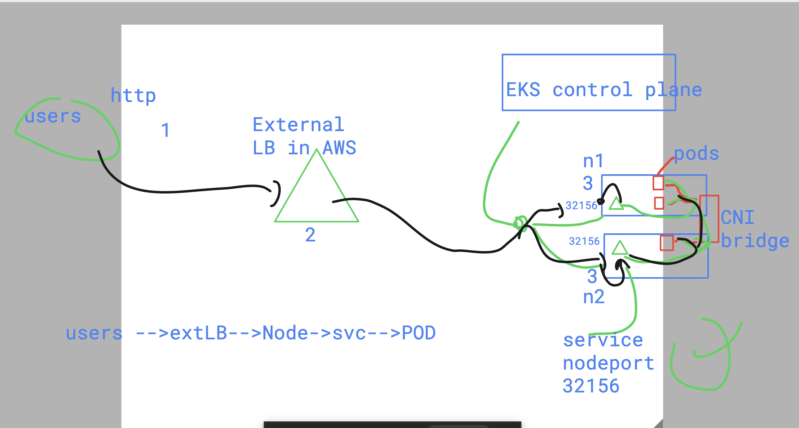
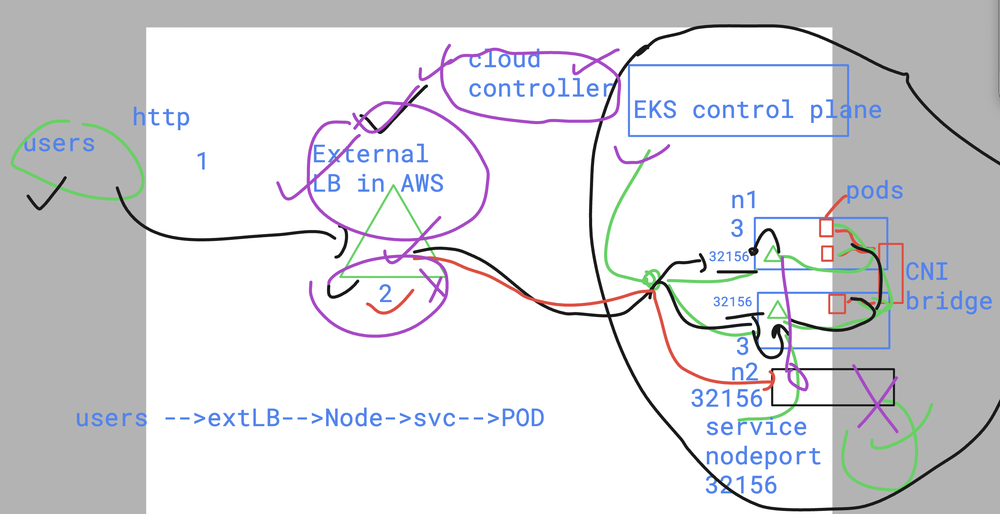
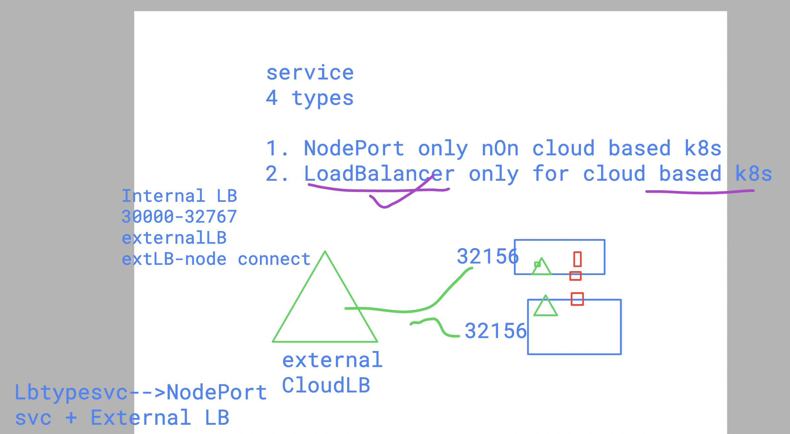

# devops_airtel

## EKS revision 



## to download eks cluster kubeconfig 
- configure aws configure cli 

```
aws --version 
aws-cli/2.15.27 Python/3.11.9 Darwin/23.5.0 source/arm64 prompt/off
 humanfirmware@darwin  ~/Downloads  


 humanfirmware@darwin  ~/Downloads  aws configure
AWS Access Key ID [****************IU2H]: 
AWS Secret Access Key [****************l/HR]: 
Default region name [us-east-1]: 
Default output format [None]: 


 humanfirmware@darwin  ~/Downloads  aws s3 ls
2024-06-27 13:38:17 databricks-workspace-stack-f727e-bucket
2024-06-18 16:02:50 delvex-software-center

```

### downloding kubeconfig file 

```
aws eks update-kubeconfig --name ashu-eks-new  --region us-east-1
Added new context arn:aws:eks:us-east-1:992382386705:cluster/ashu-eks-new to /Users/humanfirmware/.kube/config
 humanfirmware@darwin  ~/Downloads  

 humanfirmware@darwin  ~/Downloads  kubectl config get-contexts 
CURRENT   NAME                                                      CLUSTER                                                   AUTHINFO                                                  NAMESPACE
*         arn:aws:eks:us-east-1:992382386705:cluster/ashu-eks-new   arn:aws:eks:us-east-1:992382386705:cluster/ashu-eks-new   arn:aws:eks:us-east-1:992382386705:cluster/ashu-eks-new   
          rancher-desktop                                           rancher-desktop                                           rancher-desktop                                           
          splunk-k8s                                                splunk-k8s                                                clusterUser_ashu-manual-eurogroup_splunk-k8s              
 humanfirmware@darwin  ~/Downloads  

```

### verify connection 

```
kubectl get nodes
NAME                              STATUS   ROLES    AGE   VERSION
ip-192-168-100-159.ec2.internal   Ready    <none>   12m   v1.30.0-eks-036c24b
ip-192-168-173-55.ec2.internal    Ready    <none>   12m   v1.30.0-eks-036c24b
 humanfirmware@darwin  ~/Downloads  

```

### lets create deployment 

```
kubectl create deployment d1  --image=nginx --port 80 --dry-run=client -o yam
l  >d.yml 
 humanfirmware@darwin  ~/devops_airtel/k8s/day13   master  ls
README.md d.yml
 humanfirmware@darwin  ~/devops_airtel/k8s/day13   master  kubectl create -f d.yml 
deployment.apps/d1 created
 humanfirmware@darwin  ~/devops_airtel/k8s/day13   master  


```

### scaling and verify 

```
kubectl get deploy
NAME   READY   UP-TO-DATE   AVAILABLE   AGE
d1     1/1     1            1           22s
 humanfirmware@darwin  ~/Downloads  kubectl  get  pods
NAME                  READY   STATUS    RESTARTS   AGE
d1-5fd78d99c6-p8f5x   1/1     Running   0          29s
 humanfirmware@darwin  ~/Downloads  
 humanfirmware@darwin  ~/Downloads  
 humanfirmware@darwin  ~/Downloads  kubectl  get nodes
NAME                              STATUS   ROLES    AGE   VERSION
ip-192-168-100-159.ec2.internal   Ready    <none>   16m   v1.30.0-eks-036c24b
ip-192-168-173-55.ec2.internal    Ready    <none>   15m   v1.30.0-eks-036c24b

 humanfirmware@darwin  ~/Downloads  kubectl  get  pods -o wide
NAME                  READY   STATUS    RESTARTS   AGE   IP               NODE                             NOMINATED NODE   READINESS GATES
d1-5fd78d99c6-p8f5x   1/1     Running   0          45s   192.168.139.95   ip-192-168-173-55.ec2.internal   <none>           <none>

 humanfirmware@darwin  ~/Downloads  kubectl scale deployment  d1 --replicas=2
deployment.apps/d1 scaled
 humanfirmware@darwin  ~/Downloads  kubectl  get  pods -o wide               
NAME                  READY   STATUS              RESTARTS   AGE   IP               NODE                              NOMINATED NODE   READINESS GATES
d1-5fd78d99c6-p8f5x   1/1     Running             0          75s   192.168.139.95   ip-192-168-173-55.ec2.internal    <none>           <none>
d1-5fd78d99c6-q2z2p   0/1     ContainerCreating   0          4s    <none>           ip-192-168-100-159.ec2.internal   <none>           <none>
 humanfirmware@darwin  ~/Downloads  


```
### creating Nodeport service 

```
kubectl get deploy
kubNAME   READY   UP-TO-DATE   AVAILABLE   AGE
d1     2/2     2            2           8m45s
 humanfirmware@darwin  ~/Downloads  kubectl  expose deployment  d1 --type NodePort --port 80 --name lb1 
service/lb1 exposed
 humanfirmware@darwin  ~/Downloads  kubectl  get  service 
NAME         TYPE        CLUSTER-IP      EXTERNAL-IP   PORT(S)        AGE
kubernetes   ClusterIP   10.100.0.1      <none>        443/TCP        41m
lb1          NodePort    10.100.69.235   <none>        80:32156/TCP   7s
 humanfirmware@darwin  ~/Downloads  


```

### accessing app 



### accessing webapp of EKS by users




### actual traffic flow in k8s 



### Cloud controller 
- it will only come if you are using cloud based k8s 
- like EKS , AKS , GKE , OKE



### understanding Loadbalancer service type 



### Creating svc 

```
kubectl  get  svc
NAME         TYPE        CLUSTER-IP      EXTERNAL-IP   PORT(S)        AGE
kubernetes   ClusterIP   10.100.0.1      <none>        443/TCP        74m
lb1          NodePort    10.100.69.235   <none>        80:32156/TCP   33m
 humanfirmware@darwin  ~/Downloads  kubectl delete svc lb1 
service "lb1" deleted
 humanfirmware@darwin  ~/Downloads  kubectl get deploy
NAME   READY   UP-TO-DATE   AVAILABLE   AGE
d1     3/3     3            3           42m
 humanfirmware@darwin  ~/Downloads  kubectl  expose deployment d1  --type LoadBalancer --port 80 --name ashulb1 
service/ashulb1 exposed
 humanfirmware@darwin  ~/Downloads  kubectl get svc
NAME         TYPE           CLUSTER-IP      EXTERNAL-IP                                                               PORT(S)        AGE
ashulb1      LoadBalancer   10.100.161.39   ab7eb766269f34d1591a20b55219e8f0-1639424893.us-east-1.elb.amazonaws.com   80:30265/TCP   6s
kubernetes   ClusterIP      10.100.0.1      <none>                                                                    443/TCP        75m
 humanfirmware@darwin  ~/Downloads  


```


