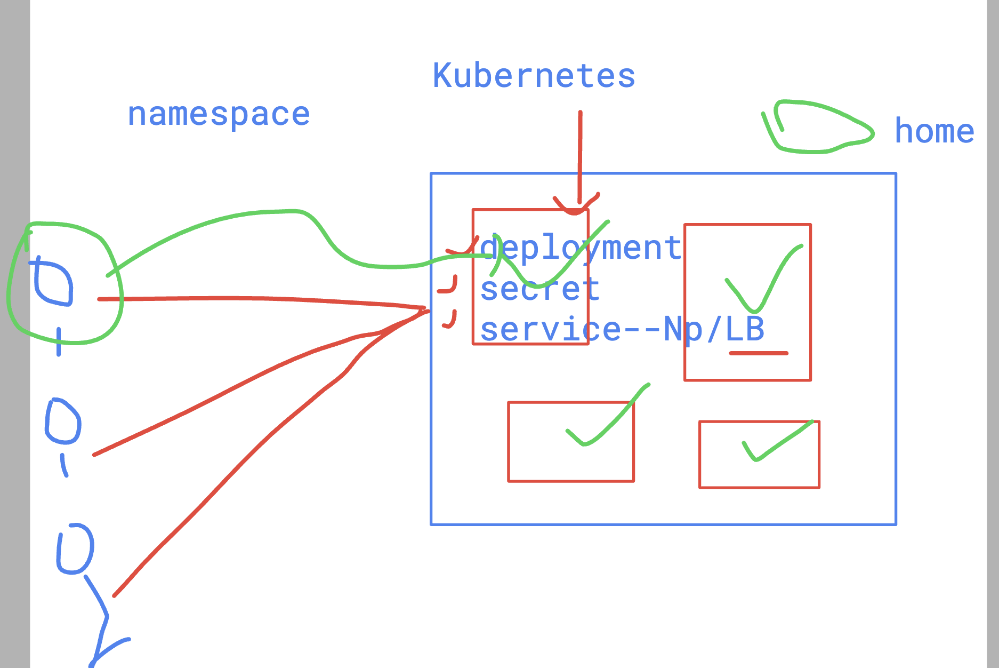

# devops_airtel

## Namespaces in Kubernetes 



### checking default namespaces in k8s 

```
kubectl   get  namespaces
NAME              STATUS   AGE
kube-system       Active   76d
kube-public       Active   76d
kube-node-lease   Active   76d
default           Active   76d
monitoring        Active   9d

 humanfirmware@darwin  ~/devops_airtel/k8s   master  kubectl   get  ns        
NAME              STATUS   AGE
kube-system       Active   76d
kube-public       Active   76d
kube-node-lease   Active   76d
default           Active   76d
```

### Note: by default all your pods/ svc/secrets/deployment etc 
- they go in default namespace 

### creating and setting custom namespace 

```
kubectl  create  ns  ashu-space --dry-run=client -o yaml 
apiVersion: v1
kind: Namespace
metadata:
  creationTimestamp: null
  name: ashu-space
spec: {}
status: {}
 humanfirmware@darwin  ~/devops_airtel/k8s   master  kubectl  create  ns  ashu-space --dry-run=client -o yaml >day14/ns.yml 
 humanfirmware@darwin  ~/devops_airtel/k8s   master  kubectl create -f day14/ns.yml 
namespace/ashu-space created
 humanfirmware@darwin  ~/devops_airtel/k8s   master  kubectl  get ns
NAME              STATUS   AGE
kube-system       Active   76d
kube-public       Active   76d
kube-node-lease   Active   76d
default           Active   76d
monitoring        Active   9d
ashu-space        Active   3s
 humanfirmware@darwin  ~/devops_airtel/k8s   master  kubectl config set-context --current --namespace ashu-space 
Context "rancher-desktop" modified.

 humanfirmware@darwin  ~/devops_airtel/k8s   master  kubectl  get pods
No resources found in ashu-space namespace.

 humanfirmware@darwin  ~/devops_airtel/k8s   master  kubectl  get svc 
No resources found in ashu-space namespace.

```

## if we have permission to create/delete thing in other namespace also 

```
kubectl create -f dep.yml 
deployment.apps/d11 created
 humanfirmware@darwin  ~/devops_airtel/k8s/day14   master  kubectl  get deploy
NAME   READY   UP-TO-DATE   AVAILABLE   AGE
d11    0/1     1            0           4s
 humanfirmware@darwin  ~/devops_airtel/k8s/day14   master  kubectl  get svc   
No resources found in ashu-space namespace.
 humanfirmware@darwin  ~/devops_airtel/k8s/day14   master  kubectl create -f dep.yml
deployment.apps/d11 created
 humanfirmware@darwin  ~/devops_airtel/k8s/day14   master  kubectl  get deploy 
NAME   READY   UP-TO-DATE   AVAILABLE   AGE
d11    1/1     1            1           37s
 humanfirmware@darwin  ~/devops_airtel/k8s/day14   master  kubectl  get deploy  -n default 
NAME     READY   UP-TO-DATE   AVAILABLE   AGE
my-app   1/1     1            1           27h
d11      1/1     1            1           12s
```

### deletting deployment 

```
 kubectl delete deploy d11 -n default 
deployment.apps "d11" deleted
 humanfirmware@darwin  ~/devops_airtel/k8s/day14   master  kubectl delete deploy d11            
deployment.apps "d11" deleted
 humanfirmware@darwin  ~/devops_airtel/k8s/day14   master  
```

