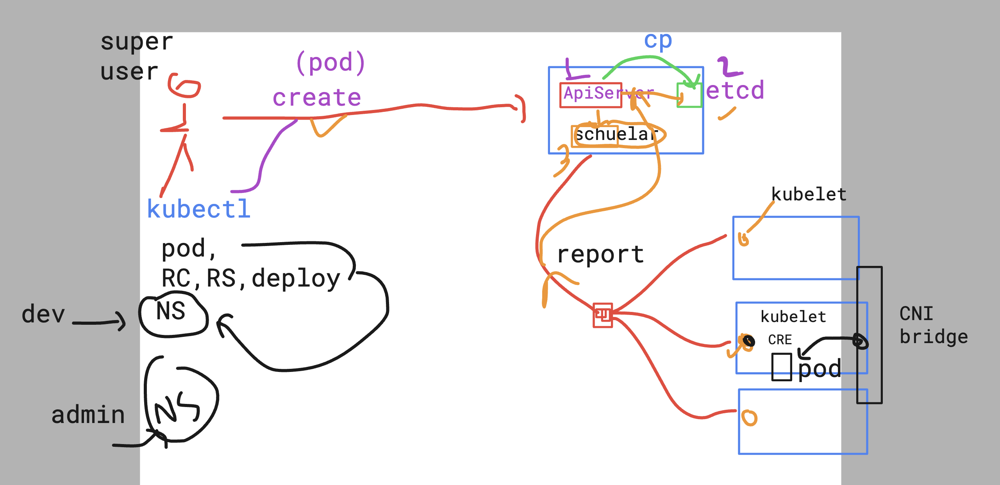
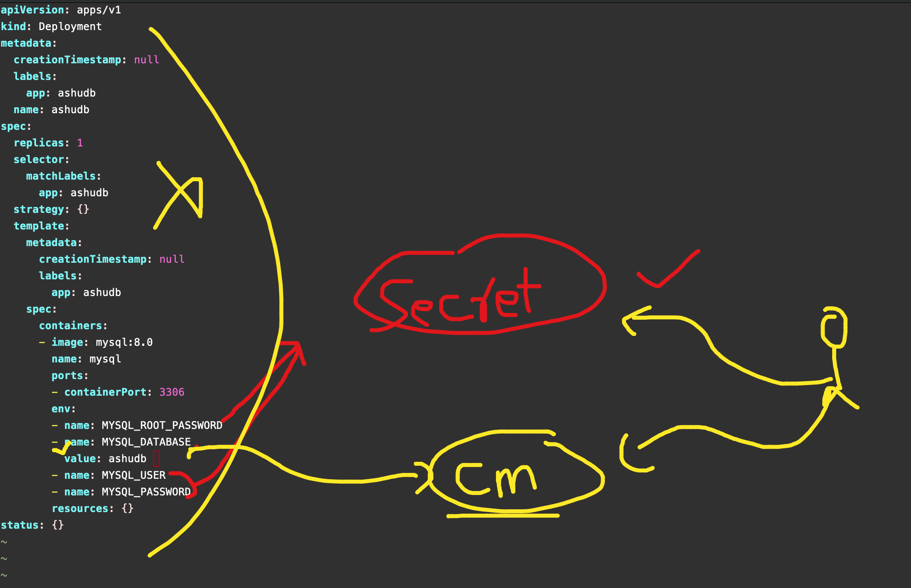

# devops_airtel

### k8s revision 

### getting all pods in every Namespace
```
kubectl  get pods --all-namespaces 
NAMESPACE              NAME                                                     READY   STATUS    RESTARTS   AGE
amitk8s1               amitpod1                                                 1/1     Running   0          20h
ingress-nginx          ingress-nginx-controller-f4d6b8f76-7vkqh                 1/1     Running   0          14h
kube-system            aws-node-h77cj                                           2/2     Running   0          24h

OR ====>
kubectl  get pods -A
NAMESPACE              NAME                                                     READY   STATUS    RESTARTS   AGE
amitk8s1               amitpod1                                                 1/1     Running   0          20h
ingress-nginx          ingress-nginx-controller-f4d6b8f76-7vkqh                 1/1     Running   0          14h
kube-system            aws-node-h77cj                                           2/2     Running   0          24h
kube-system            aws-node-mrfrx                                           2/2     Running   0          24h
```

### Revision 



### calling configMap 



### creating cm 

```
kubectl create configmap ashu-db-name  --from-literal  dbname=mydbairtel --dry-run=client -o yaml  >cm.yaml
```

### yaml file of db.yaml 

```
apiVersion: apps/v1
kind: Deployment
metadata:
  creationTimestamp: null
  labels:
    app: ashudb
  name: ashudb
spec:
  replicas: 1
  selector:
    matchLabels:
      app: ashudb
  strategy: {}
  template:
    metadata:
      creationTimestamp: null
      labels:
        app: ashudb
    spec:
      containers:
      - image: mysql:8.0
        name: mysql
        ports:
        - containerPort: 3306
        env: 
        - name: MYSQL_ROOT_PASSWORD
        - name: MYSQL_DATABASE
          valueFrom:
            configMapKeyRef:
              name: ashu-db-name 
              key: dbname
        - name: MYSQL_USER
        - name: MYSQL_PASSWORD
        resources: {}

```
