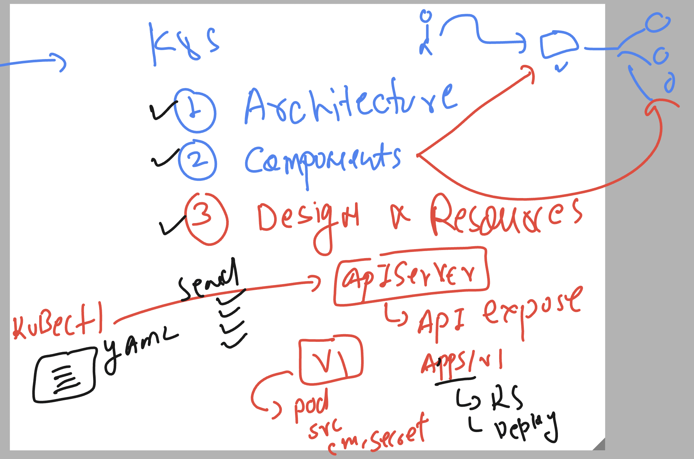
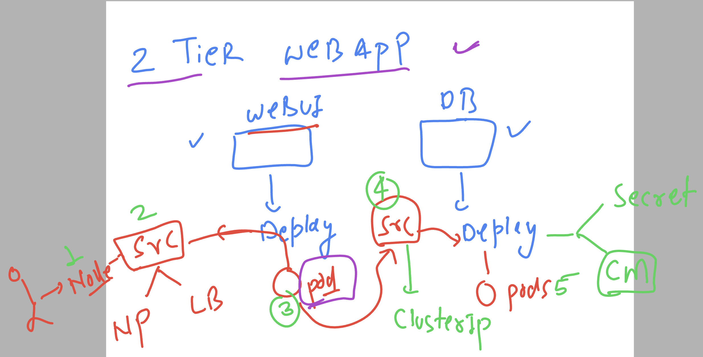

# devops_airtel

### k8s revision 



### deployment of 2 teir webapp



### checking it 

```
kubectl create -f db.yaml
deployment.apps/d1 created
secret/ashu-root-cred created
configmap/ashu-db-name created
service/ashudbsvc created
 humanfirmware@darwin  ~/devops_airtel/k8s/day19   master  kubectl get cm
NAME               DATA   AGE
kube-root-ca.crt   1      118d
ashu-db-name       1      4s
 humanfirmware@darwin  ~/devops_airtel/k8s/day19   master  kubectl get secret
NAME               TYPE                             DATA   AGE
basit-reg-secret   kubernetes.io/dockerconfigjson   1      65d
ashu-root-cred     Opaque                           1      10s
 humanfirmware@darwin  ~/devops_airtel/k8s/day19   master  kubectl get deploy
NAME   READY   UP-TO-DATE   AVAILABLE   AGE
d1     0/1     1            0           17s
 humanfirmware@darwin  ~/devops_airtel/k8s/day19   master  kubectl get po    
NAME                  READY   STATUS                       RESTARTS   AGE
d1-5c764669cf-244sv   0/1     CreateContainerConfigError   0          21s
 humanfirmware@darwin  ~/devops_airtel/k8s/day19   master  kubectl get svc
NAME         TYPE        CLUSTER-IP     EXTERNAL-IP   PORT(S)    AGE
kubernetes   ClusterIP   10.43.0.1      <none>        443/TCP    18d
ashudbsvc    ClusterIP   10.43.31.108   <none>        3306/TCP   24s
```

