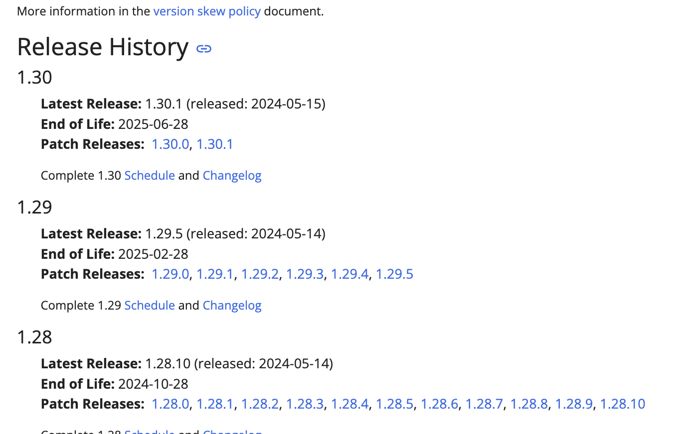
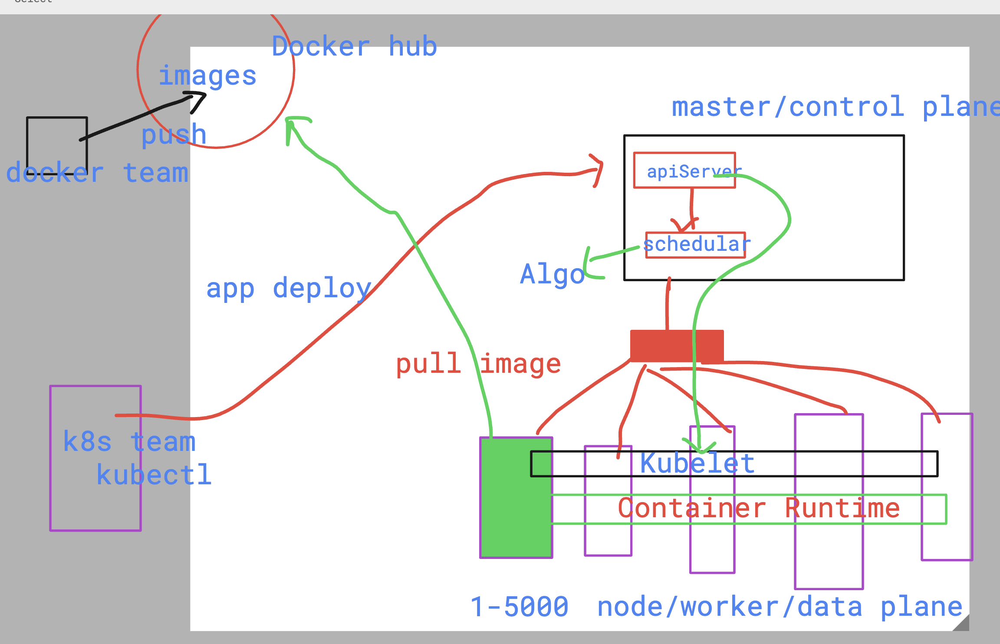
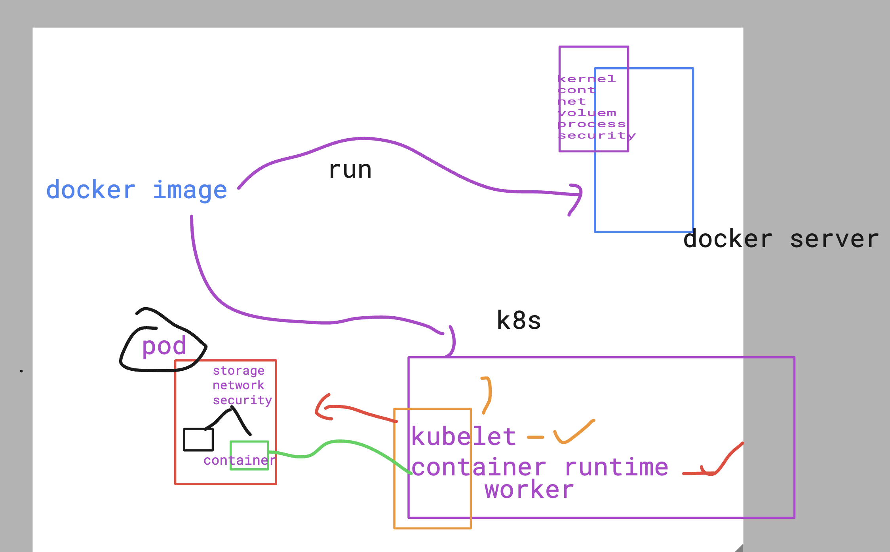
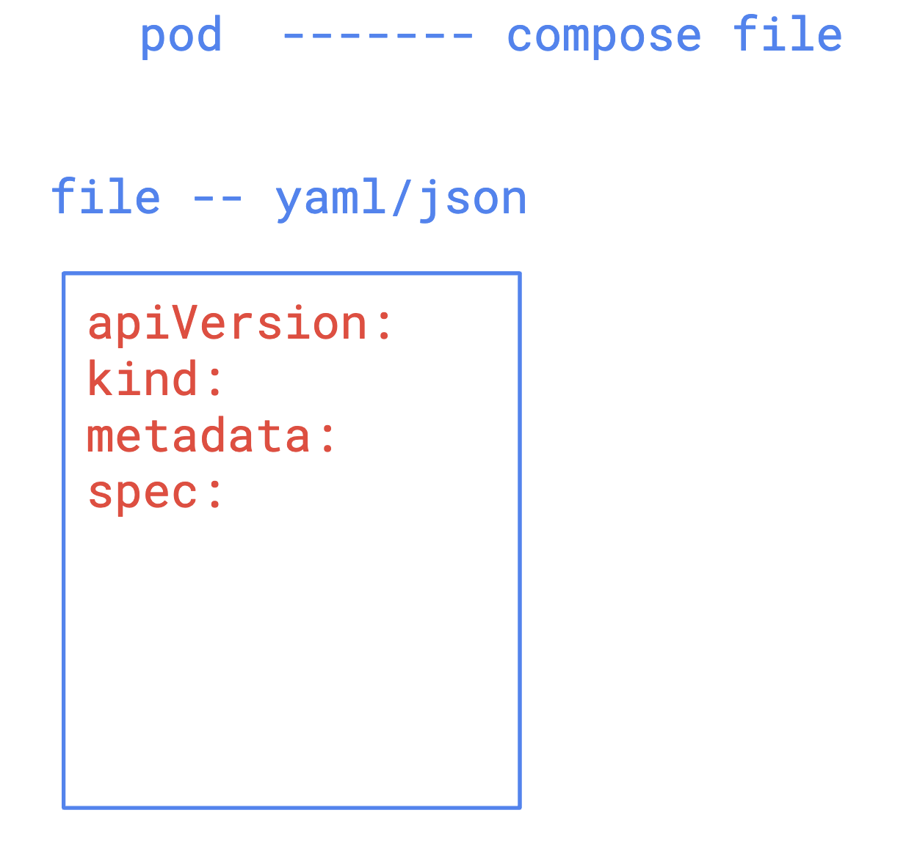

# devops_airtel

### checking kubernetes release 



### Kubernetes internal workflow 



## Introduction to pod 



### in kubernetes to create any object we are going to create file structure 


### checking from kubectl about k8s status

```
humanfirmware@darwin  ~/Desktop  kubectl  version 
Client Version: v1.30.0
Kustomize Version: v5.0.4-0.20230601165947-6ce0bf390ce3
Server Version: v1.29.3+k3s1
 humanfirmware@darwin  ~/Desktop  kubectl  cluster-info
Kubernetes control plane is running at https://127.0.0.1:6443
CoreDNS is running at https://127.0.0.1:6443/api/v1/namespaces/kube-system/services/kube-dns:dns/proxy
Metrics-server is running at https://127.0.0.1:6443/api/v1/namespaces/kube-system/services/https:metrics-server:https/proxy

To further debug and diagnose cluster problems, use 'kubectl cluster-info dump'.
 humanfirmware@darwin  ~/Desktop  


```

### checking list of master and workers

```
 humanfirmware@darwin  ~/Desktop  kubectl   get  nodes
NAME                   STATUS   ROLES                  AGE   VERSION
lima-rancher-desktop   Ready    control-plane,master   38d   v1.29.3+k3s1
 humanfirmware@darwin  ~/Desktop  

```

## lets create yaml file for pod 

```
 humanfirmware@darwin  ~/devops_airtel/k8s   master ±  ls
README.md day1      day2      ecsday1   ecsday2   ecsday3
 humanfirmware@darwin  ~/devops_airtel/k8s   master ±  cd day2 
 humanfirmware@darwin  ~/devops_airtel/k8s/day2   master ±  ls
README.md     ashupod1.yaml files.png     pod1.png      rel.png       work.png
 humanfirmware@darwin  ~/devops_airtel/k8s/day2   master ±  kubectl  create  -f  ashupod1.yaml 
pod/ashupod1 created
 humanfirmware@darwin  ~/devops_airtel/k8s/day2   master ±  kubectl  get  pods
NAME       READY   STATUS              RESTARTS   AGE
ashupod1   0/1     ContainerCreating   0          5s
 humanfirmware@darwin  ~/devops_airtel/k8s/day2   master ±  kubectl  get  pods
NAME       READY   STATUS              RESTARTS   AGE
ashupod1   0/1     ContainerCreating   0          17s
 humanfirmware@darwin  ~/devops_airtel/k8s/day2   master ±  

```