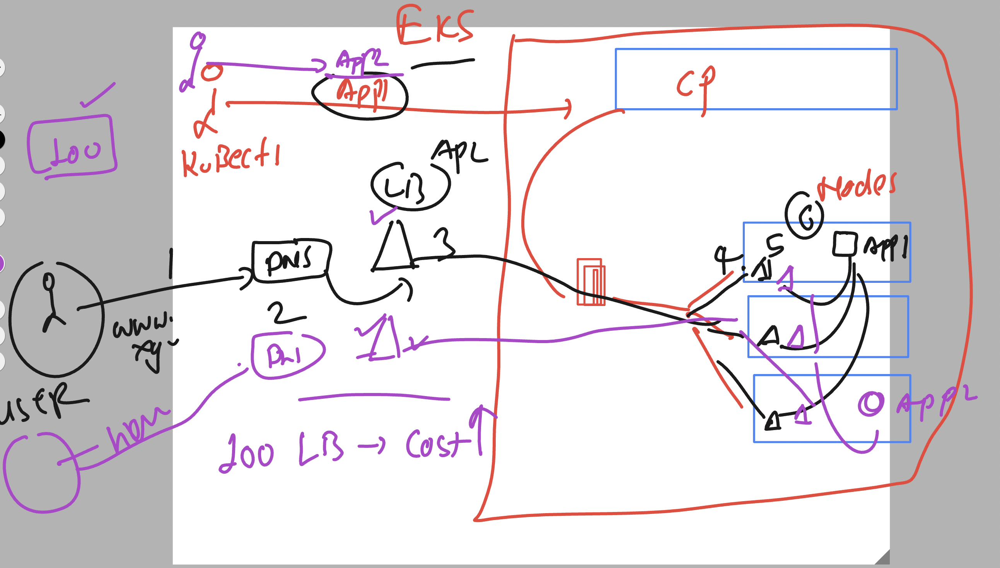
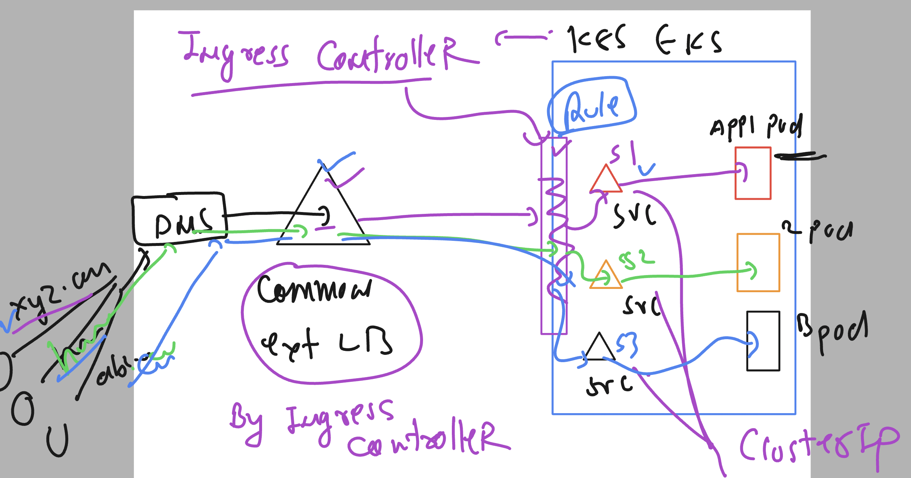
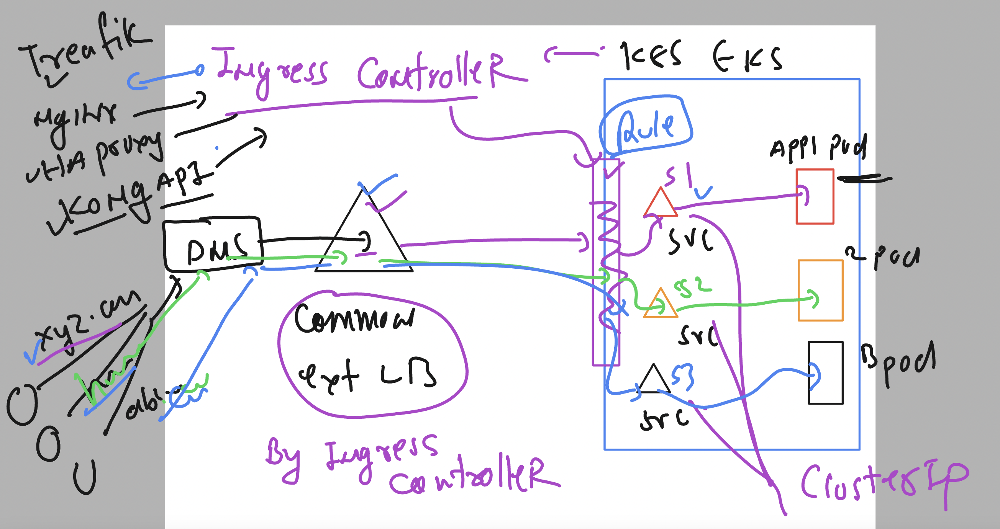

# devops_airtel

# Deploy multiple app in EKS / any cloud based k8s 

- it will be required to have any app its own external cloud LB which will lead to high costing 

## solving multiple external LB problem to avoid high costing using Ingress controller

### List of ingress controllers supported by K8s

