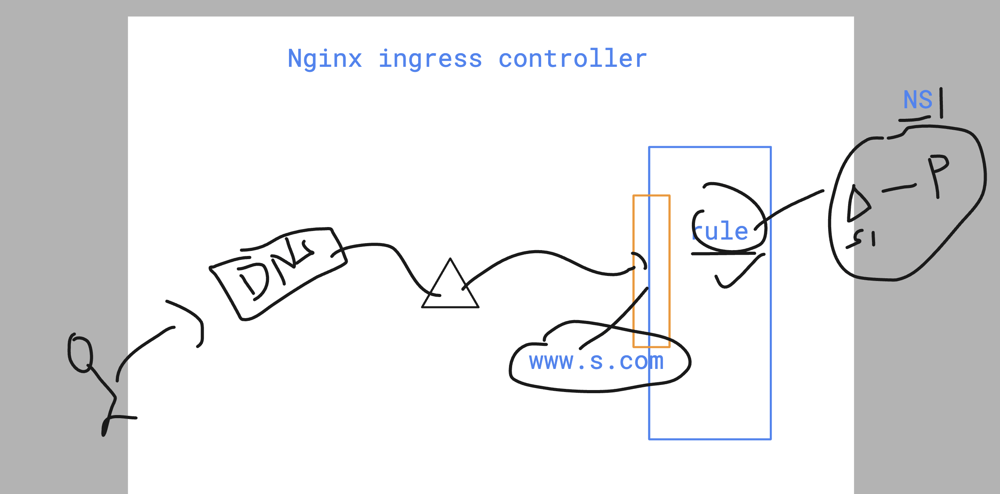

# Kubernetes ingress controller 

### using ingress controller to send traffic 



### setup nginx ignress controller 

## using officail k8s repo 

```
https://github.com/kubernetes/ingress-nginx
```


```
kubectl apply -f https://raw.githubusercontent.com/kubernetes/ingress-nginx/main/deploy/static/provider/baremetal/deploy.yaml
namespace/ingress-nginx created
serviceaccount/ingress-nginx created
serviceaccount/ingress-nginx-admission created
role.rbac.authorization.k8s.io/ingress-nginx created
role.rbac.authorization.k8s.io/ingress-nginx-admission created
clusterrole.rbac.authorization.k8s.io/ingress-nginx created
clusterrole.rbac.authorization.k8s.io/ingress-nginx-admission created
rolebinding.rbac.authorization.k8s.io/ingress-nginx created
rolebinding.rbac.authorization.k8s.io/ingress-nginx-admission created
clusterrolebinding.rbac.authorization.k8s.io/ingress-nginx created
clusterrolebinding.rbac.authorization.k8s.io/ingress-nginx-admission created
configmap/ingress-nginx-controller created
service/ingress-nginx-controller created
service/ingress-nginx-controller-admission created
deployment.apps/ingress-nginx-controller created
job.batch/ingress-nginx-admission-create created
job.batch/ingress-nginx-admission-patch created
ingressclass.networking.k8s.io/nginx created
validatingwebhookconfiguration.admissionregistration.k8s.io/ingress-nginx-admission created

```

### lets verify 

```
ubectl   get deploy  -n ingress-nginx  
NAME                       READY   UP-TO-DATE   AVAILABLE   AGE
ingress-nginx-controller   1/1     1            1           2m25s
 humanfirmware@darwin  ~  kubectl   get svc  -n ingress-nginx  
NAME                                 TYPE        CLUSTER-IP      EXTERNAL-IP   PORT(S)                      AGE
ingress-nginx-controller             NodePort    10.43.222.222   <none>        80:32432/TCP,443:30504/TCP   2m33s
ingress-nginx-controller-admission   ClusterIP   10.43.59.145    <none>        443/TCP                      2m33s
```

### deploy app + ingress routing rule 

```
ubectl  create  deploy  d1 --image=nginx 
deployment.apps/d1 created
 humanfirmware@darwin  ~  kubectl expose deploy d1 --type ClusterIP --port 80 --name s1 
service/s1 exposed
 humanfirmware@darwin  ~  kubectl  get po 
NAME                  READY   STATUS              RESTARTS   AGE
d1-577f6df444-xb2sr   0/1     ContainerCreating   0          20s
 humanfirmware@darwin  ~  kubectl  get svc
NAME         TYPE        CLUSTER-IP      EXTERNAL-IP   PORT(S)   AGE
kubernetes   ClusterIP   10.43.0.1       <none>        443/TCP   7m11s
s1           ClusterIP   10.43.149.158   <none>        80/TCP    5s

```

### now routing rule 

```
kubectl create -f day21/rule.yaml 
ingress.networking.k8s.io/minimal-ingress created
 humanfirmware@darwin  ~/devops_airtel/k8s   master  

====>>

kubectl  get po 
NAME                  READY   STATUS    RESTARTS   AGE
d1-577f6df444-xb2sr   1/1     Running   0          4m27s
 humanfirmware@darwin  ~  kubectl  get svc
NAME         TYPE        CLUSTER-IP      EXTERNAL-IP   PORT(S)   AGE
kubernetes   ClusterIP   10.43.0.1       <none>        443/TCP   11m
s1           ClusterIP   10.43.149.158   <none>        80/TCP    4m12s
 humanfirmware@darwin  ~  kubectl  get ing
NAME              CLASS   HOSTS           ADDRESS   PORTS   AGE
minimal-ingress   nginx   hello.xyz.com             80      12s
 humanfirmware@darwin  ~  


```