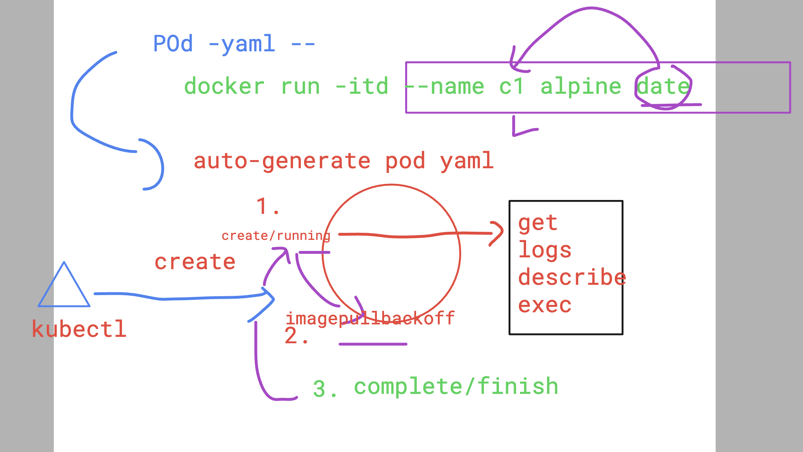

# devops_airtel

## creating pod using cli 

```
kubectl run  ashupod1 --image=nginx --port 80 
pod/ashupod1 created


 humanfirmware@darwin  ~/devops_airtel/k8s   master  kubectl get  pods
NAME       READY   STATUS              RESTARTS   AGE
ashupod1   0/1     ContainerCreating   0          6s
```

## Deleting pod 

```
 humanfirmware@darwin  ~/devops_airtel/k8s   master  kubectl get po    
NAME       READY   STATUS    RESTARTS   AGE
ashupod1   1/1     Running   0          119s
 humanfirmware@darwin  ~/devops_airtel/k8s   master  kubectl delete pod ashupod1 
pod "ashupod1" deleted
 humanfirmware@darwin  ~/devops_airtel/k8s   master  
```

### creating pod yaml using kubectl 

```
 humanfirmware@darwin  ~/devops_airtel/k8s   master  kubectl run  ashupod1 --image=nginx --port 80  --dry-run=client -o yaml
apiVersion: v1
kind: Pod
metadata:
  creationTimestamp: null
  labels:
    run: ashupod1
  name: ashupod1
spec:
  containers:
  - image: nginx
    name: ashupod1
    ports:
    - containerPort: 80
    resources: {}
  dnsPolicy: ClusterFirst
  restartPolicy: Always
status: {}
 humanfirmware@darwin  ~/devops_airtel/k8s   master  kubectl run  ashupod1 --image=nginx --port 80  --dry-run=client -o yaml  >day3/autopod.yaml
 humanfirmware@darwin  ~/devops_airtel/k8s   master  
```

### creating pod 

```
kubectl create -f autopod.yaml 
pod/ashupod1 created
 humanfirmware@darwin  ~/devops_airtel/k8s/day3   master  kubectl get po 
NAME       READY   STATUS              RESTARTS   AGE
ashupod1   0/1     ContainerCreating   0          3s
```

### getting node name where pod got scheduled 

```
kubectl  get  nodes
NAME                   STATUS   ROLES                  AGE   VERSION
lima-rancher-desktop   Ready    control-plane,master   41d   v1.29.3+k3s1
 humanfirmware@darwin  ~/devops_airtel/k8s/day3   master  kubectl  get  pods 
NAME       READY   STATUS    RESTARTS   AGE
ashupod1   1/1     Running   0          119s
 humanfirmware@darwin  ~/devops_airtel/k8s/day3   master  kubectl  get  pods -o wide
NAME       READY   STATUS    RESTARTS   AGE    IP           NODE                   NOMINATED NODE   READINESS GATES
ashupod1   1/1     Running   0          2m3s   10.42.0.97   lima-rancher-desktop   <none>           <none>
```

### checking more info about pod 

```
kubectl describe pod ashupod1
Name:             ashupod1
Namespace:        default
Priority:         0
Service Account:  default
Node:             lima-rancher-desktop/192.168.5.15
Start Time:       Tue, 28 May 2024 08:25:31 +0530
Labels:           run=ashupod1
Annotations:      <none>
Status:           Running
IP:               10.42.0.97
IPs:
  IP:  10.42.0.97
Containers:
  ashupod1:
    Container ID:   docker://4d1fa7cd22543867ebb0f304a81b060cd5ed530625230dcbe835a1d9e551ecc2
    Image:          nginx
    Image ID:       docker-pullable://nginx@sha256:a484819eb60211f5299034ac80f6a681b06f89e65866ce91f356ed7c72af059c
    Port:           80/TCP
    Host Port:      0/TCP
    State:          Running
      Started:      Tue, 28 May 2024 08:25:42 +0530
```

### checking events 

```
kubectl  get  events    


LAST SEEN   TYPE     REASON      OBJECT         MESSAGE
12m         Normal   Scheduled   pod/ashupod1   Successfully assigned default/ashupod1 to lima-rancher-desktop
12m         Normal   Pulling     pod/ashupod1   Pulling image "nginx"
12m         Normal   Pulled      pod/ashupod1   Successfully pulled image "nginx" in 10.794s (10.794s including waiting)
12m         Normal   Created     pod/ashupod1   Created container ashupod1
12m         Normal   Started     pod/ashupod1   Started container ashupod1
10m         Normal   Killing     pod/ashupod1   Stopping container ashupod1
6m41s       Normal   Scheduled   pod/ashupod1   Successfully assigned default/ashupod1 to lima-rancher-desktop
6m41s       Normal   Pulling     pod/ashupod1   Pulling image "nginx"
6m30s       Normal   Pulled      pod/ashupod1   Successfully pulled image "nginx" in 10.814s (10.814s including waiting)
6m30s       Normal   Created     pod/ashupod1   Created container ashupod1
6m30s       Normal   Started     pod/ashupod1   Started container ashupod1
```

### accessing container inside pod 

```
kubectl  get pods
NAME       READY   STATUS    RESTARTS   AGE
ashupod1   1/1     Running   0          7m7s
 humanfirmware@darwin  ~/devops_airtel/k8s/day3   master  
 humanfirmware@darwin  ~/devops_airtel/k8s/day3   master  kubectl  exec -it ashupod1 -- bash 
root@ashupod1:/# 
root@ashupod1:/# cd /usr/share/nginx/html/
root@ashupod1:/usr/share/nginx/html# ls
50x.html  index.html
root@ashupod1:/usr/share/nginx/html# id
uid=0(root) gid=0(root) groups=0(root)
root@ashupod1:/usr/share/nginx/html# exit
exit
```

### checking logs of container inside pod 

```
kubectl logs ashupod1


/docker-entrypoint.sh: /docker-entrypoint.d/ is not empty, will attempt to perform configuration
/docker-entrypoint.sh: Looking for shell scripts in /docker-entrypoint.d/
/docker-entrypoint.sh: Launching /docker-entrypoint.d/10-listen-on-ipv6-by-default.sh
10-listen-on-ipv6-by-default.sh: info: Getting the checksum of /etc/nginx/conf.d/default.conf
10-listen-on-ipv6-by-default.sh: info: Enabled listen on IPv6 in /etc/nginx/conf.d/default.conf
/docker-entrypoint.sh: Sourcing /docker-entrypoint.d/15-local-resolvers.envsh
/docker-entrypoint.sh: Launching /docker-entrypoint.d/20-envsubst-on-templates.sh
/docker-entrypoint.sh: Launching /docker-entrypoint.d/30-tune-worker-processes.sh
/docker-entrypoint.sh: Configuration complete; ready for start up
2024/05/28 02:55:42 [notice] 1#1: using the "epoll" event method
2024/05/28 02:55:42 [notice] 1#1: nginx/1.25.5
```
### remove pod 

```
 kubectl delete  -f autopod.yaml 
pod "ashupod1" deleted
```

## pod lifecycle 




### checking complete state

```
kubectl run ashuopd2 --image=alpine --command date 
pod/ashuopd2 created
 humanfirmware@darwin  ~/devops_airtel/k8s/day3   master  kubectl get pods
NAME       READY   STATUS              RESTARTS   AGE
ashupod1   0/1     ImagePullBackOff    0          5m6s
ashuopd2   0/1     ContainerCreating   0          3s
 humanfirmware@darwin  ~/devops_airtel/k8s/day3   master  kubectl get pods
NAME       READY   STATUS              RESTARTS   AGE
ashupod1   0/1     ImagePullBackOff    0          5m13s
ashuopd2   0/1     ContainerCreating   0          10s
 humanfirmware@darwin  ~/devops_airtel/k8s/day3   master  kubectl get pods
NAME       READY   STATUS             RESTARTS   AGE
ashupod1   0/1     ImagePullBackOff   0          5m20s
ashuopd2   0/1     Completed          0          17s
```

