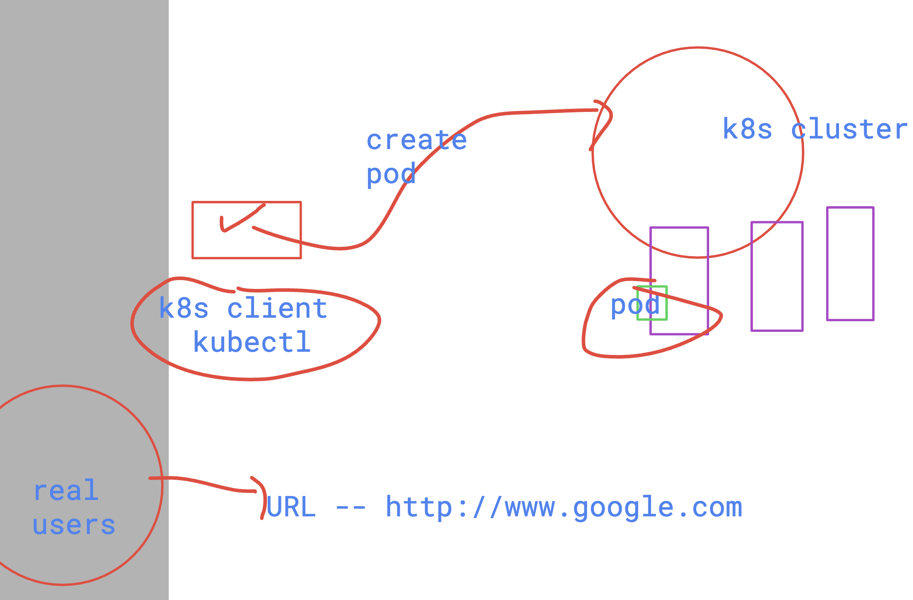

# devops_airtel

### deploying springboot webapp docker image as pod 

```
kubectl run ashuweb --image=dockerashu/ashuspring:bmoappv1 --port 8
080 --dry-run=client -o yaml >webspring.yml

 humanfirmware@darwin  ~/devops_airtel/k8s/day4   master  kubectl create -f webspring.yml 
pod/ashuweb created

 humanfirmware@darwin  ~/devops_airtel/k8s/day4   master  kubectl get pods
NAME      READY   STATUS              RESTARTS   AGE
ashuweb   0/1     ContainerCreating   0          11s
```

### accessing pod app



### access web app using kubectl port-forward

```
humanfirmware@darwin  ~/Desktop  kubectl get pods        
NAME      READY   STATUS    RESTARTS   AGE
ashuweb   1/1     Running   0          5m42s
 humanfirmware@darwin  ~/Desktop  
 humanfirmware@darwin  ~/Desktop  
 
 
 ✘ humanfirmware@darwin  ~/Desktop  kubectl port-forward   ashuweb  1234:8080  
Forwarding from 127.0.0.1:1234 -> 8080
Forwarding from [::1]:1234 -> 8080
Handling connection for 1234
Handling connection for 1234
Handling connection for 1234
```