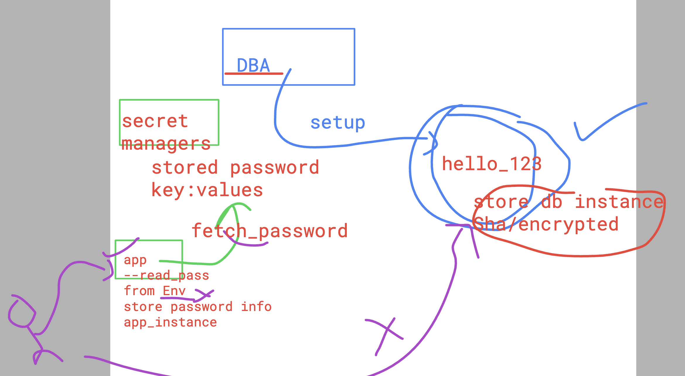
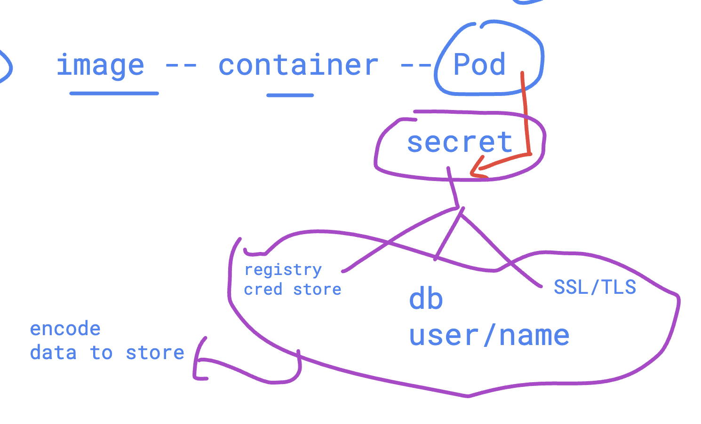

# devops_airtel

### Docker hub VS azure container registry 



## tag 
```
docker  tag  nginx:latest  ashutoshh.azurecr.io/ashuweb:v1
```

### login

```
docker login  ashutoshh.azurecr.io 
Username: ashutoshh
Password: 
Login Succeeded

```

### push

```
ocker push ashutoshh.azurecr.io/ashuweb:v1 
The push refers to repository [ashutoshh.azurecr.io/ashuweb]
d10c7f4d14b6: Preparing 

```

### lets deploy this image 

```
kubectl run ashupod1 --image=ashutoshh.azurecr.io/ashuweb:v1   --port 80 --dry-run=client -o yaml >pod.yml
 humanfirmware@darwin  ~/devops_airtel/k8s/day5   master  kubectl create -f pod.yml 
pod/ashupod1 created
 humanfirmware@darwin  ~/devops_airtel/k8s/day5   master  kubectl get pods
NAME       READY   STATUS              RESTARTS   AGE
ashupod1   0/1     ContainerCreating   0          8s
 humanfirmware@darwin  ~/devops_airtel/k8s/day5   master  kubectl get pods
NAME       READY   STATUS         RESTARTS   AGE
ashupod1   0/1     ErrImagePull   0          31s
```
### to see error message check below command 

```
kubectl  describe  pod  ashupod1 
ents:
  Type     Reason     Age                From               Message
  ----     ------     ----               ----               -------
  Normal   Scheduled  72s                default-scheduler  Successfully assigned default/ashupod1 to lima-rancher-desktop
  Normal   Pulling    40s (x2 over 71s)  kubelet            Pulling image "ashutoshh.azurecr.io/ashuweb:v1"
  Warning  Failed     28s (x2 over 55s)  kubelet            Failed to pull image "ashutoshh.azurecr.io/ashuweb:v1": Error response from daemon: Head "https://ashutoshh.azurecr.io/v2/ashuweb/manifests/v1": unauthorized: authentication required, visit https://aka.ms/acr/authorization for more information.
  Warning  Failed     28s (x2 over 55s)  kubelet            Error: ErrImagePull
  Normal   BackOff    13s (x2 over 55s)  kubelet            Back-off pulling image "ashutoshh.azurecr.io/ashuweb:v1"
  Warning  Failed     13s (x2 over 55s)  kubelet            Error: ImagePullBackOff
 humanfirmware@darwin  ~  

```

## secret in k8s



### creating secret 

```
kubectl create  secret 
Create a secret with specified type.

 A docker-registry type secret is for accessing a container registry.

 A generic type secret indicate an Opaque secret type.

 A tls type secret holds TLS certificate and its associated key.

Available Commands:
  docker-registry   Create a secret for use with a Docker registry
  generic           Create a secret from a local file, directory, or literal value
  tls               Create a TLS secret

```

### creating secret 

```
kubectl create  secret  docker-registry ashu-reg-secret  --docker-server=ashutoshh.azurecr.io --docker-username=ashutoshh --docker-password="PACRCAY/36" --dry-run=client -o yaml  >secret.yml
==== checking secret 
kubectl create -f secret.yml 
secret/ashu-reg-secret created
 humanfirmware@darwin  ~/devops_airtel/k8s/day5   master  kubectl get secrets
NAME              TYPE                             DATA   AGE
ashu-reg-secret   kubernetes.io/dockerconfigjson   1      5s
```

### delete and recreate pod

```
kubectl replace -f pod.yml --force
pod "ashupod1" deleted
pod/ashupod1 replaced
```
### verify 

```
kubectl  get secret
NAME              TYPE                             DATA   AGE
ashu-reg-secret   kubernetes.io/dockerconfigjson   1      2m38s
 humanfirmware@darwin  ~  kubectl  get pod   
NAME       READY   STATUS    RESTARTS   AGE
ashupod1   1/1     Running   0          37s

```


