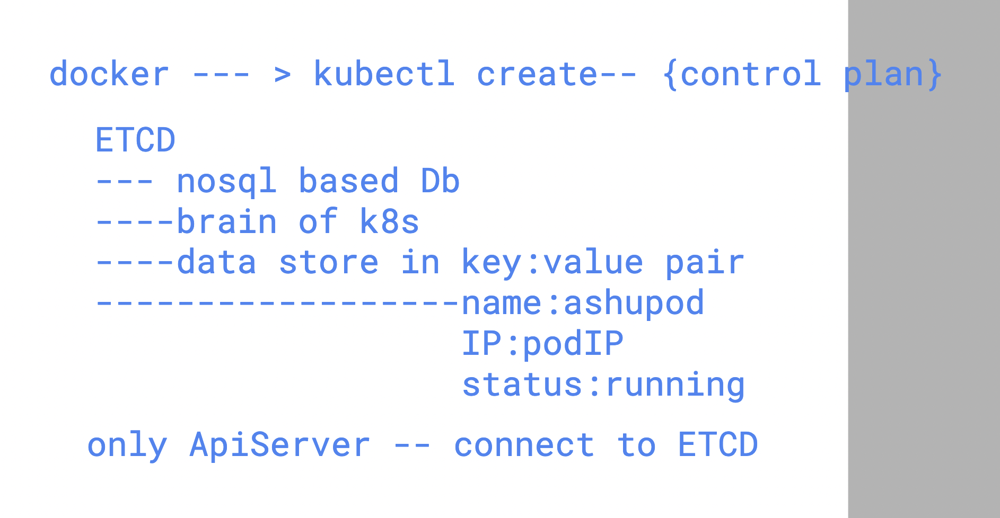
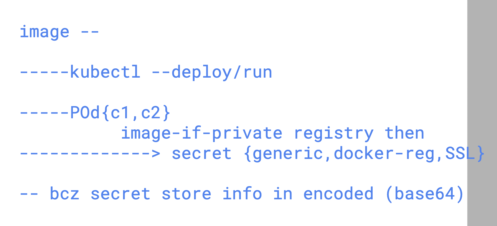
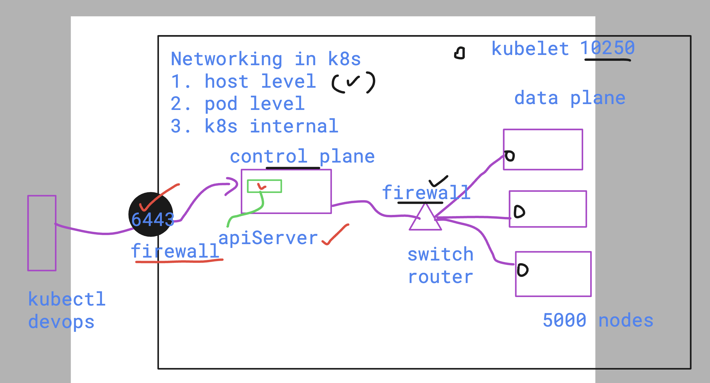
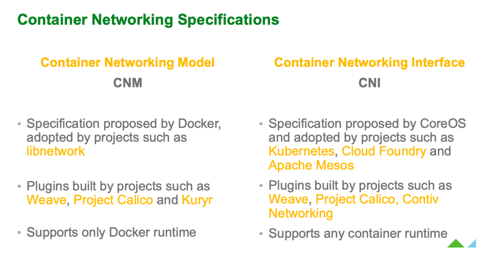
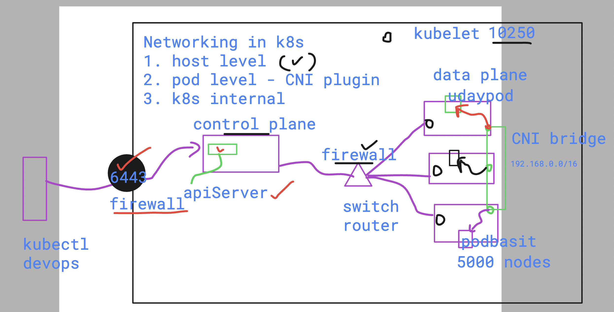
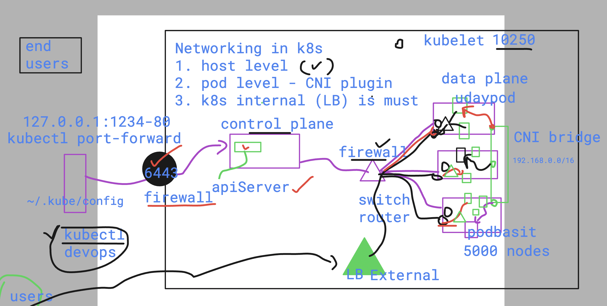
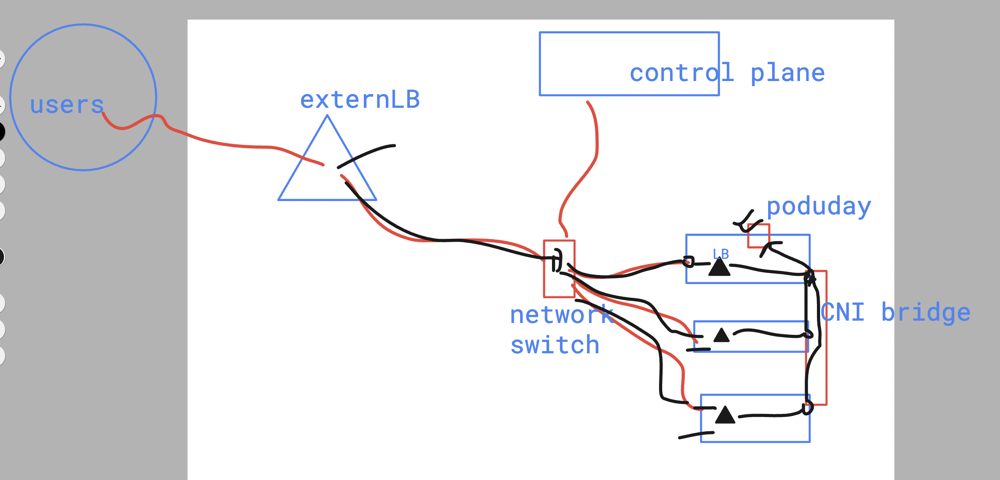

# devops_airtel

## ETCD in control plane 

### secret revision 

### Kubernetes Networking 

## to network for pods -- k8s team choose CNI over CNM 

## To Implement CNI 
- there are lots of networking plugin created by many org 
- [click_to_read](https://github.com/containernetworking/cni)

### pod Networking using Distributed CNI bridge

### k8s internal LB is must to access POd app 

### final inetnal and external networking 

