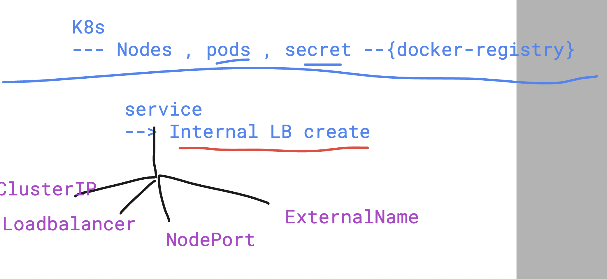
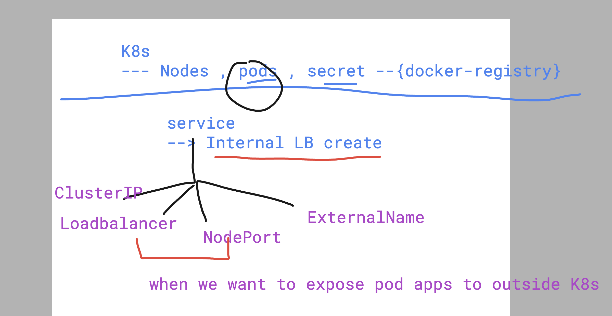
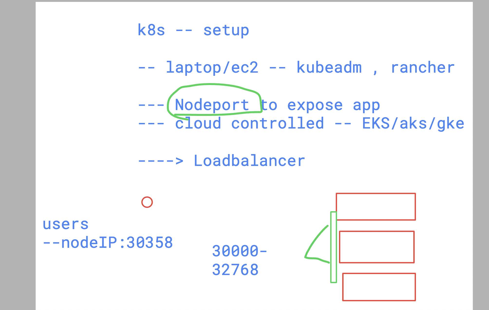

# devops_airtel

### deploy docker hub private image as pod 

## secret creation 

```
kubectl create secret docker-registry basit-reg-secret  --docker-username="" --docker-password="" --docker-server=https://index.docker.io/v1/ --dry-run=client -o yaml >day7/secret1.yml
 humanfirmware@darwin  ~/devops_airtel/k8s   master  kubectl create -f day7/secret1.yml 
secret/basit-reg-secret created
 humanfirmware@darwin  ~/devops_airtel/k8s   master  kubectl get secrets
NAME               TYPE                             DATA   AGE
ashu-reg-secret    kubernetes.io/dockerconfigjson   1      6d7h
basit-reg-secret   kubernetes.io/dockerconfigjson   1      5s
```

### deploy pod 

```
ubectl  run ashupod1 --image=basit189/sample-webapp:latest --dr
y-run=client -o yaml >day7/pod1.yml 
 humanfirmware@darwin  ~/devops_airtel/k8s   master  kubectl create -f day7/pod1.yml 
pod/ashupod1 created
 humanfirmware@darwin  ~/devops_airtel/k8s   master  kubectl get po -w
NAME       READY   STATUS              RESTARTS   AGE
ashupod1   0/1     ContainerCreating   0          4s

```


### Introduction to kubernetes services to create Loadbalancer 



## to expose pod app outside k8s cluster we need to create 2 type of services only



### Creating service from running pod 

```
kubectl get pods
NAME       READY   STATUS    RESTARTS   AGE
ashupod1   1/1     Running   0          13s
 humanfirmware@darwin  ~/devops_airtel/k8s/day7   master  kubectl  expose pod  ashupod1 --type NodePort --port 80 --name ashulb1 --dry-run=client -o yaml 
apiVersion: v1
kind: Service
metadata:
  creationTimestamp: null
  labels:
    run: ashupod1
  name: ashulb1
spec:
  ports:
  - port: 80
    protocol: TCP
    targetPort: 80
  selector:
    run: ashupod1
  type: NodePort
status:
  loadBalancer: {}
 humanfirmware@darwin  ~/devops_airtel/k8s/day7   master  kubectl  expose pod  ashupod1 --type NodePort --port 80 --name ashulb1 --dry-run=client -o yaml >nodeport1.yml 
 humanfirmware@darwin  ~/devops_airtel/k8s/day7   master  kubectl create -f nodeport1.yml 
service/ashulb1 created
```

## verify service 

```
kubectl get service
NAME         TYPE        CLUSTER-IP      EXTERNAL-IP   PORT(S)        AGE
kubernetes   ClusterIP   10.43.0.1       <none>        443/TCP        14d
ashulb1      NodePort    10.43.106.118   <none>        80:30358/TCP   30s
 humanfirmware@darwin  ~/devops_airtel/k8s/day7   master  kubectl get svc    
NAME         TYPE        CLUSTER-IP      EXTERNAL-IP   PORT(S)        AGE
kubernetes   ClusterIP   10.43.0.1       <none>        443/TCP        14d
ashulb1      NodePort    10.43.106.118   <none>        80:30358/TCP   33s
 humanfirmware@darwin  ~/devops_airtel/k8s/day7   master  

```


### user can access app using any of worker node IP and NodePort which is in range of (30000-32768)



