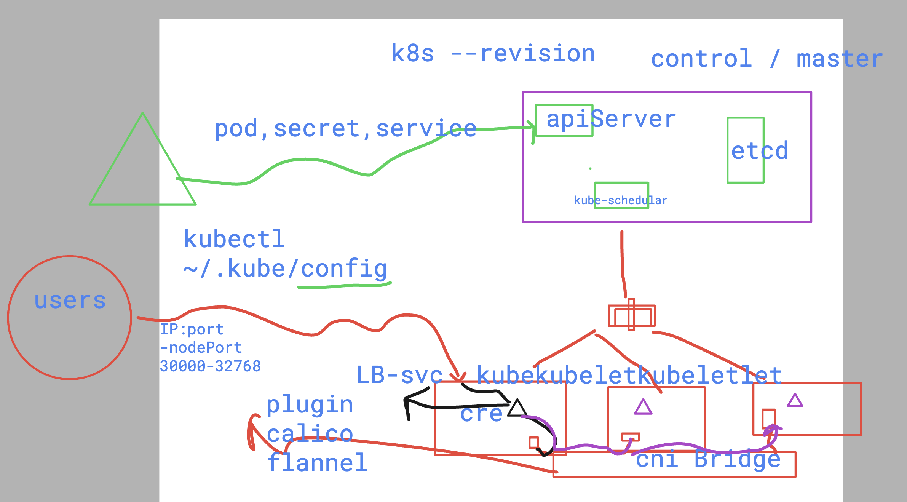
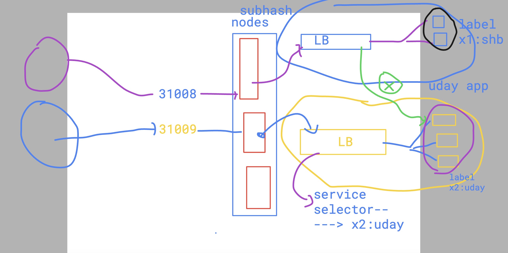

# devops_airtel

### about k8s revision



### Deleting all the pods 

```
 kubectl delete pods --all
pod "ashupod1" deleted
 humanfirmware@darwin  ~/devops_airtel/k8s   master  kubectl get pods
No resources found in default namespace.
 humanfirmware@darwin  ~/devops_airtel/k8s   master  

```

### service delete 

```
kubectl get svc
NAME         TYPE        CLUSTER-IP      EXTERNAL-IP   PORT(S)        AGE
kubernetes   ClusterIP   10.43.0.1       <none>        443/TCP        15d
ashulb1      NodePort    10.43.106.118   <none>        80:30358/TCP   40h
 humanfirmware@darwin  ~/devops_airtel/k8s   master  kubectl delete svc ashulb1 
service "ashulb1" deleted
 humanfirmware@darwin  ~/devops_airtel/k8s   master  
```

### internal k8s lb (service) -- is finind pods using their labels



### Creating pod using label 

```
kubectl create -f pod.yml 
pod/ashupod3 created
 humanfirmware@darwin  ~/devops_airtel/k8s/day8   master  kubectl get pod
NAME       READY   STATUS              RESTARTS   AGE
ashupod3   0/1     ContainerCreating   0          4s

 humanfirmware@darwin  ~/devops_airtel/k8s/day8   master  kubectl get pod --show-labels
NAME       READY   STATUS              RESTARTS   AGE   LABELS
ashupod3   0/1     ContainerCreating   0          12s   run=ashupod3
```

### if we create service using create command 

```
kubectl  create service 
Create a service using a specified subcommand.

Aliases:
service, svc

Available Commands:
  clusterip      Create a ClusterIP service
  externalname   Create an ExternalName service
  loadbalancer   Create a LoadBalancer service
  nodeport       Create a NodePort service

Usage:
  kubectl create service [flags] [options]

Use "kubectl create service <command> --help" for more information about a given command.
Use "kubectl options" for a list of global command-line options (applies to all commands).
 ✘ humanfirmware@darwin  ~/devops_airtel/k8s/day8   master  kubectl  create service  nodeport  ashulb1 --tcp 80:80 --dry-run=client -o yaml
apiVersion: v1
kind: Service
metadata:
  creationTimestamp: null
  labels:
    app: ashulb1
  name: ashulb1
spec:
  ports:
  - name: 80-80
    port: 80
    protocol: TCP
    targetPort: 80
  selector:
    app: ashulb1
  type: NodePort
status:
  loadBalancer: {}


 humanfirmware@darwin  ~/devops_airtel/k8s/day8   master  kubectl get pod --show-labels                                                  
NAME       READY   STATUS    RESTARTS   AGE     LABELS
ashupod3   1/1     Running   0          3m16s   run=ashupod3
```


## if label of pods is not used by selector of service then interlb can't find pod 

```
kubectl get pods --show-labels
NAME       READY   STATUS    RESTARTS   AGE     LABELS
ashupod3   1/1     Running   0          4m49s   run=ashupod3
 humanfirmware@darwin  ~/devops_airtel/k8s/day8   master  

 humanfirmware@darwin  ~/devops_airtel/k8s/day8   master  kubectl get svc               
NAME         TYPE        CLUSTER-IP    EXTERNAL-IP   PORT(S)        AGE
kubernetes   ClusterIP   10.43.0.1     <none>        443/TCP        16d
ashulb1      NodePort    10.43.86.12   <none>        80:31387/TCP   40s

 humanfirmware@darwin  ~/devops_airtel/k8s/day8   master  kubectl get svc ashulb1 
NAME      TYPE       CLUSTER-IP    EXTERNAL-IP   PORT(S)        AGE
ashulb1   NodePort   10.43.86.12   <none>        80:31387/TCP   43s

 humanfirmware@darwin  ~/devops_airtel/k8s/day8   master  kubectl get svc ashulb1  -o wide
NAME      TYPE       CLUSTER-IP    EXTERNAL-IP   PORT(S)        AGE   SELECTOR
ashulb1   NodePort   10.43.86.12   <none>        80:31387/TCP   46s   app=ashulb1
 humanfirmware@darwin  ~/devops_airtel/k8s/day8   master  
```

### matching label of pod to service selector 

```
kubectl get pods --show-labels  
NAME       READY   STATUS    RESTARTS   AGE     LABELS
ashupod3   1/1     Running   0          6m27s   run=ashupod3
 humanfirmware@darwin  ~/devops_airtel/k8s/day8   master  kubectl replace -f svc.yml --force
service "ashulb1" deleted
service/ashulb1 replaced
 humanfirmware@darwin  ~/devops_airtel/k8s/day8   master  kubectl get svc ashulb1  -o wide  
NAME      TYPE       CLUSTER-IP     EXTERNAL-IP   PORT(S)        AGE   SELECTOR
ashulb1   NodePort   10.43.65.176   <none>        80:30838/TCP   6s    run=ashupod3
 humanfirmware@darwin  ~/devops_airtel/k8s/day8   master  kubectl get pods --show-labels    
NAME       READY   STATUS    RESTARTS   AGE     LABELS
ashupod3   1/1     Running   0          7m17s   run=ashupod3
 humanfirmware@darwin  ~/devops_airtel/k8s/day8   master  
```

### service store pods ip and port in endpoint resource 

```
kubectl get pods --show-labels
NAME       READY   STATUS              RESTARTS   AGE   LABELS
ashupod3   1/1     Running             0          11m   run=ashupod3
ashupod4   0/1     ContainerCreating   0          9s    run=ashupod3
 humanfirmware@darwin  ~/devops_airtel/k8s/day8   master  
 humanfirmware@darwin  ~/devops_airtel/k8s/day8   master  kubectl get pods -o wide      
NAME       READY   STATUS    RESTARTS   AGE   IP            NODE                   NOMINATED NODE   READINESS GATES
ashupod3   1/1     Running   0          11m   10.42.0.128   lima-rancher-desktop   <none>           <none>
ashupod4   1/1     Running   0          17s   10.42.0.129   lima-rancher-desktop   <none>           <none>
 humanfirmware@darwin  ~/devops_airtel/k8s/day8   master  kubectl  get  endpoints       
NAME         ENDPOINTS                       AGE
kubernetes   192.168.5.15:6443               16d
ashulb1      10.42.0.128:80,10.42.0.129:80   4m8s
```

