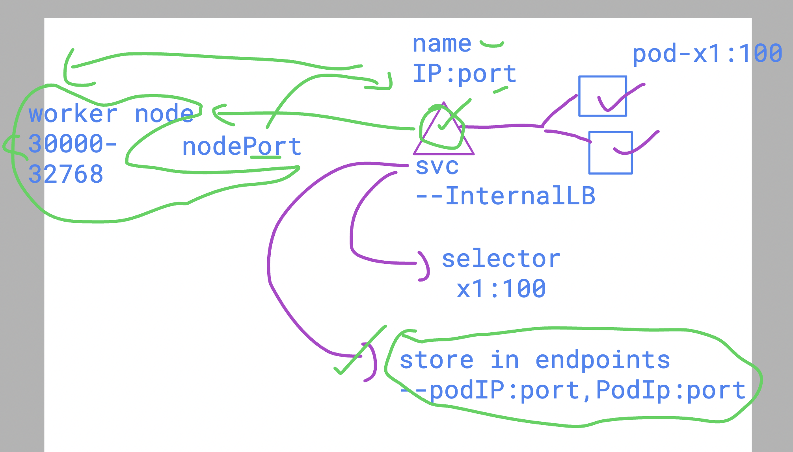
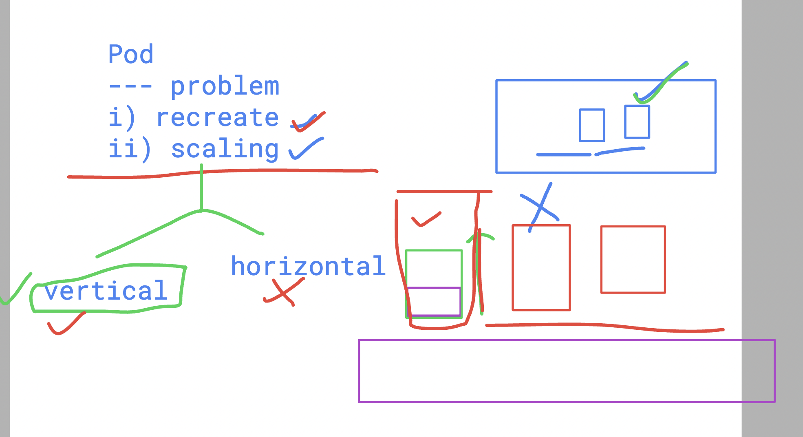

# devops_airtel

## K8s service revision 



## horizontal scaling is a problem in pod deployment 



### Creating pod using RC 

```
kubectl create -f myrc.yml
replicationcontroller/ashurc1 created
 humanfirmware@darwin  ~/devops_airtel/k8s/day9   master  kubectl  get  replicationcontroller
NAME      DESIRED   CURRENT   READY   AGE
ashurc1   1         1         0       11s
 humanfirmware@darwin  ~/devops_airtel/k8s/day9   master  
 humanfirmware@darwin  ~/devops_airtel/k8s/day9   master  kubectl  get  rc                   
NAME      DESIRED   CURRENT   READY   AGE
ashurc1   1         1         1       16s

```

## testing recreation -- self healing 

```

kubectl delete pod --all
pod "ashupod3" deleted
pod "ashupod4" deleted
pod "ashurc1-nn98x" deleted
 humanfirmware@darwin  ~/devops_airtel/k8s/day9   master  kubectl  get  po        
NAME            READY   STATUS              RESTARTS   AGE
ashurc1-rkfjz   0/1     ContainerCreating   0          12s

 humanfirmware@darwin  ~/devops_airtel/k8s/day9   master  kubectl  get  po
NAME            READY   STATUS    RESTARTS   AGE
ashurc1-rkfjz   1/1     Running   0          38s
```

## scaling pods using RC -- manually

```
kubectl  get rc
NAME      DESIRED   CURRENT   READY   AGE
ashurc1   1         1         1       3m2s
 humanfirmware@darwin  ~/devops_airtel/k8s/day9   master  
 humanfirmware@darwin  ~/devops_airtel/k8s/day9   master  kubectl  scale rc  ashurc1  --replicas=3
replicationcontroller/ashurc1 scaled
 humanfirmware@darwin  ~/devops_airtel/k8s/day9   master  
 humanfirmware@darwin  ~/devops_airtel/k8s/day9   master  kubectl  get rc                         
NAME      DESIRED   CURRENT   READY   AGE
ashurc1   3         3         1       4m
 humanfirmware@darwin  ~/devops_airtel/k8s/day9   master  kubectl  get  po --show-labels          
NAME            READY   STATUS    RESTARTS   AGE    LABELS
ashurc1-9xn8m   1/1     Running   0          117s   x1=helloashu
ashurc1-kbvqz   1/1     Running   0          12s    x1=helloashu
ashurc1-b8772   1/1     Running   0          12s    x1=helloashu
 humanfirmware@darwin  ~/devops_airtel/k8s/day9   master  

```

## creating service using RC 

```
 kubectl  get  rc

NAME      DESIRED   CURRENT   READY   AGE
ashurc1   1         1         1       5m4s
 humanfirmware@darwin  ~/devops_airtel/k8s/day9   master  
 humanfirmware@darwin  ~/devops_airtel/k8s/day9   master  
 humanfirmware@darwin  ~/devops_airtel/k8s/day9   master  kubectl expose rc ashurc1 --type NodePort --port 80 --name ashulb
1 --dry-run=client -o yaml >np.yml 
```
