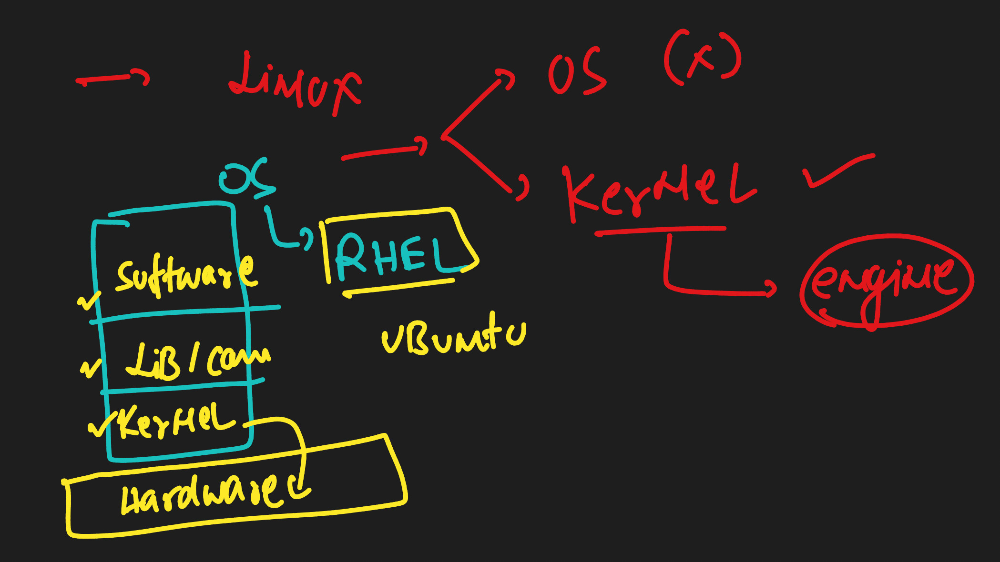
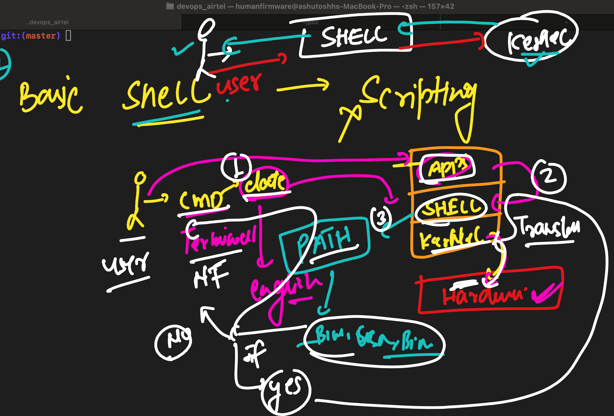
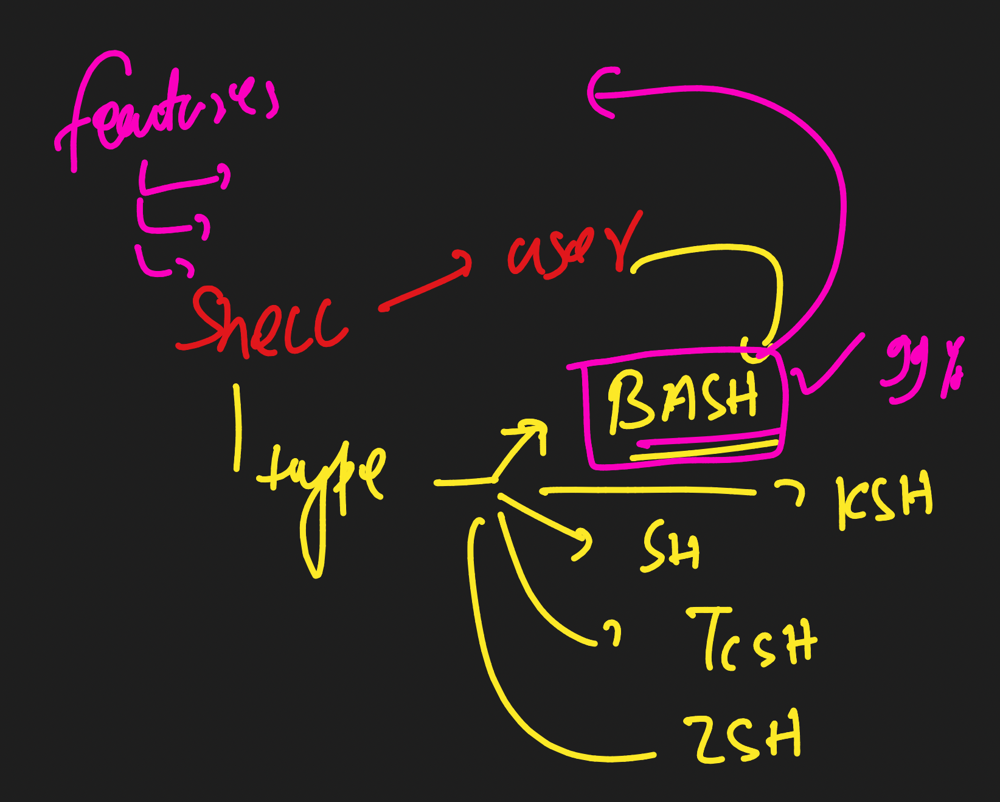

### Info about LInux as kernel 



### Understanding working of shell in linux 



### exploring env variable in linux 

```
[airtel@gaea-test ~]$ x=10
[airtel@gaea-test ~]$ 
[airtel@gaea-test ~]$ echo $x
10
[airtel@gaea-test ~]$ echo $path

[airtel@gaea-test ~]$ echo $PATH
/usr/local/bin:/bin:/usr/bin:/usr/local/sbin:/usr/sbin:/home/airtel/.local/bin:/home/airtel/bin
[airtel@gaea-test ~]$ 
[airtel@gaea-test ~]$ 
[airtel@gaea-test ~]$ cal
    January 2024    
Su Mo Tu We Th Fr Sa
    1  2  3  4  5  6
 7  8  9 10 11 12 13
14 15 16 17 18 19 20
21 22 23 24 25 26 27
28 29 30 31

[airtel@gaea-test ~]$ which  cal 
/bin/cal

```

### default history size checking 

```
[airtel@gaea-test ~]$ echo    $HISTSIZE
1000
[airtel@gaea-test ~]$ whoami
airtel
[airtel@gaea-test ~]$ 

```

### changing history size 

```
[airtel@gaea-test ~]$ HISTSIZE=2
[airtel@gaea-test ~]$ echo    $HISTSIZE
2
[airtel@gaea-test ~]$ date
-bash: /bin/date: Permission denied
[airtel@gaea-test ~]$ cal
    January 2024    
Su Mo Tu We Th Fr Sa
    1  2  3  4  5  6
 7  8  9 10 11 12 13
14 15 16 17 18 19 20
21 22 23 24 25 26 27
28 29 30 31

[airtel@gaea-test ~]$ ls
[airtel@gaea-test ~]$ history 
    8  ls
    9  history 

```

### changing size in ,bashrch 

```
airtel@gaea-test ~]$ cat  .bashrc 
# .bashrc

# Source global definitions
if [ -f /etc/bashrc ]; then
	. /etc/bashrc
fi

# Uncomment the following line if you don't like systemctl's auto-paging feature:
# export SYSTEMD_PAGER=

# User specific aliases and functions

# changing history size

HISTSIZE=2000

```

### checking it

```
[airtel@gaea-test ~]$ echo $HISTSIZE
1000
[airtel@gaea-test ~]$ source  .bashrc  # laod file without logout that user 
[airtel@gaea-test ~]$ 
[airtel@gaea-test ~]$ echo $HISTSIZE
2000

```

### listing env variable for current user 

```
[airtel@gaea-test ~]$ env
XDG_SESSION_ID=250
HOSTNAME=gaea-test
SHELL=/bin/bash
TERM=xterm-256color
HISTSIZE=2000
USER=airtel
LS_COLORS=rs=0:di=38;5;27:ln=38;5;51:mh=44;38;5;15:pi=40;38;5;11:so=38;5;13:do=38;5;5:bd=48;5;232;38;5;11:cd=48;5;232;38;5;3:or=48;5;232;38;5;9:mi=05;48;5;232;38;5;15:su=48;5;196;38;5;15:sg=48;5;11;38;5;16:ca=48;5;196;38;5;226:tw=48;5;10;38;5;16:ow=48;5;10;38;5;21:st=48;5;21;38;5;15:ex=38;5;34:*.tar=38;5;9:*.tgz=38;5;9:*.arc=38;5;9:*.arj=38;5;9:*.taz=38;5;9:*.lha=38;5;9:*.lz4=38;5;9:*.lzh=38;5;9:*.lzma=38;5;9:*.tlz=38;5;9:*.txz=38;5;9:*.tzo=38;5;9:*.t7z=38;5;9:*.zip=38;5;9:*.z=38;5;9:*.Z=38;5;9:*.dz=38;5;9:*.gz=38;5;9:*.lrz=38;5;9:*.lz=38;5;9:*.lzo=38;5;9:*.xz=38;5;9:*.bz2=38;5;9:*.bz=38;5;9:*.tbz=38;5;9:*.tbz2=38;5;9:*.tz=38;5;9:*.deb=38;5;9:*.rpm=38;5;9:*.jar=38;5;9:*.war=38;5;9:*.ear=38;5;9:*.sar=38;5;9:*.rar=38;5;9:*.alz=38;5;9:*.ace=38;5;9:*.zoo=38;5;9:*.cpio=38;5;9:*.7z=38;5;9:*.rz=3
```

### options of shell



### all the available shell in your os 

```
[airtel@gaea-test ~]$ cat  /etc/shells 
/bin/sh
/bin/bash
/usr/bin/sh
/usr/bin/bash
```


## changing shell for current user without root access

```
[airtel@gaea-test ~]$ chsh 
Changing shell for airtel.
New shell [/bin/bash]: /bin/sh
Password: 
Shell changed.
[airtel@gaea-test ~]$ 

```

### settting alias for current user 

```
[airtel@gaea-test ~]$ alias  apr='cal 4 2024'
[airtel@gaea-test ~]$ 
[airtel@gaea-test ~]$ 
[airtel@gaea-test ~]$ apr
     April 2024     
Su Mo Tu We Th Fr Sa
    1  2  3  4  5  6
 7  8  9 10 11 12 13
14 15 16 17 18 19 20
21 22 23 24 25 26 27
28 29 30


```

### mking alias permannet 

```
[airtel@gaea-test ~]$ cat .bashrc 
# .bashrc

# Source global definitions
if [ -f /etc/bashrc ]; then
	. /etc/bashrc
fi

# Uncomment the following line if you don't like systemctl's auto-paging feature:
# export SYSTEMD_PAGER=

# User specific aliases and functions

# changing history size

HISTSIZE=2000

# setting alias 

alias apr='cal  4 2024'
[airtel@gaea-test ~]$ 


```

