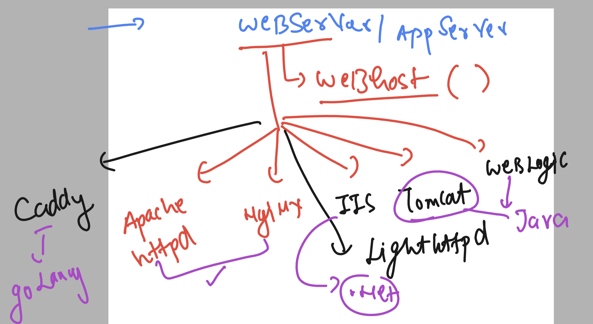
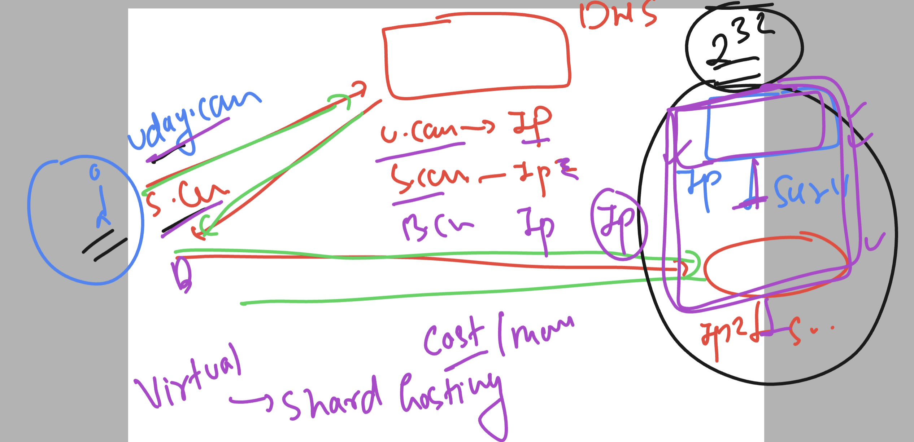
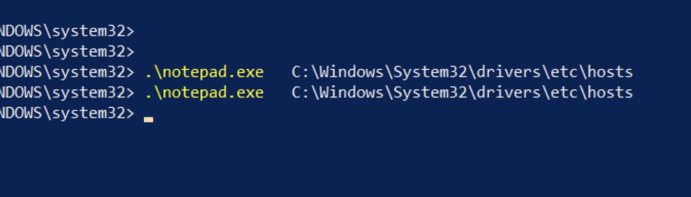

### web server 



### Installing httpd server

```
[ec2-user@ip-172-31-31-63 ~]$ rpm -q httpd
package httpd is not installed
[ec2-user@ip-172-31-31-63 ~]$ 
[ec2-user@ip-172-31-31-63 ~]$ sudo yum install httpd -y
Failed to set locale, defaulting to C
Loaded plugins: extras_suggestions, langpacks, priorities, update-motd
amzn2-core                                                                                      | 3.6 kB  00:00:00     
amzn2extra-docker                                                                               | 2.9 kB  00:00:00     
amzn2extra-kernel-5.10                                                                          | 3.0 kB  00:00:00     
Resolving Dependencies
--> Running transaction check
---> Package httpd.x86_64 0:2.4.58-1.amzn2 will be installed
```

### veriry 

```
[ec2-user@ip-172-31-31-63 ~]$ rpm -qi httpd
Name        : httpd
Version     : 2.4.58
Release     : 1.amzn2
Architecture: x86_64
Install Date: Wed Mar  6 03:40:49 2024
Group       : System Environment/Daemons
Size        : 4356527
License     : ASL 2.0
Signature   : RSA/SHA512, Thu Oct 26 20:15:37 2023, Key ID 11cf1f95c87f5b1a
Source RPM  : httpd-2.4.58-1.amzn2.src.rpm
Build Date  : Thu Oct 26 20:10:09 2023
Build Host  : build.amazon.com
Relocations : (not relocatable)
Packager    : Amazon Linux
Vendor      : Amazon Linux
URL         : https://httpd.apache.org/
Summary     : Apache HTTP Server
Description :
The Apache HTTP Server is a powerful, efficient, and extensible
web server.

```

### checking config and sub config files 

```
[ec2-user@ip-172-31-31-63 ~]$ rpm -qc httpd
/etc/httpd/conf.d/autoindex.conf
/etc/httpd/conf.d/userdir.conf
/etc/httpd/conf.d/welcome.conf
/etc/httpd/conf.modules.d/00-base.conf
/etc/httpd/conf.modules.d/00-dav.conf
/etc/httpd/conf.modules.d/00-lua.conf
/etc/httpd/conf.modules.d/00-mpm.conf
/etc/httpd/conf.modules.d/00-optional.conf
/etc/httpd/conf.modules.d/00-proxy.conf
/etc/httpd/conf.modules.d/00-systemd.conf
/etc/httpd/conf.modules.d/01-cgi.conf
/etc/httpd/conf/httpd.conf
/etc/httpd/conf/magic
/etc/logrotate.d/httpd
/etc/sysconfig/htcacheclean
[ec2-user@ip-172-31-31-63 ~]$ 

```

### hosting sample page 

```
oot@ip-172-31-31-63 ~]# cd /var/www/html/
[root@ip-172-31-31-63 html]# ls
[root@ip-172-31-31-63 html]# echo hello >index.html 
[root@ip-172-31-31-63 html]# 
[root@ip-172-31-31-63 html]# 
[root@ip-172-31-31-63 html]# systemctl start httpd
[root@ip-172-31-31-63 html]# systemctl enable  httpd
Created symlink from /etc/systemd/system/multi-user.target.wants/httpd.service to /usr/lib/systemd/system/httpd.service.

```

### we can take a sample realworld page 

```
 cd  /tmp/
[root@ip-172-31-31-63 tmp]# git clone https://github.com/schoolofdevops/html-sample-app.git
cp -rf html-sample-app/*  /var/www/html/
cp: overwrite '/var/www/html/index.html'? y

```

### logs we can see 

```
[root@ip-172-31-31-63 httpd]# pwd
/var/log/httpd
[root@ip-172-31-31-63 httpd]# ls
access_log  error_log
```

### Understanding Virtual / shared hosting 



### /etc/host location in windows 



### in linux 
/etc/hosts
