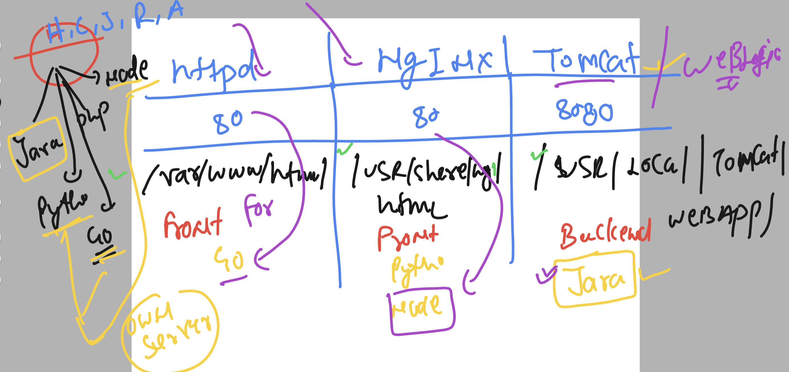
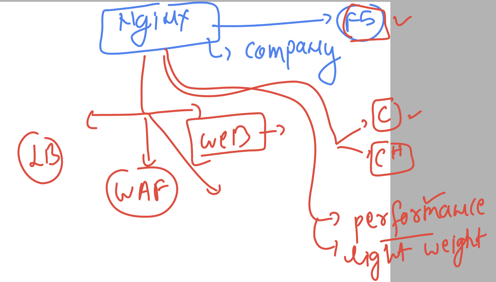

### final linux session about web server 



### info about Nginx 



### docs to install nginx on rhel/centos etc

[click_here](https://docs.nginx.com/nginx/admin-guide/installing-nginx/installing-nginx-open-source/)

### Installing on amaozn linux 

```
sudo amazon-linux-extras install epel
sudo yum install nginx

```

### verify 

```
[root@ip-172-31-18-146 ~]# nginx -v
nginx version: nginx/1.20.1
[root@ip-172-31-18-146 ~]# 


```

### rpm check 

```
[root@ip-172-31-18-146 ~]# rpm -qc  nginx 
/etc/logrotate.d/nginx
/etc/nginx/fastcgi.conf
/etc/nginx/fastcgi.conf.default
/etc/nginx/fastcgi_params
/etc/nginx/fastcgi_params.default
/etc/nginx/koi-utf
/etc/nginx/koi-win
/etc/nginx/mime.types
/etc/nginx/mime.types.default
/etc/nginx/nginx.conf
/etc/nginx/nginx.conf.default
/etc/nginx/scgi_params
/etc/nginx/scgi_params.default
/etc/nginx/uwsgi_params
/etc/nginx/uwsgi_params.default
/etc/nginx/win-utf

```

### checking config file 

```
root@ip-172-31-18-146 nginx]# ls
conf.d        fastcgi.conf.default    koi-utf     mime.types.default  scgi_params          uwsgi_params.default
default.d     fastcgi_params          koi-win     nginx.conf          scgi_params.default  win-utf
fastcgi.conf  fastcgi_params.default  mime.types  nginx.conf.default  uwsgi_params
[root@ip-172-31-18-146 nginx]# cd  conf.d/
[root@ip-172-31-18-146 conf.d]# ls
[root@ip-172-31-18-146 conf.d]# cd ../default.d/
[root@ip-172-31-18-146 default.d]# ls
[root@ip-172-31-18-146 default.d]# nginx -t
nginx: the configuration file /etc/nginx/nginx.conf syntax is ok
nginx: configuration file /etc/nginx/nginx.conf test is successful
[root@ip-172-31-18-146 default.d]# 
[root@ip-172-31-18-146 default.d]# 

```


