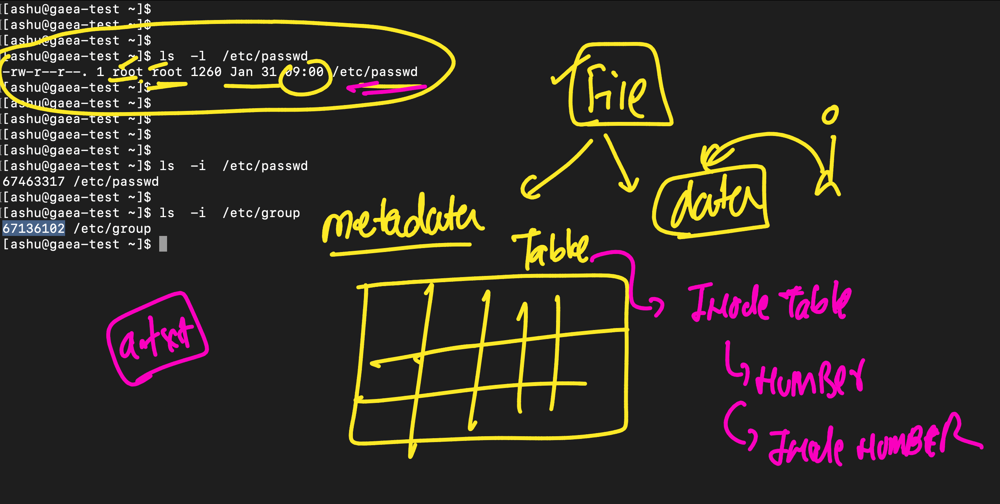
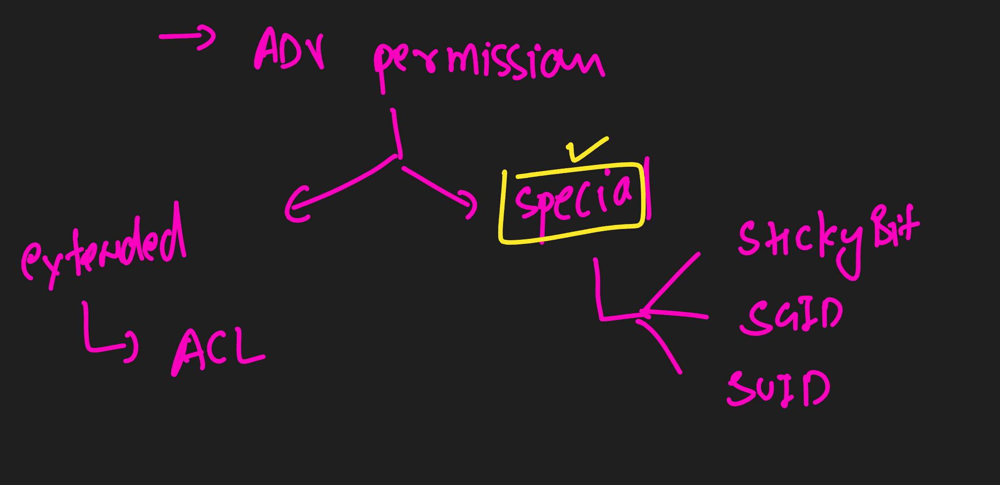
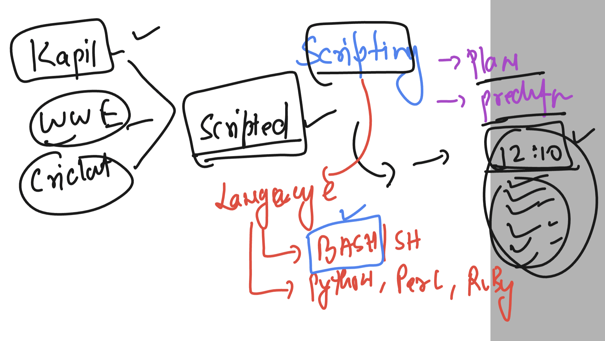

## linux understanding 

### understanding metadata



### adv permission 



### sticky bit 

```
[root@gaea-test ~]# ls -ld /tasks
drwxrwxr-x. 7 root tech 79 Feb  3 16:24 /tasks
[root@gaea-test ~]# 
[root@gaea-test ~]# 
[root@gaea-test ~]# chmod  +t  /tasks
[root@gaea-test ~]# 
[root@gaea-test ~]# ls  -ld  /tasks
drwxrwxr-t. 7 root tech 79 Feb  3 16:24 /tasks
[root@gaea-test ~]# 

```
### removing and adding demo 2

```
[root@gaea-test ~]# chmod  -t   /tasks
[root@gaea-test ~]# 
[root@gaea-test ~]# ls  -ld  /tasks
drwxrwxr-x. 7 root tech 79 Feb  3 16:24 /tasks
[root@gaea-test ~]# 
[root@gaea-test ~]# 
[root@gaea-test ~]# 
[root@gaea-test ~]# chmod   1775   /tasks
[root@gaea-test ~]# 
[root@gaea-test ~]# ls  -ld  /tasks
drwxrwxr-t. 7 root tech 79 Feb  3 16:24 /tasks
[root@gaea-test ~]# 
[root@gaea-test ~]# 
[root@gaea-test ~]# chmod   0775   /tasks
[root@gaea-test ~]# 
[root@gaea-test ~]# ls  -ld  /tasks
drwxrwxr-x. 7 root tech 79 Feb  3 16:24 /tasks
[root@gaea-test ~]# 


```

### SGID 

```
root@gaea-test ~]# chmod g+s   /tasks/
[root@gaea-test ~]# 
[root@gaea-test ~]# ls -ld  /tasks
drwxrwsr-t. 5 root tech 51 Feb  3 16:29 /tasks
[root@gaea-test ~]# chmod g-s   /tasks/
[root@gaea-test ~]# ls -ld  /tasks
drwxrwxr-t. 5 root tech 51 Feb  3 16:29 /tasks
[root@gaea-test ~]# chmod  2775  /tasks
[root@gaea-test ~]# ls -ld  /tasks
drwxrwsr-x. 5 root tech 51 Feb  3 16:29 /tasks
[root@gaea-test ~]# chmod  3775  /tasks
[root@gaea-test ~]# 
[root@gaea-test ~]# 
[root@gaea-test ~]# ls -ld  /tasks
drwxrwsr-t. 5 root tech 51 Feb  3 16:29 /tasks
[root@gaea-test ~]# 

```

### SUID -- only apply in a file must which can be a command or script 

```
ot@gaea-test ~]# 
[root@gaea-test ~]# 
[root@gaea-test ~]# chmod  4755 /bin/touch 
[root@gaea-test ~]# 
[root@gaea-test ~]# ls -l /bin/touch 
-rwsr-xr-x. 1 root root 62480 Nov 11  2020 /bin/touch
[root@gaea-test ~]# 
[root@gaea-test ~]# 
[root@gaea-test ~]# chmod  0755 /bin/touch 
[root@gaea-test ~]# 
[root@gaea-test ~]# ls -l /bin/touch 
-rwxr-xr-x. 1 root root 62480 Nov 11  2020 /bin/touch
[root@gaea-test ~]# 
[root@gaea-test ~]# chmod  u+s  /bin/touch 
[root@gaea-test ~]# 
[root@gaea-test ~]# ls -l /bin/touch 
-rwsr-xr-x. 1 root root 62480 Nov 11  2020 /bin/touch
[root@gaea-test ~]# 
[root@gaea-test ~]# chmod  u-s  /bin/touch 
[root@gaea-test ~]# 
[root@gaea-test ~]# chmod  u+s  /bin/touch 
[root@gaea-test ~]# 

```

### Understanding scripting 



### first ever shell script

```
[root@gaea-test ~]# cat  hello.sh 
#!/bin/bash
date
cal
ls
pwd
whoami

```

### How to RUN 

## method 1

```
bash hello.sh 
Sat Feb  3 16:51:19 IST 2024
    February 2024   
Su Mo Tu We Th Fr Sa
             1  2  3
 4  5  6  7  8  9 10
11 12 13 14 15 16 17
18 19 20 21 22 23 24
25 26 27 28 29

anaconda-ks.cfg  hello.sh  time.txt
/root
root

```

### method 2

```
[root@gaea-test ~]# ls -l hello.sh 
-rw-r--r--. 1 root root 35 Feb  3 16:51 hello.sh
[root@gaea-test ~]# 
[root@gaea-test ~]# 
[root@gaea-test ~]# chmod  +x  hello.sh 
[root@gaea-test ~]# 
[root@gaea-test ~]# ls -l hello.sh 
-rwxr-xr-x. 1 root root 35 Feb  3 16:51 hello.sh
[root@gaea-test ~]# 
[root@gaea-test ~]# ./hello.sh 
Sat Feb  3 16:52:52 IST 2024
    February 2024   
Su Mo Tu We Th Fr Sa
             1  2  3
 4  5  6  7  8  9 10
11 12 13 14 15 16 17
18 19 20 21 22 23 24
25 26 27 28 29

anaconda-ks.cfg  hello.sh  time.txt
/root
root

====>>
root@gaea-test ~]# /root/hello.sh 
Sat Feb  3 16:53:08 IST 2024
    February 2024   
Su Mo Tu We Th Fr Sa
             1  2  3
 4  5  6  7  8  9 10
11 12 13 14 15 16 17
18 19 20 21 22 23 24
25 26 27 28 29

anaconda-ks.cfg  hello.sh  time.txt
/root
root
[root@gaea-test ~]# 

```

