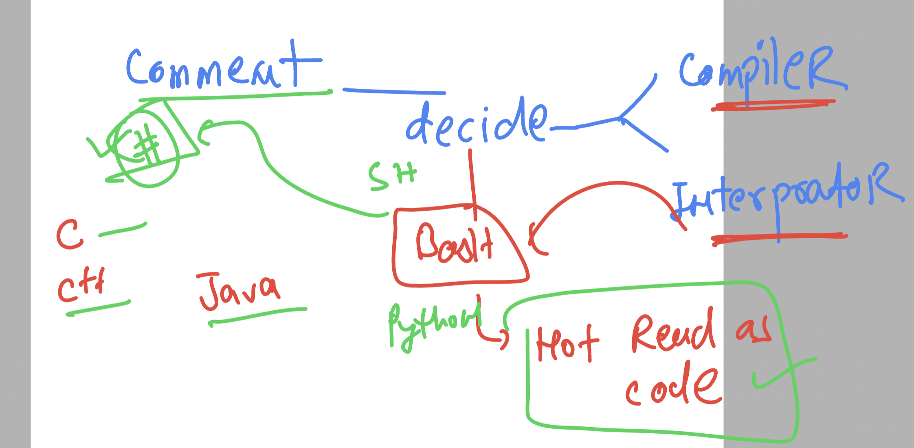

## linux shell scripting 

### quotations in shell 


### understanding comment in language 



### sample code of shell to take input from user 

```
#!/bin/bash 


echo "Please enter some linux command  to run  "
# in case you want to take input from user 
read cmd
# in above line read is waiting for user to enter something -- as soon as user is gonna enter it will store in a variable cmd 
x=cal
sleep 2
echo "hey i am going to RUn $cmd command "
sleep 3
$cmd

```

##  condition 

```
#!/bin/bash 

echo "please press some number ..."
read n1

# if starting 

if [ $n1 -eq 10 ]
then 
	cal 


elif [ $n1 -lt 10 ]
then
	uptime 

elif [ $n1 -gt 10 ]
then
	whoami 


fi

```

### task 1


