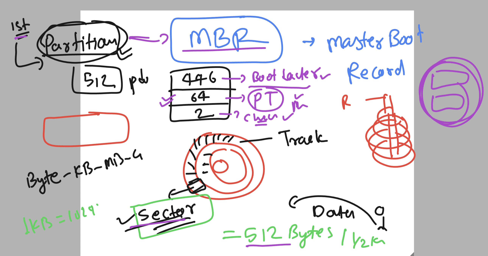

### Storage understanding 

### concept 


### device management by udev in linux 


### checking udev directory 

```
[root@gaea-test ~]# cd /etc/udev/
[root@gaea-test udev]# ls
hwdb.bin  rules.d  udev.conf
[root@gaea-test udev]# cat udev.conf 
# see udev.conf(5) for details

#udev_log="info"
[root@gaea-test udev]# cd rules.d/
[root@gaea-test rules.d]# ls
99-vmware-scsi-timeout.rules
[root@gaea-test rules.d]# cat 99-vmware-scsi-timeout.rules 
ACTION=="add", SUBSYSTEMS=="scsi", ATTRS{vendor}=="VMware  ", ATTRS{model}=="Virtual disk    ", RUN+="/bin/sh -c 'echo 180 > /sys$DEVPATH/timeout'"
[root@gaea-test rules.d]# 


```

### to check kernel message related to device 

```
dmesg   | grep -i sda
[    2.591470] sd 0:0:0:0: [sda] 104857600 512-byte logical blocks: (53.7 GB/50.0 GiB)
[    2.591715] sd 0:0:0:0: [sda] Write Protect is off
[    2.591716] sd 0:0:0:0: [sda] Mode Sense: 61 00 00 00
[    2.591977] sd 0:0:0:0: [sda] Cache data unavailable
[    2.591978] sd 0:0:0:0: [sda] Assuming drive cache: write through
[    2.595009]  sda: sda1 sda2
[    2.596718] sd 0:0:0:0: [sda] Attached SCSI disk
[    5.456942] XFS (sda1): Mounting V4 Filesystem
[    7.106887] XFS (sda1): Starting recovery (logdev: internal)
[    7.116112] XFS (sda1): Ending recovery (logdev: internal)
```

### checking hardware device 

```
  dmidecode 
  406  dmidecode --help
  407  dmidecode -t memory 
```
### to check list of usb devices

```
[root@gaea-test yum.repos.d]# lsusb
Bus 001 Device 001: ID 1d6b:0002 Linux Foundation 2.0 root hub
Bus 002 Device 003: ID 0e0f:0002 VMware, Inc. Virtual USB Hub
Bus 002 Device 002: ID 0e0f:0003 VMware, Inc. Virtual Mouse
Bus 002 Device 001: ID 1d6b:0001 Linux Foundation 1.1 root hub
[root@gaea-test yum.repos.d]# 

```

### type of storage 


### Need of partition is to give diff FS to storage device 


### total number of partition is related to partition table 


### reality of MBR 



### MBR pt can have max 4 primary partition type


### FInal MBR 


### creating part and format and mount 

```
[root@gaea-test ~]# fdisk -l /dev/sdb

Disk /dev/sdb: 21.5 GB, 21474836480 bytes, 41943040 sectors
Units = sectors of 1 * 512 = 512 bytes
Sector size (logical/physical): 512 bytes / 512 bytes
I/O size (minimum/optimal): 512 bytes / 512 bytes
Disk label type: dos
Disk identifier: 0x893297dd

   Device Boot      Start         End      Blocks   Id  System
/dev/sdb1            2048     6293503     3145728   83  Linux
/dev/sdb2         6293504    10487807     2097152   83  Linux
/dev/sdb3        10487808    16779263     3145728   83  Linux
/dev/sdb4        16779264    41943039    12581888    5  Extended
/dev/sdb5        16781312    20975615     2097152   83  Linux
/dev/sdb6        20977664    25171967     2097152   83  Linux
[root@gaea-test ~]# 
[root@gaea-test ~]# 
[root@gaea-test ~]# mkfs.
mkfs.btrfs   mkfs.cramfs  mkfs.ext2    mkfs.ext3    mkfs.ext4    mkfs.minix   mkfs.xfs     mkfs.xmem    
[root@gaea-test ~]# mkfs.xfs   /dev/sdb1
meta-data=/dev/sdb1              isize=256    agcount=4, agsize=196608 blks
         =                       sectsz=512   attr=2, projid32bit=1
         =                       crc=0        finobt=0, sparse=0, rmapbt=0, reflink=0
data     =                       bsize=4096   blocks=786432, imaxpct=25
         =                       sunit=0      swidth=0 blks
naming   =version 2              bsize=4096   ascii-ci=0 ftype=1
log      =internal log           bsize=4096   blocks=2560, version=2
         =                       sectsz=512   sunit=0 blks, lazy-count=1
realtime =none                   extsz=4096   blocks=0, rtextents=0
[root@gaea-test ~]# 
[root@gaea-test ~]# 
[root@gaea-test ~]# mkdir  /mnt/movies
[root@gaea-test ~]# 
[root@gaea-test ~]# mount  /dev/sdb1  /mnt/movies/
[root@gaea-test ~]# 
[root@gaea-test ~]# df -hT
Filesystem          Type      Size  Used Avail Use% Mounted on
devtmpfs            devtmpfs  3.8G     0  3.8G   0% /dev
tmpfs               tmpfs     3.8G     0  3.8G   0% /dev/shm
tmpfs               tmpfs     3.8G  8.8M  3.8G   1% /run
tmpfs               tmpfs     3.8G     0  3.8G   0% /sys/fs/cgroup
/dev/mapper/ol-root xfs        45G  5.7G   40G  13% /
/dev/sda1           xfs       497M  246M  252M  50% /boot
tmpfs               tmpfs     770M     0  770M   0% /run/user/1001
/dev/sdb1           xfs       3.0G   33M  3.0G   2% /mnt/movies

```


