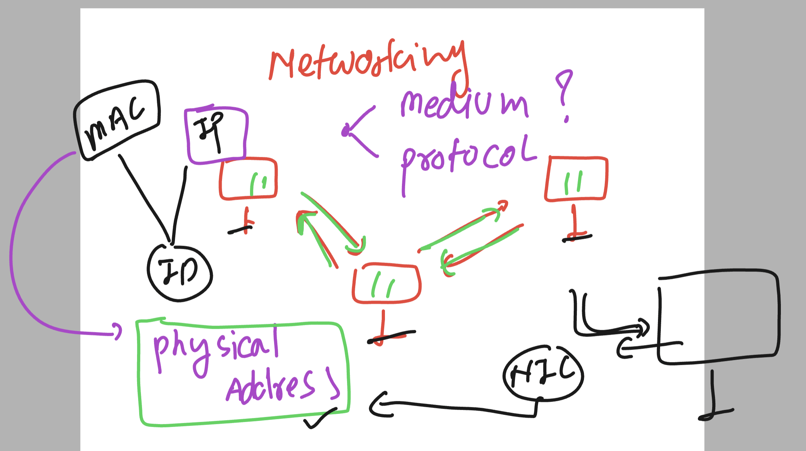
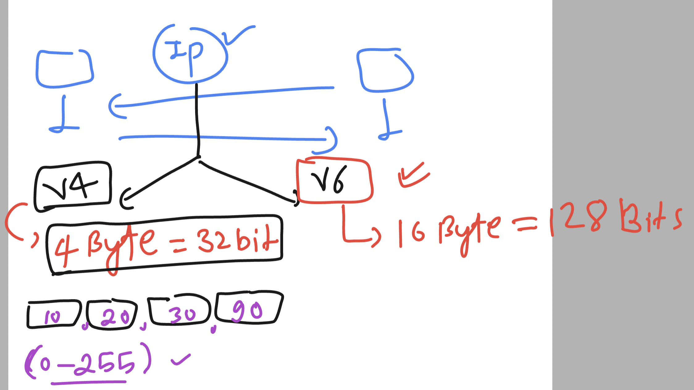
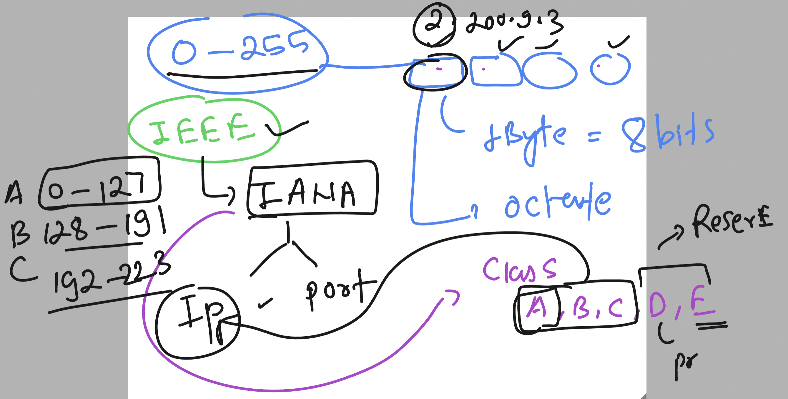
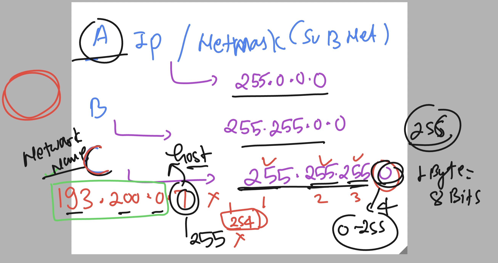
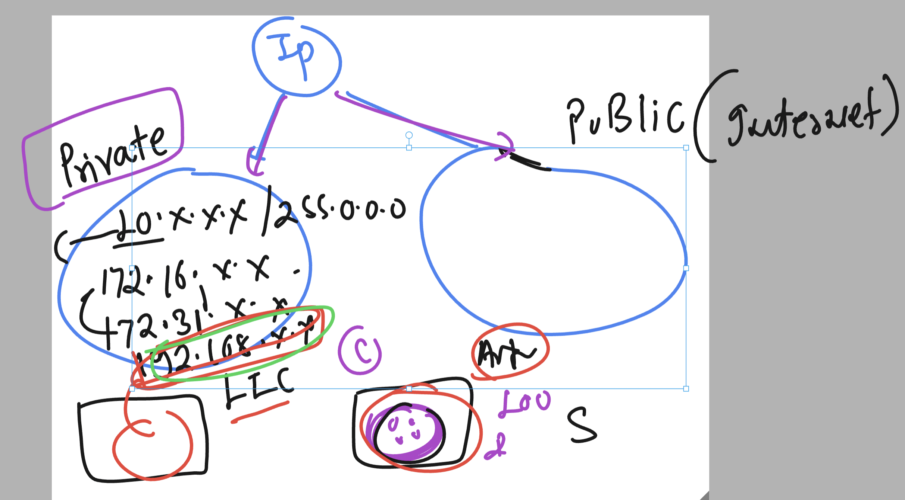
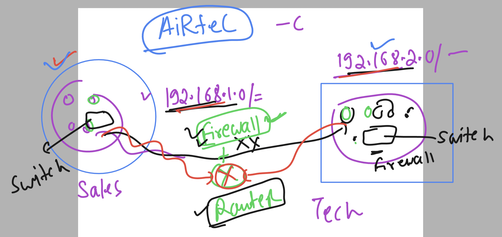
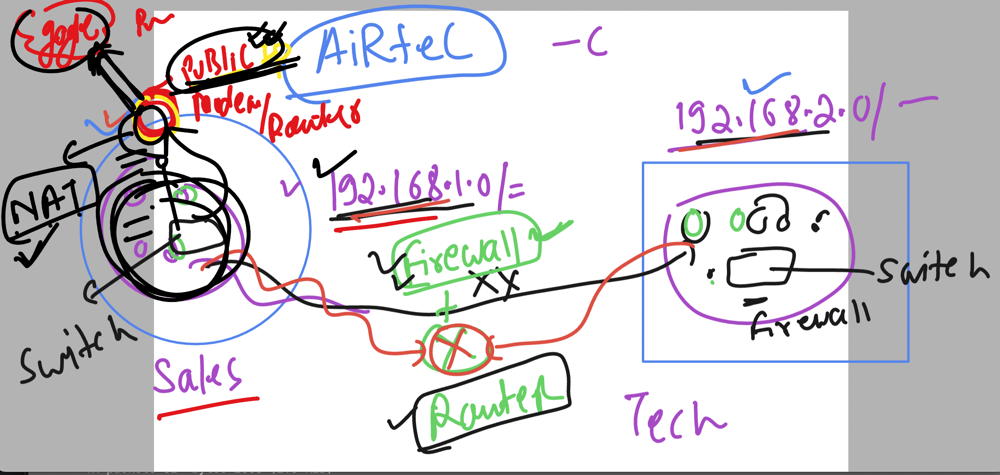

## linux understanding 

### basic understanding 



### to check MAC address in linux we can use ifconfig 

```
ns33: flags=4163<UP,BROADCAST,RUNNING,MULTICAST>  mtu 1500
        inet 192.168.192.128  netmask 255.255.255.0  broadcast 192.168.192.255
        inet6 fe80::1bdd:ab2f:6cbf:1b97  prefixlen 64  scopeid 0x20<link>
        ether 00:0c:29:ba:02:33 
```

### more info about IP address 




### more depth understanding about IP address by IEEE




### number of IP address is decided by netmask 



### giving ip address to specific NIC card 

```
[root@gaea-test ~]# ifconfig  lo 
lo: flags=73<UP,LOOPBACK,RUNNING>  mtu 65536
        inet 127.0.0.1  netmask 255.0.0.0
        inet6 ::1  prefixlen 128  scopeid 0x10<host>
        loop  txqueuelen 1000  (Local Loopback)
        RX packets 32  bytes 2368 (2.3 KiB)
        RX errors 0  dropped 0  overruns 0  frame 0
        TX packets 32  bytes 2368 (2.3 KiB)
        TX errors 0  dropped 0 overruns 0  carrier 0  collisions 0

[root@gaea-test ~]# ifconfig  lo  200.91.0.4 
[root@gaea-test ~]# ifconfig  lo 
lo: flags=73<UP,LOOPBACK,RUNNING>  mtu 65536
        inet 200.91.0.4  netmask 255.255.255.0
        inet6 ::1  prefixlen 128  scopeid 0x10<host>
        loop  txqueuelen 1000  (Local Loopback)
        RX packets 32  bytes 2368 (2.3 KiB)
        RX errors 0  dropped 0  overruns 0  frame 0
        TX packets 32  bytes 2368 (2.3 KiB)
        TX errors 0  dropped 0 overruns 0  carrier 0  collisions 0

[root@gaea-test ~]# ifconfig  lo  200.91.0.4  netmask 255.255.0.0
[root@gaea-test ~]# ifconfig  lo  
lo: flags=73<UP,LOOPBACK,RUNNING>  mtu 65536
        inet 200.91.0.4  netmask 255.255.0.0
        inet6 ::1  prefixlen 128  scopeid 0x10<host>
        loop  txqueuelen 1000  (Local Loopback)
        RX packets 32  bytes 2368 (2.3 KiB)
        RX errors 0  dropped 0  overruns 0  frame 0
        TX packets 32  bytes 2368 (2.3 KiB)
        TX errors 0  dropped 0 overruns 0  carrier 0  collisions 0


```

### NEtworking distribution 



### More understanding of netowrk 



### Understanding NAT 




