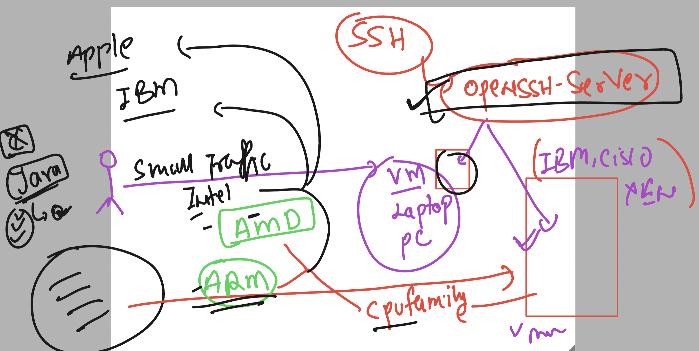
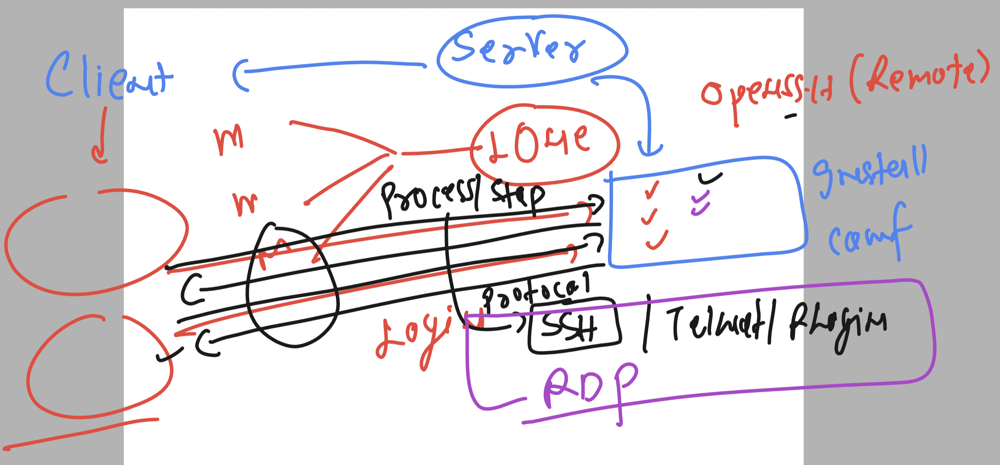
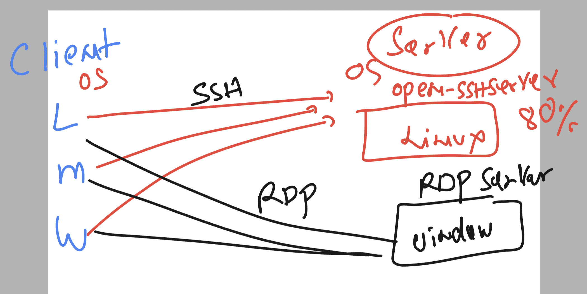
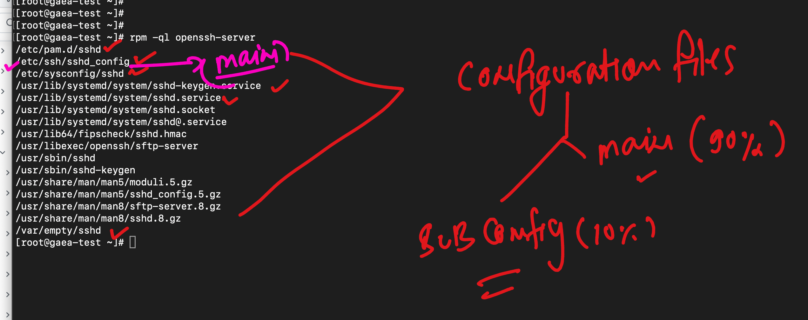
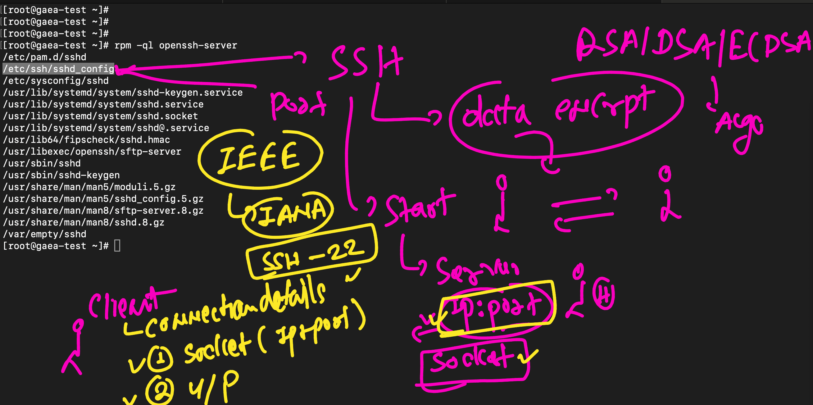
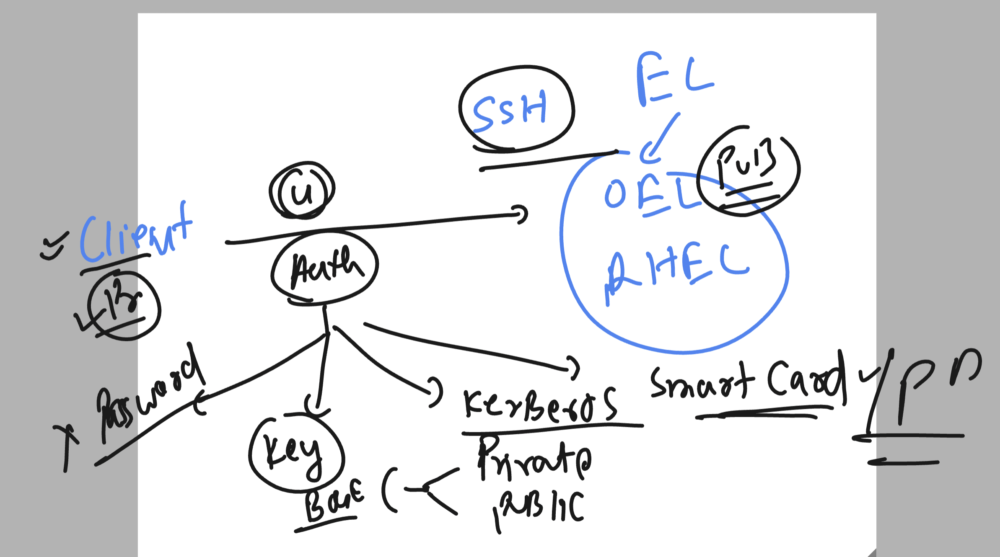
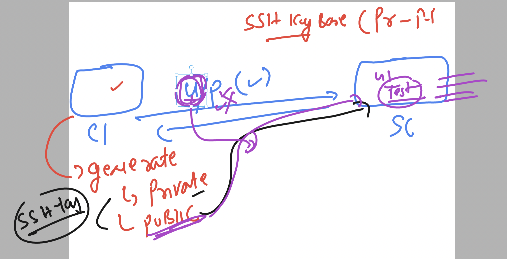

  ## linux understanding 

  ### Software and CPU (processor)  Relation 

  

  ### understanding remote protocols

  

  ### client and server proto relation 

  

  ## Now on Server side of linxu type

  ### checking software

```
[root@gaea-test ~]# rpm -q openssh-server
openssh-server-7.4p1-23.0.1.el7_9.x86_64
[root@gaea-test ~]# 
[root@gaea-test ~]# 
[root@gaea-test ~]# rpm -qa  | grep -i openssh
openssh-7.4p1-23.0.1.el7_9.x86_64
openssh-clients-7.4p1-23.0.1.el7_9.x86_64
openssh-server-7.4p1-23.0.1.el7_9.x86_64

```

### checking more info 

```
[root@gaea-test ~]# rpm -qi openssh-server
Name        : openssh-server
Version     : 7.4p1
Release     : 23.0.1.el7_9
Architecture: x86_64
Install Date: Tue Jan 16 13:42:34 2024
Group       : System Environment/Daemons
Size        : 993610
License     : BSD
Signature   : RSA/SHA256, Tue Aug  1 18:17:22 2023, Key ID 72f97b74ec551f03
Source RPM  : openssh-7.4p1-23.0.1.el7_9.src.rpm
Build Date  : Tue Aug  1 18:16:58 2023
Build Host  : build-ol7-x86_64.oracle.com
Relocations : (not relocatable)
Vendor      : Oracle America
URL         : http://www.openssh.com/portable.html
Summary     : An open source SSH server daemon
Description :

```

### main and sub config file of server 



### ssh server socket 



### ssh auth method 



### private and public key concept 



### testing 

```
[root@gaea-test ~]# ssh-keygen  
Generating public/private rsa key pair.
Enter file in which to save the key (/root/.ssh/id_rsa): 
Enter passphrase (empty for no passphrase): 
Enter same passphrase again: 
Your identification has been saved in /root/.ssh/id_rsa.
Your public key has been saved in /root/.ssh/id_rsa.pub.
The key fingerprint is:
SHA256:Hi69a989s4Fgu5m8pxe6gbC0X167SpUxKYOWyUjMh/E root@gaea-test
The key's randomart image is:
+---[RSA 2048]----+
|     ooo         |
|     .++.+   .   |
|      ..E o +    |
|       .   o +   |
|      o S o o    |
|     . B + +..   |
|      + = =.o..  |
|       o.*.Booo. |
|       .+o%B+.o+ |
+----[SHA256]-----+
[root@gaea-test ~]#


[root@gaea-test ~]# ssh-copy-id   test@52.87.167.216
/bin/ssh-copy-id: INFO: Source of key(s) to be installed: "/root/.ssh/id_rsa.pub"
/bin/ssh-copy-id: INFO: attempting to log in with the new key(s), to filter out any that are already installed
/bin/ssh-copy-id: INFO: 1 key(s) remain to be installed -- if you are prompted now it is to install the new keys
test@52.87.167.216's password: 

Number of key(s) added: 1

Now try logging into the machine, with:   "ssh 'test@52.87.167.216'"
and check to make sure that only the key(s) you wanted were added.

[root@gaea-test ~]# 

```


