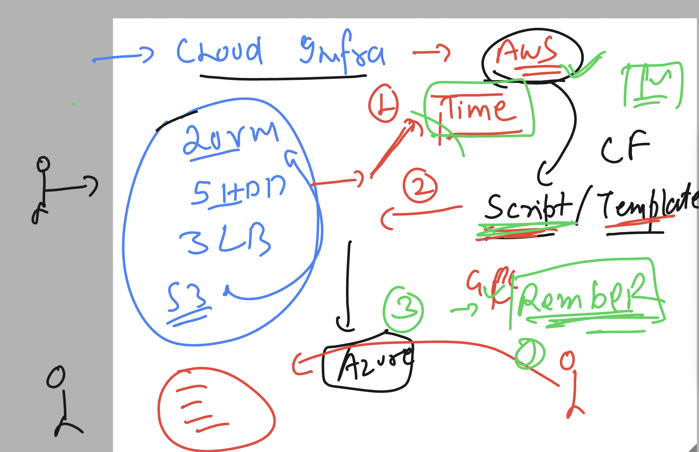
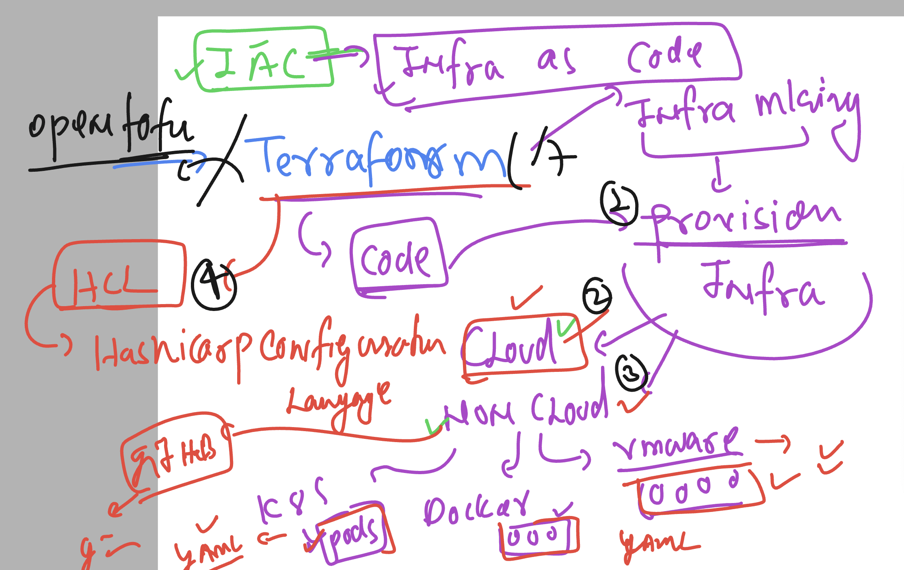
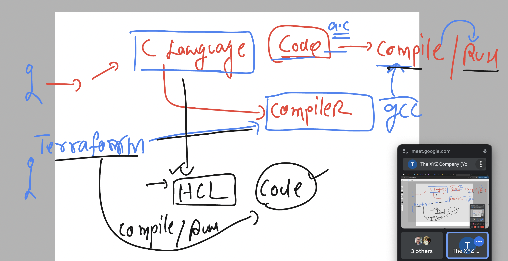
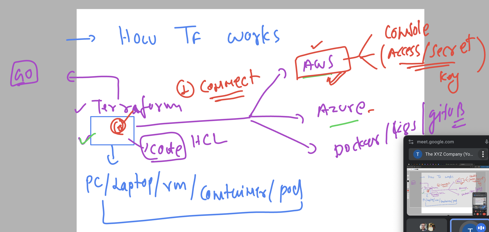
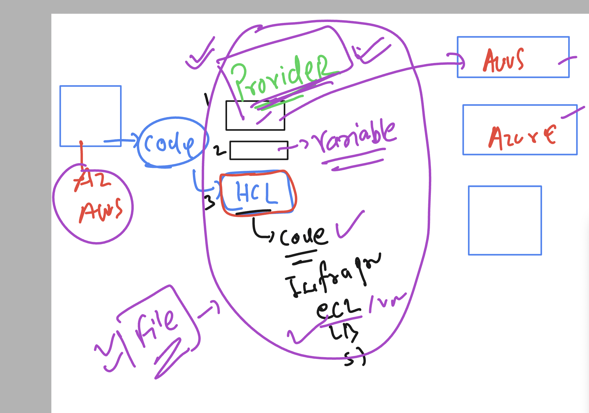

## Understanding problem of cloud infra creation 



### Understanding terraform 



### Basic info about Hashicorp 


### Terraform as compiler understanding 



## workflow of terraform for aws 

### using access and secret key 



### Terraform providers 



### Installing terraform  

[clicK_here](https://developer.hashicorp.com/terraform/install)

### Installing on Mac 

```
brew tap hashicorp/tap
brew install hashicorp/tap/terraform

===> verifty 
terraform -v
Terraform v1.9.5
on darwin_arm64

```

### Installing on Linux 

```
 wget https://releases.hashicorp.com/terraform/1.9.5/terraform_1.9.5_linux_amd64.zip

 unzip terraform_1.9.5_linux_amd64.zip 
Archive:  terraform_1.9.5_linux_amd64.zip
  inflating: LICENSE.txt             
  inflating: terraform   

[root@ip-172-31-84-50 ~]# ls
LICENSE.txt  terraform  terraform_1.9.5_linux_amd64.zip

===> verify 

[root@ip-172-31-84-50 ~]# terraform -v
Terraform v1.9.5
on linux_amd64

[root@ip-172-31-84-50 ~]# terraform -version 
Terraform v1.9.5
on linux_amd64

[root@ip-172-31-84-50 ~]# terraform --version 
Terraform v1.9.5
on linux_amd64

```


