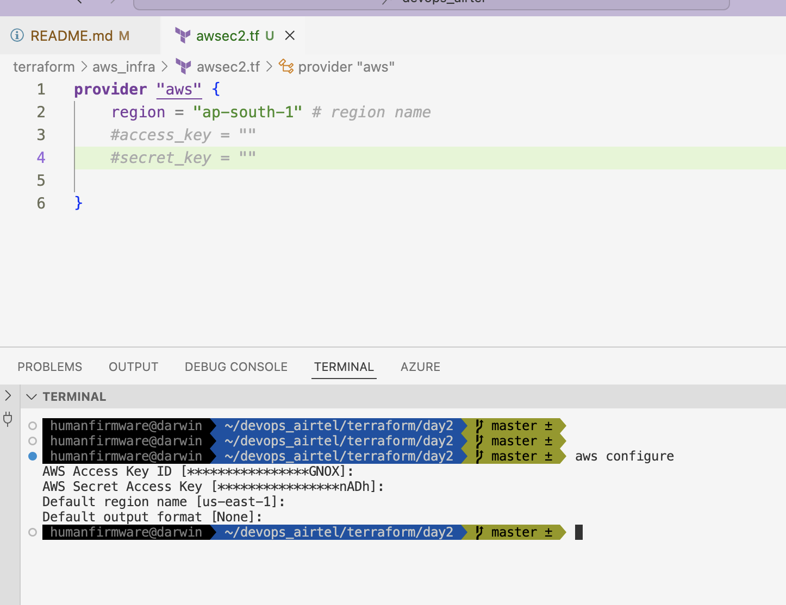

# devops_airtel

# writing terraform scripts

### configure aws access and secret key 



## to run code go to directory 

### step 1 

```
ls
awsec2.tf
 humanfirmware@darwin  ~/devops_airtel/terraform/aws_infra   master ±  terraform init 
Initializing the backend...
Initializing provider plugins...
- Finding latest version of hashicorp/aws...
- Installing hashicorp/aws v5.66.0...
```

### step 2  --PLan 

```
terraform plan 

Terraform used the selected providers to generate the following execution plan. Resource actions are indicated with the following symbols:
  + create

Terraform will perform the following actions:

  # aws_instance.ashu_ec2 will be created
  + resource "aws_instance" "ashu_ec2" {
      + ami                                  = "ami-0e53db6fd757e38c7"
      + arn                                  = (known after apply)
      + associate_public_ip_address          = (known after apply)
      + availability_zone                    = (known after apply)
```

### step 3 -- apply (actually create)

```
terraform apply 

Terraform used the selected providers to generate the following execution plan. Resource actions are indicated with the following symbols:
  + create

Terraform will perform the following actions:

  # aws_instance.ashu_ec2 will be created
  + resource "aws_instance" "ashu_ec2" {
      + ami                                  = "ami-0e53db6fd757e38c7"
      + arn                                  = (known after apply)
      + associate_public_ip_address          = (known after apply)
      + availability_zone                    = (known after apply)
      + cpu_core_count                       = (known after apply)
      + cpu_threads_per_core                 = (known after apply)
      + disable_api_stop                     = (known after apply)
      + disable_api_termination              = (known after apply)
      + ebs_optimized                        = (known after apply)
      + get_password_data                    = false
      + host_id                              = (known after apply)
      + host_resource_group_arn              = (known after apply)
      + iam_instance_profile                 = (known after apply)
      + id                                   = (known after apply)
      + instance_initiated_shutdown_behavior = (known after apply)
      + instance_lifecycle                   = (known after apply)
      + instance_state                       = (known after apply)
      + instance_type                        = "t2.micro"
      + ipv6_address_count                   = (known after apply)
      + ipv6_addresses                       = (known after apply)
      + key_name                             = "ashu-delvex"
      + monitoring                           = (known after apply)
      + outpost_arn                          = (known after apply)
      + password_data                        = (known after apply)
      + placement_group                      = (known after apply)
      + placement_partition_number           = (known after apply)
      + primary_network_interface_id         = (known after apply)
      + private_dns                          = (known after apply)
      + private_ip                           = (known after apply)
      + public_dns                           = (known after apply)
      + public_ip                            = (known after apply)
      + secondary_private_ips                = (known after apply)
      + security_groups                      = (known after apply)
      + source_dest_check                    = true
      + spot_instance_request_id             = (known after apply)
      + subnet_id                            = (known after apply)
      + tags_all                             = (known after apply)
      + tenancy                              = (known after apply)
      + user_data                            = (known after apply)
      + user_data_base64                     = (known after apply)
      + user_data_replace_on_change          = false
      + vpc_security_group_ids               = (known after apply)

      + capacity_reservation_specification (known after apply)

      + cpu_options (known after apply)

      + ebs_block_device (known after apply)

      + enclave_options (known after apply)

      + ephemeral_block_device (known after apply)

      + instance_market_options (known after apply)

      + maintenance_options (known after apply)

      + metadata_options (known after apply)

      + network_interface (known after apply)

      + private_dns_name_options (known after apply)

      + root_block_device (known after apply)
    }

Plan: 1 to add, 0 to change, 0 to destroy.

Do you want to perform these actions?
  Terraform will perform the actions described above.
  Only 'yes' will be accepted to approve.

  Enter a value: yes

aws_instance.ashu_ec2: Creating...
aws_instance.ashu_ec2: Still creating... [10s elapsed]
aws_instance.ashu_ec2: Creation complete after 13s [id=i-09cd16614d4da8b53]

```

### destroy 

```
guarantee to take exactly these actions if you run "terraform apply" now.
 humanfirmware@darwin  ~/devops_airtel/terraform/aws_infra   master ±  terraform destroy 
aws_instance.ashu_ec2: Refreshing state... [id=i-09cd16614d4da8b53]

Terraform used the selected providers to generate the following execution plan. Resource actions are indicated with the following symbols:
  - destroy

Terraform will perform the following actions:

  # aws_instance.ashu_ec2 will be destroyed
  - resource "aws_instance" "ashu_ec2" {
      - ami                                  = "ami-0e53db6fd757e38c7" -> null
      - arn                                  = "arn:aws:ec2:ap-south-1:992382386705:instance/i-09cd16614d4da8b53" -> null
      - associate_public_ip_address          = true -> null
      - availability_zone                    = "ap-south-1a" -> null
```