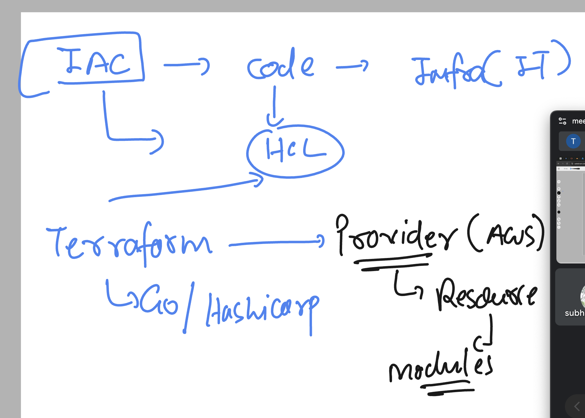
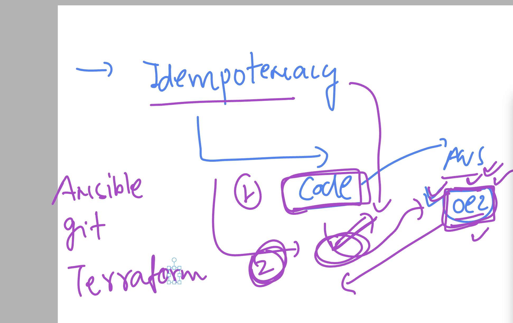

## Revision 



## Idemotency in terraform 



### checking and using provider version 

```
 humanfirmware@darwin  ~/devops_airtel/terraform/idempotent   master  ls -a
.                   ..                  .terraform          .terraform.lock.hcl ec2.tf              provider.tf
 humanfirmware@darwin  ~/devops_airtel/terraform/idempotent   master  ls  .terraform
providers
 humanfirmware@darwin  ~/devops_airtel/terraform/idempotent   master  ls  .terraform/providers 
registry.terraform.io
 humanfirmware@darwin  ~/devops_airtel/terraform/idempotent   master  ls  .terraform/providers/registry.terraform.io 
hashicorp
 humanfirmware@darwin  ~/devops_airtel/terraform/idempotent   master  ls  .terraform/providers/registry.terraform.io/hashicorp 
aws
 humanfirmware@darwin  ~/devops_airtel/terraform/idempotent   master  ls  .terraform/providers/registry.terraform.io/hashicorp/aws 
5.67.0
 humanfirmware@darwin  ~/devops_airtel/terraform/idempotent   master  


```

